# 01-Promise视频简介

Promise是es6进行异步编程的新解决方案 从语法来说 它是一个构造函数 可以封装异步的任务 对结果进行处理 Promise最大的好处是解决回调递的问题 并且它在指定回调与进行错误处理这块 要更加灵活与方便 而且Promise在现在项目中 不过是Web还是app都应用得十分广泛 无论前端还是后端 都有Promise的身影


第三的关键问题是我们封装的基础

第五的async与await是我们异步的终极解决方案 它俩完全摒弃了回调函数

​	

# 02 Promise介绍


异步编程

- fs 文件操作 fs是node.js下边的模块可以对计算机的磁盘进行读写操作

- Mongodb数据库操作
- AJAX 网络请求
- 定时器 例如setTimeout也是一个异步编程

Promise之前都是纯回调函数进行处理


【面试考点】Promise支持链式调用 可以解决回调地狱问题


一个回调函数套着另外一个异步任务 无限套娃


Promise是构造函数 可以实例化对象封装异步操作 获取成功和失败的结果 其优势是支持链式调用 可以解决回调地狱问题

Promise可以包裹一个异步操作

​	

# 03 Promise初体验（1）

# 04 Promise初体验（2）

增加了传参打印随机生成抽奖数 传给 .then() 作为resolve/reject

**1-初体验.html**

```html
<!doctype html>
<html lang="en">
<head>
    <meta charset="UTF-8">
    <title>基本使用</title>
    <link crossorigin='anonymous' href="https://cdn.bootcss.com/twitter-bootstrap/3.3.7/css/bootstrap.min.css" rel="stylesheet">
</head>
<body>
    <div class="container">
        <h2 class="page-header">Promise 初体验</h2>
        <button class="btn btn-primary" id="btn">点击抽奖</button>
    </div>
    <script>
        //生成随机数
        function rand(m,n){
            return Math.ceil(Math.random() * (n-m+1)) + m-1;
        }
        /**
            点击按钮,  1s 后显示是否中奖(30%概率中奖)
                若中奖弹出    恭喜恭喜, 奖品为 10万 RMB 劳斯莱斯优惠券
                若未中奖弹出  再接再厉
        */
        //获取元素对象
        const btn = document.querySelector('#btn');
        //绑定单击事件
        btn.addEventListener('click', function(){
            //定时器
            // setTimeout(() => {
            //     //30%  1-100  1 2 30
            //     //获取从1 - 100的一个随机数
            //     let n = rand(1, 100);
            //     //判断
            //     if(n <= 30){
            //         alert('恭喜恭喜, 奖品为 10万 RMB 劳斯莱斯优惠券');
            //     }else{
            //         alert('再接再厉');
            //     }
            // }, 1000);

            //Promise 形式实现
            // resolve 解决  函数类型的数据
            // reject  拒绝  函数类型的数据
            const p = new Promise((resolve, reject) => { //Promise实例化对象需要接收参数 这个参数是一个函数类型的值 而且函数还有两个形参 叫resolve和reject 当然你写a和b也行 潜规则叫resolve和reject
                setTimeout(() => {
                    //30%  1-100  1 2 30
                    //获取从1 - 100的一个随机数
                    let n = rand(1, 100);
                    //判断
                    if(n <= 30){
                        resolve(n); // 将 promise 对象的状态设置为 『成功』
                    }else{
                        reject(n); // 将 promise 对象的状态设置为 『失败』
                    }
                }, 1000);
            });

            console.log(p);
            //调用 then 方法 执行时会接收两个【函数参数】 第一个函数参数对象是对象成功时的回调，第二个是对象失败时的回调
            // value 值
            // reason 理由
            // 写value和reason也是潜规则 你写a和b也没问题
            p.then((value) => {
                alert('恭喜恭喜, 奖品为 10万 RMB 劳斯莱斯优惠券, 您的中奖数字为 ' + value);
            }, (reason) => {
                alert('再接再厉, 您的号码为 ' + reason);
            });

        });

    </script>
</body>

</html>
```

​	

# 05 Promise实践练习-fs读取文件

用Promise的好处就是你可以先写Promise的事件处理逻辑 写完再在下面写事件处理内容

**2-Promise实践练习-fs模块.js**

```js
//
const fs = require('fs');

//回调函数的形式 没有带Promise的形式
// fs.readFile('./resource/content.txt',(err,data)=>{
//   // 如果出错 则抛出错误
//   if(err) throw err;
//   //没有错误 输出文件内容
//   // console.log(data); // 只输出Buffer流
//   console.log(data.toString()); //将Buffer流转成字符串
// });

//Promise形式
let p = new Promise((resolve,reject) => {
  fs.readFile('./resource/content.txt',(err,data)=>{
    //如果出错
    if(err) reject(err);
    //如果成功
    resolve(data);
  });
});

//调用 then 对结果进行处理
// 第一个函数参数为成功情况
// 第二个函数参数为失败情况
p.then(value=>{
  console.log(value.toString());
},reason=>{
  console.log(reason);
});
```

​	

# 06 Promise实践练习-AJAX请求

参考文章

[Http status:0 通常是什么原因引起的](https://www.publiccms.com/question/2020/03-26/509.html)

[【译】3种解决CORS错误的方式与Access-Control-Allow-Origin的作用原理](https://segmentfault.com/a/1190000022506474)

​	

**3-Promise实践练习-AJAX请求.html**

```HTML
<!DOCTYPE html>
<html lang="en">
<head>
    <meta charset="UTF-8">
    <!-- <meta name="viewport" content="width=device-width, initial-scale=1.0"> -->
    <title>Promise 封装 AJAX</title>
    <link crossorigin='anonymous' href="https://cdn.bootcss.com/twitter-bootstrap/3.3.7/css/bootstrap.min.css" rel="stylesheet">
</head>
<body>
    <div class="container">
        <h2 class="page-header">Promise 封装 AJAX 操作</h2>
        <button class="btn btn-primary" id="btn">点击发送 AJAX</button>
    </div>
    <script>
        //接口地址 https://api.apiopen.top/getJoke
        //获取元素对象
        const btn = document.querySelector('#btn');

        btn.addEventListener('click', function(){
            //创建 Promise
            const p = new Promise((resolve, reject) => {
                //1.创建对象
                const xhr = new XMLHttpRequest();
                //2. 初始化
                xhr.open('GET', 'https://cors-anywhere.herokuapp.com/https://api.apiopen.top/getJoke');
                //3. 发送
                xhr.send();
                //4. 处理响应结果
                xhr.onreadystatechange = function(){
                    if(xhr.readyState === 4){
                        //判断响应状态码 2xx   
                        if(xhr.status >= 200 && xhr.status < 300){
                            //控制台输出响应体
                            resolve(xhr.response); // xhr.response里面存的就是响应体
                        }else{
                            //控制台输出响应状态码
                            reject(xhr.status);
                        }
                    }
                }
            });
            //调用then方法
            p.then(value=>{
                console.log(value);
            }, reason=>{
                console.warn(reason); // warn颜色区分log
            });
        });
    </script>
</body>
</html>
```

​	

# 07 Promise封装fs读取文件操作


**4-Promise封装练习-fs模块.js**

```js
/**
 * 封装一个函数 mineReadFile 读取文件内容
 * 参数：path 文件路径
 * 返回：promise 对象
 */
function mineReadFile(path){
  return new Promise((resolve,reject)=>{
    //读取文件 这里用用一个来变量接收实例化对象比较好 这里懒了 没接收直接写
    require('fs').readFile(path,(err,data)=>{
      //判断
      if(err) reject(err);
      //成功
      resolve(data);
    })
  })
}

mineReadFile('./resource/content.txt') //then可以回车到下一行 可以的
.then(value=>{
  //输出文件内容
  console.log(value.toString());
},reason=>{
  console.log(reason);
}); // 直接跟.then 因为它返回的结果是一个promise对象

```

​	

# 08 util.promisify方法进行promise风格转化


也就是错误优先的回调

异步的API基本上回调函数都是error

​	

**5-util.promisify方法.js**

```js
/**
 * util.promisify 方法  (node.js内置的方法)
 * 也就是错误优先的回调
 */
//引入 util 模块
const util = require('util');
//引入 fs 模块
const fs = require('fs');
// 返回一个新的函数
let mineReadFile = util.promisify(fs.readFile);

mineReadFile('./resource/content.txt').then(value=>{
  console.log(value.toString());
})

/**
 * 对于以后使用promise 我们不需要每一个都手动封装 
 * 而是可以借助于util.promisify这个方法 将原来那种回调函数风格的方法转变成一个promise风格的函数
 * 这样使用起来会更加方便一些
 */

```

​	

# 09 Promise封装AJAX请求

**6-Promise封装练习.html**

```html
<!DOCTYPE html>
<html lang="en">
<head>
  <meta charset="UTF-8">
  <meta http-equiv="X-UA-Compatible" content="IE=edge">
  <meta name="viewport" content="width=device-width, initial-scale=1.0">
  <title>Promise封装AJAX操作</title>
</head>
<body>
  <script>
    /** 
     * 封装一个函数 sendAJAX 发送 GET AJAX请求
     * 参数 URL
     * 返回结果 Promise 对象
     */
    function sendAJAX(url){
      return new Promise((resolve,reject)=>{
        const xhr = new XMLHttpRequest();
        xhr.responseType = 'json'; // 格式是可以调整的
        xhr.open("GET",url);
        xhr.send();
        //处理结果
        xhr.onreadystatechange = function(){
          if(xhr.readyState === 4){ // readyState为4是所有结果都返回时的这么一个状态
            //判断成功 状态码为2xx的时候为成功
            if(xhr.status >= 200 && xhr.status < 300){
              // 成功的结果
              resolve(xhr.response);
            }else{
              reject(xhr.status);
            }
          }
        }
      })
    }

    // 这么一封装 AJAX请求也变得简单起来
    sendAJAX('https://api.apiopen.top/getJoke')
    .then(value=>{
      console.log(value);
    }, reason=>{
      console.warn(reason);
    });
  </script>
</body>
</html>
```

​	

# 10 promise对象状态属性介绍

【重点】

状态是promise实例对象当中的一个属性 它叫做promiseStatus

pending 待定的


它不可能由成功变为失败也不可以从失败变为成功 且状态只能改变一次


promiseStatus是内置的我们不能直接去对这个属性做操作

​	

# 11 promise对象结果值属性介绍

【重点】属性：promiseResult


resolve和reject可以对promiseResult的值进行赋值和修改 别人是不可以的

promiseResult保存的是我们异步任务成功或失败的结果


​	

# 12 Promise工作流程


then()方法返回的也是一个promise对象 后面会讲

​	

# 13 Promise的API-构造函数-then-catch

需要接收一个函数参数 可以使用箭头函数去声明 也可以使用匿名函数去申请


catch只能指定失败的回调

**7-Promise的API-1.html**

```html
<!DOCTYPE html>
<html lang="en">
<head>
  <meta charset="UTF-8">
  <meta http-equiv="X-UA-Compatible" content="IE=edge">
  <meta name="viewport" content="width=device-width, initial-scale=1.0">
  <title>Document</title>
</head>
<body>
  <script>
    //
    let p = new Promise((resolve,reject)=>{
      //同步调用
      // console.log(111);
      // 修改 promise 对象的状态
      reject('error');
    });

    // console.log(222);

    //执行 catch 方法
    p.catch(reason=>{
      console.log(reason);
    });
  </script>
</body>
</html>
```

​	

# 14 Promise.resolve方法

resolve相较于then和catch来说不太一样，它是属于Promise函数对象的 它并不属于实例对象 能快速封装一个值 转换成Promise对象


**8-Promise的API-resolve.html**

```html
<!DOCTYPE html>
<html lang="en">
<head>
  <meta charset="UTF-8">
  <meta http-equiv="X-UA-Compatible" content="IE=edge">
  <meta name="viewport" content="width=device-width, initial-scale=1.0">
  <title>Promise API - resolve</title>
</head>
<body>
  <script>
    //
    let p1 = Promise.resolve(521);
    /** 
     * 如果传入的参数为 非Promise类型的对象 则返回的结果为成功promise对象
     * 如果传入的参数为 Promise对象 则参数的结果（也就是这个Promise参数对象的结果）决定了外层 resolve 的结果
    */
   let p2 = Promise.resolve(new Promise((resolve, reject)=>{
    // resolve('OK');
    reject('Error');
   }));
    console.log(p2);
    //如果是resolve则不用then或catch来处理 但如果是reject则必须要有 回调处理error 否则控制台会报错
    p2.catch(reason=>{
    });
  </script>
</body>
</html>
```

​	

# 15 Promise.reject方法

> resolve产出的Promise对象可以是成功的也可以是失败的 但reject产出的一定是失败的

**9-Promise的API-reject.html**

```html
<!DOCTYPE html>
<html lang="en">
<head>
  <meta charset="UTF-8">
  <meta http-equiv="X-UA-Compatible" content="IE=edge">
  <meta name="viewport" content="width=device-width, initial-scale=1.0">
  <title>Promise API - reject</title>
</head>
<body>
  <script>
    //
    // let p = Promise.reject(521);
    // let p2 = Promise.reject('I Love U');
    // console.log(p);
    // console.log(p2);

    let p3 = Promise.reject(new Promise((resolve, reject)=>{ // 匿名函数
      resolve('OK');
    }));

    console.log(p3);
    p3.catch(reason=>{
      reason.then(value=>{
        console.log(value); // OK  嵌套Promise获取里面的值 因为嵌套里的Promise是resolve 所以用value 而不是reason
      })
      console.log(reason); // 返回一个Promise对象
    })
  </script>
</body>
</html>
```

​	

# 16 Promise.all方法


**10-Promise的API-all.html**

```html
<!DOCTYPE html>
<html lang="en">
<head>
  <meta charset="UTF-8">
  <meta http-equiv="X-UA-Compatible" content="IE=edge">
  <meta name="viewport" content="width=device-width, initial-scale=1.0">
  <title>Promise API - all</title>
</head>
<body>
  <script>
    let p1 = new Promise((resolve,reject)=>{
      resolve('OK');
    })
    // let p2 = Promise.resolve('success');
    let p2 = Promise.reject('Error');
    let p3 = Promise.resolve('Oh yeah!');

    //
    const result = Promise.all([p1,p2,p3]);
    console.log(result); //一个失败 all就都失败 且失败的结果值为那个失败Promise对象的结果值（也就是p2的结果值：Error）

  </script>
</body>
</html>
```

​	

# 17 Promise.race方法


race是竞赛 赛跑的意思

**11-Promise的API-race.html**

```html
<!DOCTYPE html>
<html lang="en">
<head>
  <meta charset="UTF-8">
  <meta http-equiv="X-UA-Compatible" content="IE=edge">
  <meta name="viewport" content="width=device-width, initial-scale=1.0">
  <title>Promise API - race</title>
</head>
<body>
  <script>
    let p1 = new Promise((resolve,reject)=>{
      setTimeout(()=>{
        resolve('OK');
      },1000);
    })
    let p2 = Promise.resolve('Success');
    let p3 = Promise.resolve('Oh yeah');

    //调用
    const result = Promise.race([p1,p2,p3]);

    console.log(result);
  </script>
</body>
</html>
```

​	

# 18 Promise关键问题-如何修改对象的状态

不了解关键问题我们写代码时可能会不完整或不完善

**1-状态修改.html**

```html
<!DOCTYPE html>
<html lang="en">
<head>
  <meta charset="UTF-8">
  <meta http-equiv="X-UA-Compatible" content="IE=edge">
  <meta name="viewport" content="width=device-width, initial-scale=1.0">
  <title>Promise关键问题 - Promise 对象状态改变的方式</title>
</head>
<body>
  <script>
    let p = new Promise((resolve,reject)=>{
      //1.resolve 函数
      // resolve('ok'); // pending => fulfilled(resolved)
      //2.reject 函数
      // reject('error'); // pending => rejected
      //3.抛出错误
      throw '出问题了'; //也可以改变Promise对象状态 pending => rejected
    })

    console.log(p);
  </script>
</body>
</html>
```

​	

# 19 Promise关键问题-能否执行多个回调


意思就是当Promise是A状态的时候 A状态的回调就都会调用

**2-能否执行多个回调.html**

```html
<!DOCTYPE html>
<html lang="en">
<head>
  <meta charset="UTF-8">
  <meta http-equiv="X-UA-Compatible" content="IE=edge">
  <meta name="viewport" content="width=device-width, initial-scale=1.0">
  <title>Promise关键问题 - Promise 指定多个回调</title>
</head>
<body>
  <script>
    let p = new Promise((resolve,reject)=>{
      // resolve('OK')
    })

    //指定回调 - 1
    p.then(value=>{
      console.log(value);
    })

    //指定回调 - 2
    p.then(value=>{
      alert(value);
    })
  </script>
</body>
</html>
```

​	

# 20 Promise关键问题-改变状态与指定回调的顺序问题


result指定promise状态先执行还是指定回调then/catch先执行？

同步任务时resolve比then先执行

异步任务时resolve比then后执行（例如加setTimeout包裹）

> 如果先指定的回调 那当状态发生改变时 回调函数就会调用 得到数据

​	

# 21 Promise关键问题-then方法返回结果由什么决定


**4-then方法的返回结果由什么决定.html**

```html
<!DOCTYPE html>
<html lang="en">
<head>
  <meta charset="UTF-8">
  <meta http-equiv="X-UA-Compatible" content="IE=edge">
  <meta name="viewport" content="width=device-width, initial-scale=1.0">
  <title>Promise关键问题 - Promise then方法的返回结果特点</title>
</head>
<body>
  <script>
    let p = new Promise((resolve,reject)=>{
      resolve('ok');
    });
    //执行 then 方法
    let result = p.then(value=>{
      // console.log(value);
      // 1.抛出错误
      // throw '出了问题';
      // 2.返回结果是 非Promise 类型的对象
      // return 521;
      // 3.返回结果是 Promise 对象
      return new Promise((resolve,reject)=>{
        // resolve('success');
        reject('error');
      })
    },reason=>{
      console.warn(reason);
    })

    console.log(result);
  </script>
</body>
</html>
```

​	

# 22 Promise关键问题-串联多个任务


原理就是then的返回结果也是一个promise对象

**5-promise如何串联多个任务.html**

```html
<!DOCTYPE html>
<html lang="en">
<head>
  <meta charset="UTF-8">
  <meta http-equiv="X-UA-Compatible" content="IE=edge">
  <meta name="viewport" content="width=device-width, initial-scale=1.0">
  <title>Promise关键问题 - 如何串联多个任务</title>
</head>
<body>
  <script>
    let p = new Promise((resolve,reject)=>{
      setTimeout(()=>{
        resolve('OK');
      },1000);
    });

    p.then(value=>{
      return new Promise((resolve,reject)=>{
        resolve("success"); // 上面状态是resolve 下面reject的回调不写没影响
      }); //这里return一个Promise对象 所以可以再进行then 链式操作
    }).then(value=>{ //这里then回调函数没写return 没有返回值 那么返回值就是undefined 又因为undefined不是一个成功的promise类型对象 所以这个then它的返回结果就是一个成功的Promise对象 且成功的结果就是返回的结果 结果值为undefined
      console.log(value); //success
    }).then(value=>{
      console.log(value);
    })
  </script>
</body>
</html>
```

​	

# 23 Promise关键问题-异常穿透

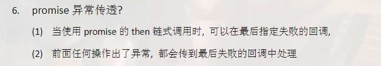

中间不用做处理 只需要在最后留一个catch处理失败的情况就OK咯

**6-异常穿透现象是怎么回事.html**

```html
<!DOCTYPE html>
<html lang="en">
<head>
  <meta charset="UTF-8">
  <meta http-equiv="X-UA-Compatible" content="IE=edge">
  <meta name="viewport" content="width=device-width, initial-scale=1.0">
  <title>Promise关键问题 - 如何串联多个任务</title>
</head>
<body>
  <script>
    let p = new Promise((resolve,reject)=>{
      setTimeout(()=>{
        resolve('OK');
        // reject('Err');
      },1000);
    });

    p.then(value=>{
      // console.log(111); // 这里打印输出OK 但是没有返回值所以 p.then 的结果是undefined 为 非Promise对象 属于resolve 所以以此类推 下面两个then也都会调用输出结果
      throw '失败啦！'
    }).then(value=>{ 
      console.log(222); 
    }).then(value=>{
      console.log(333);
    })
    .catch(reason=>{ //喜欢写catch只是因为它能比then少写一个函数 | catch不写返回值 返回的就是undefined 也就是成功的Promise对象
      console.warn(reason);
      console.warn(111);
      // return reason;
    })
    // .then(value=>{ 
    //   console.log(444);
    // },reject=>{
    //   console.log('-------');
    //   console.log(555);
    //   console.log(reject);
    //   console.log('-------');
    // });

    // 测试catch
    // p.catch(reason=>{ //喜欢写catch只是因为它能比then少写一个函数 | catch不写返回值 返回的就是undefined 也就是成功的Promise对象
    //   // console.warn(reason);
    //   return new Promise((resolve,reject)=>{
    //   // setTimeout(()=>{
    //     // resolve('OK');
    //     reject('Err');
    //   // },1000);
    // })
    // })
    // .then(value=>{ 
    //   console.log(value);
    // },reject=>{
    //   console.log('-------');
    //   console.log(555);
    //   console.log(reject);
    //   console.log('-------');
    // });
  </script>
</body>
</html>
```

​	

# 24 Promise关键问题-如何中断promise链

==只有==返回 pending对象 的promise对象才能够中断promise链 return false或者-1都不好使 只会看成非Promise对象处理 变成一个成功的Promise对象

改成pending状态下面的resolve和reject状态就都不会执行 所以只会跑一个then

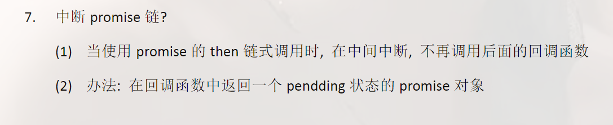

**7-如何中断Promise链条.html**

```html
<!DOCTYPE html>
<html lang="en">
<head>
  <meta charset="UTF-8">
  <meta http-equiv="X-UA-Compatible" content="IE=edge">
  <meta name="viewport" content="width=device-width, initial-scale=1.0">
  <title>Promise关键问题 - 如何串联多个任务</title>
</head>
<body>
  <script>
    let p = new Promise((resolve,reject)=>{
      setTimeout(()=>{
        resolve('OK');
        // reject('Err');
      },1000);
    });

    p.then(value=>{
      console.log(111); 
      // 有且只有一个方式
      return new Promise(()=>{}); //改变为pending状态 下面状态不匹配便不执行
    }).then(value=>{ 
      console.log(222); 
    }).then(value=>{
      console.log(333);
    })
    .catch(reason=>{ 
      console.warn(reason);
    })
    // });
  </script>
</body>
</html>
```

​	

# 25 Promise自定义封装-初始结构搭建

**index.html**

```html
<!DOCTYPE html>
<html lang="en">
<head>
  <meta charset="UTF-8">
  <meta http-equiv="X-UA-Compatible" content="IE=edge">
  <meta name="viewport" content="width=device-width, initial-scale=1.0">
  <title>Promise-封装 | 1 - 初始结构搭建</title>
  <!-- 通过自定义（手写）promise 把我们下边全局内置的promise覆盖了 -->
  <script src="./promise.js"></script>
</head>
<body>
  <script>
    let p = new Promise((resolve,reject)=>{
      resolve('OK');
    })

    p.then(value=>{
      console.log(value);
    },reason=>{
      console.log(reason);
    })
  </script>
</body>
</html>
```

**promise.js**

```js
// 只要这么一声明 index.html new的就是我这里的promise
function Promise(executor){

}

// index.html:17 Uncaught TypeError: p.then is not a function
// 所以我们要添加 then 方法
Promise.prototype.then = function(onResolved, onRejected){

}
```

​	

# 26 -Promise自定义封装-resolve与reject结构搭建

更新 P25 js文件

```js
// 只要这么一声明 index.html new的就是我这里的promise
// 声明构造函数
function Promise(executor){
  //resolve 函数
  function resolve(data){

  }
  // reject 函数
  function reject(data){

  }

  // 同步调用 【执行器函数】
  executor(resolve,reject);
}

// index.html:17 Uncaught TypeError: p.then is not a function
// 所以我们要添加 then 方法
Promise.prototype.then = function(onResolved, onRejected){

}
```

​	

# 27 Promise自定义封装 resolve与reject代码实现

更新了promise.js里的resolve函数和reject函数的代码实现

**promise.js**

```js
// 只要这么一声明 index.html new的就是我这里的promise
// 声明构造函数
function Promise(executor){
  // 属性需要自己添加 函数里什么都没有
  //添加属性
  this.PromiseState = 'pending'; //pending:未决定的状态
  this.PromiseResult = null;

  // console.log(this); //实例对象的this
  // 保存实例对象的 this 的值
  const self = this; // self 潜规则命名为self
  
  //resolve 函数
  function resolve(data){
    // console.log(this); //如果上面没有保存实例对象的this 那么这里的this是属于window全局对象的
    // 所以下面赋值不能用this了 要用保存了实例对象this的self
    // 1. 修改对象的状态 (promiseState)
    // this.PromiseState = 'fulfilled'; // resolved 【fulfilled和resolved】这两个表示的都是成功的意思
    self.PromiseState = 'fulfilled'; // resolved 【fulfilled和resolved】这两个表示的都是成功的意思
    // 2. 设置对象结果值 (promiseResult)
    // this.PromiseResult = data;
    self.PromiseResult = data;
  }
  // reject 函数
  function reject(data){
    self.PromiseState = 'rejected';
    self.PromiseResult = data;
  }

  // 同步调用 【执行器函数】
  executor(resolve,reject);
}

// index.html:17 Uncaught TypeError: p.then is not a function
// 所以我们要添加 then 方法
Promise.prototype.then = function(onResolved, onRejected){

}
```

**index.html**

```html
<!DOCTYPE html>
<html lang="en">
<head>
  <meta charset="UTF-8">
  <meta http-equiv="X-UA-Compatible" content="IE=edge">
  <meta name="viewport" content="width=device-width, initial-scale=1.0">
  <title>Promise-封装 | 1 - 初始结构搭建</title>
  <!-- 通过自定义（手写）promise 把我们下边全局内置的promise覆盖了 -->
  <script src="./promise.js"></script>
</head>
<body>
  <script>
    let p = new Promise((resolve,reject)=>{
      // resolve('OK');
      reject('error');
    })

    console.log(p);

    // p.then(value=>{
    //   console.log(value);
    // },reason=>{
    //   console.log(reason);
    // })
  </script>
</body>
</html>
```

​	

# 28 Promise自定义封装-throw抛出异常改变状态

抛出异常的值会传递给try-catch中的catch形参 所以我们设置try-catch 只需要把e给到catch的reject函数就好了

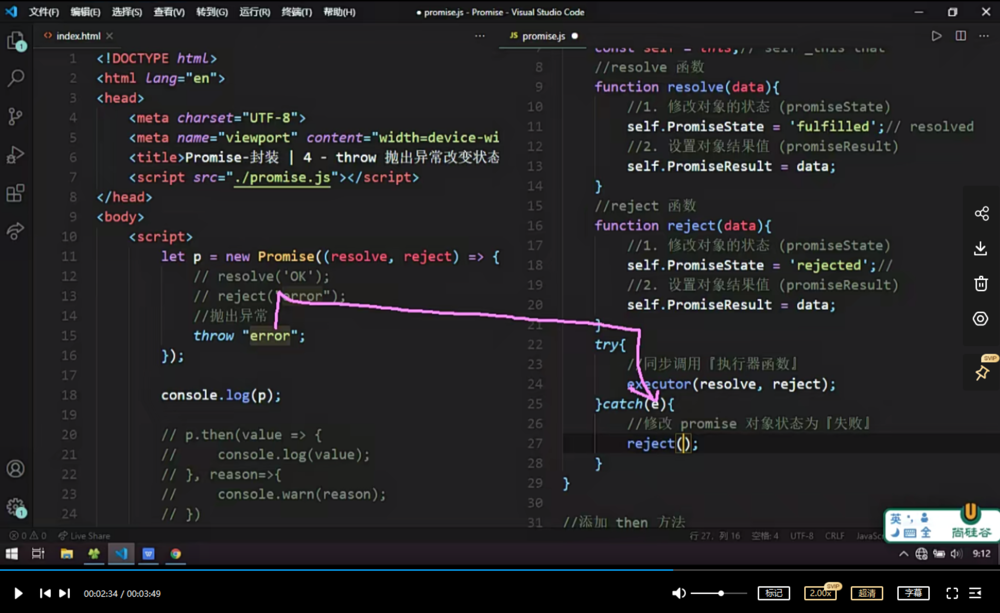

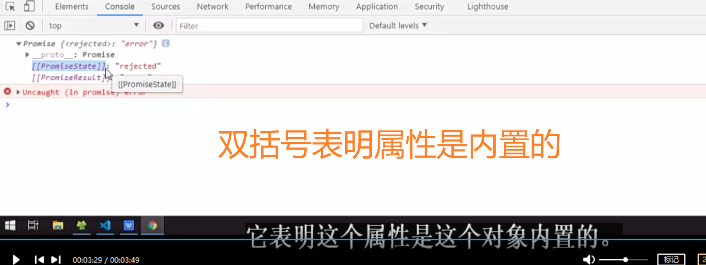

这些属性我们没有办法通过js代码直接去对它进行操作

对代码多增加了throw异常抛出 用rejected的形式输出结果 在js代码中多增加了try-catch对throw异常进行判断

**promise.js**

```js
//声明构造函数
function Promise(executor){
    //添加属性
    this.PromiseState = 'pending';
    this.PromiseResult = null;
    //保存实例对象的 this 的值
    const self = this;// self _this that
    //resolve 函数
    function resolve(data){
        //1. 修改对象的状态 (promiseState)
        self.PromiseState = 'fulfilled';// resolved
        //2. 设置对象结果值 (promiseResult)
        self.PromiseResult = data;
    }
    //reject 函数
    function reject(data){
        //1. 修改对象的状态 (promiseState)
        self.PromiseState = 'rejected';// 
        //2. 设置对象结果值 (promiseResult)
        self.PromiseResult = data;
    }
    try{
        //同步调用『执行器函数』
        executor(resolve, reject);
    }catch(e){
        //修改 promise 对象状态为『失败』
        reject(e);
    }
}

//添加 then 方法
Promise.prototype.then = function(onResolved, onRejected){

}
```

**index.html**

```HTML
<!DOCTYPE html>
<html lang="en">
<head>
    <meta charset="UTF-8">
    <meta name="viewport" content="width=device-width, initial-scale=1.0">
    <title>Promise-封装 | 4 - throw 抛出异常改变状态 </title>
    <script src="./promise.js"></script>
</head>
<body>
    <script>
        let p = new Promise((resolve, reject) => {
            // resolve('OK');
            reject("error");
            //抛出异常
            // throw "error";
        });

        console.log(p);

        // p.then(value => {
        //     console.log(value);
        // }, reason=>{
        //     console.warn(reason);
        // })
    </script>
</body>
</html>
```

​	

# 29 Promise自定义封装-Promise对象状态只能修改一次

不论是内置还是自定义promise对象 状态只能改变一次

代码更新：加了if判断状态是否改变 改变则不执行当前函数 直接return

**index.html**

```html
<!DOCTYPE html>
<html lang="en">
<head>
    <meta charset="UTF-8">
    <meta name="viewport" content="width=device-width, initial-scale=1.0">
    <title>Promise-封装 | 5 - throw 状态只能修改一次 </title>
    <script src="./promise.js"></script>
</head>
<body>
    <script>
        let p = new Promise((resolve, reject) => {
            resolve('OK');
            reject("error");
            //抛出异常
            // throw "error";
        });

        console.log(p);

    </script>
</body>
</html>
```

**promise.js**

```js
//声明构造函数
function Promise(executor){
    //添加属性
    this.PromiseState = 'pending';
    this.PromiseResult = null;
    //保存实例对象的 this 的值
    const self = this;// self _this that
    //resolve 函数
    function resolve(data){
        // 判断状态
        if(self.PromiseState!=='pending') return;
        //1. 修改对象的状态 (promiseState)
        self.PromiseState = 'fulfilled';// resolved
        //2. 设置对象结果值 (promiseResult)
        self.PromiseResult = data;
    }
    //reject 函数
    function reject(data){
        // 判断状态
        if(self.PromiseState!=='pending') return;
        //1. 修改对象的状态 (promiseState)
        self.PromiseState = 'rejected';// 
        //2. 设置对象结果值 (promiseResult)
        self.PromiseResult = data;
    }
    try{
        //同步调用『执行器函数』
        executor(resolve, reject);
    }catch(e){
        //修改 promise 对象状态为『失败』
        reject(e);
    }
}

//添加 then 方法
Promise.prototype.then = function(onResolved, onRejected){
  
}
```

​	

# 30 Promise自定义封装-then方法执行回调

**index.html**

```html
<!DOCTYPE html>
<html lang="en">
<head>
    <meta charset="UTF-8">
    <meta name="viewport" content="width=device-width, initial-scale=1.0">
    <title>Promise-封装 | 6 - then 方法执行回调 </title>
    <script src="./promise.js"></script>
</head>
<body>
    <script>
        //实例化对象
        let p = new Promise((resolve, reject) => {
            // resolve('OK');
            // reject("Error");
            throw "ERROR";
        });

        p.then(value => {
            console.log(value);
        }, reason=>{
            console.warn(reason);
        })
    </script>
</body>
</html>
```

**promise.js**

```js
//声明构造函数
function Promise(executor){
    //添加属性
    this.PromiseState = 'pending';
    this.PromiseResult = null;
    //保存实例对象的 this 的值
    const self = this;// self _this that
    //resolve 函数
    function resolve(data){
        //判断状态
        if(self.PromiseState !== 'pending') return;
        //1. 修改对象的状态 (promiseState)
        self.PromiseState = 'fulfilled';// resolved
        //2. 设置对象结果值 (promiseResult)
        self.PromiseResult = data;
    }
    //reject 函数
    function reject(data){
        //判断状态
        if(self.PromiseState !== 'pending') return;
        //1. 修改对象的状态 (promiseState)
        self.PromiseState = 'rejected';// 
        //2. 设置对象结果值 (promiseResult)
        self.PromiseResult = data;
    }
    try{
        //同步调用『执行器函数』
        executor(resolve, reject);
    }catch(e){
        //修改 promise 对象状态为『失败』
        reject(e);
    }
}

//添加 then 方法
Promise.prototype.then = function(onResolved, onRejected){
  // 因为then由p调用 所以then中的this是实例对象p的 不用新建self
    //调用回调函数  PromiseState
    if(this.PromiseState === 'fulfilled'){
        onResolved(this.PromiseResult); //值保存在this.PromiseResult
    }
    if(this.PromiseState === 'rejected'){
        onRejected(this.PromiseResult);
    }
}
```

​	

# 31 Promise自定义封装-异步任务回调的执行

一定要注意这个回调执行 它的执行位置不是在then方法中 而是在resolve/reject里边 就是改变状态后才能去执行回调

**index.html**

```html
<!DOCTYPE html>
<html lang="en">
<head>
    <meta charset="UTF-8">
    <meta name="viewport" content="width=device-width, initial-scale=1.0">
    <title>Promise-封装 | 7 - 异步任务 then 方法实现 </title>
    <script src="./promise.js"></script>
</head>
<body>
    <script>
        //实例化对象
        let p = new Promise((resolve, reject) => {
          // 模拟异步 以后可能是文件IO 数据IO 网络请求IO
            setTimeout(() => {
                // resolve('OK');
                reject("error");
            }, 1000);
        });

        p.then(value => {
            console.log(value);
        }, reason=>{
            console.warn(reason);
        });

        console.log(p);
    </script>
</body>
</html>
```

**promise.js**

```js
//声明构造函数
function Promise(executor){
    //添加属性
    this.PromiseState = 'pending';
    this.PromiseResult = null;
    //声明属性
    this.callbacks = [];
    //保存实例对象的 this 的值
    const self = this;// self _this that
    //resolve 函数
    function resolve(data){
        //判断状态
        if(self.PromiseState !== 'pending') return;
        //1. 修改对象的状态 (promiseState)
        self.PromiseState = 'fulfilled';// resolved
        //2. 设置对象结果值 (promiseResult)
        self.PromiseResult = data;
        //调用成功的回调函数
        self.callbacks.forEach(item => {
            item.onResolved(data);
        });
    }
    //reject 函数
    function reject(data){
        //判断状态
        if(self.PromiseState !== 'pending') return;
        //1. 修改对象的状态 (promiseState)
        self.PromiseState = 'rejected';// 
        //2. 设置对象结果值 (promiseResult)
        self.PromiseResult = data;
        //执行失败的回调
        self.callbacks.forEach(item => {
            item.onRejected(data);
        });
    }
    try{
        //同步调用『执行器函数』
        executor(resolve, reject);
    }catch(e){
        //修改 promise 对象状态为『失败』
        reject(e);
    }
}

//添加 then 方法
Promise.prototype.then = function(onResolved, onRejected){
    //调用回调函数  PromiseState
    if(this.PromiseState === 'fulfilled'){
        onResolved(this.PromiseResult);
    }
    if(this.PromiseState === 'rejected'){
        onRejected(this.PromiseResult);
    }
    //判断 pending 状态
    if(this.PromiseState === 'pending'){
        //保存回调函数
        this.callbacks.push({
            onResolved: onResolved,
            onRejected: onRejected
        });
    }
}
```

​	

# 32 Promise自定义封装-指定多个回调实现

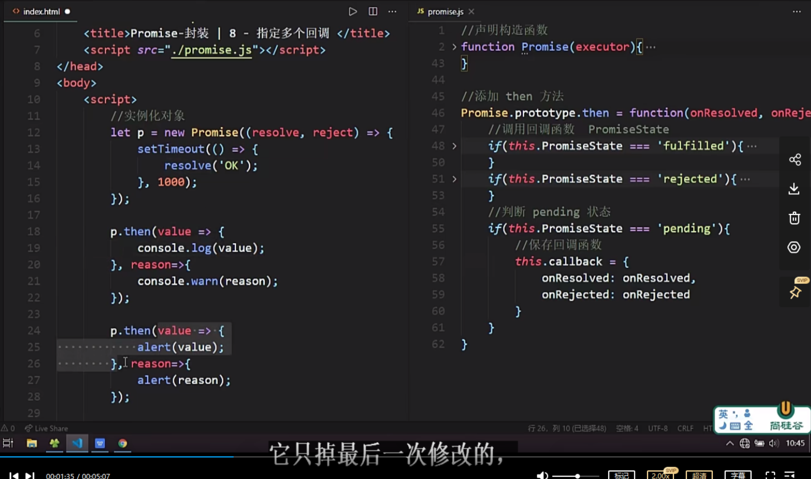

这么写的话 因为是异步执行 所以下面两个p.then进入时都是pending，第一个then保存的回调被下面第二个then保存的回调覆盖了 所以它只调用最后一次修改的（只保存最后一个的回调，其他都覆盖了）

我们不能让其覆盖 应该把所有回调的值都给保存起来

代码修改：指定多个回调 我们把callback从对象属性 变成 数组属性 把所有回调push到一个数组里面（每个回调都是一个对象）然后在resolve/reject的判断状态下用遍历forEach的方式调用成功（resolve）/失败（reject）的回调

**index.html**

```html
<!DOCTYPE html>
<html lang="en">
<head>
    <meta charset="UTF-8">
    <meta name="viewport" content="width=device-width, initial-scale=1.0">
    <title>Promise-封装 | 8 - 指定多个回调 </title>
    <script src="./promise.js"></script>
</head>
<body>
    <script>
        //实例化对象
        let p = new Promise((resolve, reject) => {
            setTimeout(() => {
                // resolve('OK');
                reject('No');
            }, 1000);
        });

        p.then(value => {
            console.log(value);
        }, reason=>{
            console.warn(reason);
        });

        p.then(value => {
            alert(value);
        }, reason=>{
            alert(reason);
        });

        console.log(p);


    </script>
</body>
</html>
```

**promise.js**

```js
//声明构造函数
function Promise(executor){
    //添加属性
    this.PromiseState = 'pending';
    this.PromiseResult = null;
    //声明属性
    this.callbacks = [];
    //保存实例对象的 this 的值
    const self = this;// self _this that
    //resolve 函数
    function resolve(data){
        //判断状态
        if(self.PromiseState !== 'pending') return;
        //1. 修改对象的状态 (promiseState)
        self.PromiseState = 'fulfilled';// resolved
        //2. 设置对象结果值 (promiseResult)
        self.PromiseResult = data;
        //调用成功的回调函数
        self.callbacks.forEach(item => {
            item.onResolved(data);
        });
    }
    //reject 函数
    function reject(data){
        //判断状态
        if(self.PromiseState !== 'pending') return;
        //1. 修改对象的状态 (promiseState)
        self.PromiseState = 'rejected';// 
        //2. 设置对象结果值 (promiseResult)
        self.PromiseResult = data;
        //执行失败的回调
        self.callbacks.forEach(item => {
            item.onRejected(data);
        });
    }
    try{
        //同步调用『执行器函数』
        executor(resolve, reject);
    }catch(e){
        //修改 promise 对象状态为『失败』
        reject(e);
    }
}

//添加 then 方法
Promise.prototype.then = function(onResolved, onRejected){
    //调用回调函数  PromiseState
    if(this.PromiseState === 'fulfilled'){
        onResolved(this.PromiseResult);
    }
    if(this.PromiseState === 'rejected'){
        onRejected(this.PromiseResult);
    }
    //判断 pending 状态
    if(this.PromiseState === 'pending'){
        //保存回调函数
        // 变成数组然后push进去就可以保存所有回调了
        this.callbacks.push({
            onResolved: onResolved,
            onRejected: onRejected
        });
    }
}
```

​	

# 33 Promise自定义封装-同步修改状态then方法结果返回

用一个变量result承接then方法的返回值，返回值类型分两种 一种是Promise对象，另一种是非Promise对象

- 非Promise对象的返回结果成功的promise对象 其值看return结果而定（无return则是undefined）
- Promise对象的返回结果由它对应then的返回结果而定

建议这一节多看几遍 难点通常也是重点

**index.html**

```html
<!DOCTYPE html>
<html lang="en">
<head>
    <meta charset="UTF-8">
    <meta name="viewport" content="width=device-width, initial-scale=1.0">
    <title>Promise-封装 | 9 - 同步任务 then 返回结果</title>
    <script src="./promise.js"></script>
</head>
<body>
    <script>
        //实例化对象
        let p = new Promise((resolve, reject) => {
            resolve('OK');
        });
        //执行 then 方法
        const res = p.then(value => {
            // console.log(value);
            // return 'hello Promise';
            // return new Promise((resolve, reject)=>{ // 这里返回的是一个对象 success只是他的PromiseResult 而不是return 'success' 你自己误解了 OK？
            //   // resolve('success');
            //   reject('oh no');
            // })
            //抛出异常
            throw "FAIL";
        }, reason=>{
            console.warn(reason);
        });
        console.log(res);
    </script>
</body>
</html>
```

**promise.js**

```js
//声明构造函数
function Promise(executor){
    //添加属性
    this.PromiseState = 'pending';
    this.PromiseResult = null;
    //声明属性
    this.callbacks = [];
    //保存实例对象的 this 的值
    const self = this;// self _this that
    //resolve 函数
    function resolve(data){
        //判断状态
        if(self.PromiseState !== 'pending') return;
        //1. 修改对象的状态 (promiseState)
        self.PromiseState = 'fulfilled';// resolved
        //2. 设置对象结果值 (promiseResult)
        self.PromiseResult = data;
        //调用成功的回调函数
        self.callbacks.forEach(item => {
            item.onResolved(data);
        });
    }
    //reject 函数
    function reject(data){
        //判断状态
        if(self.PromiseState !== 'pending') return;
        //1. 修改对象的状态 (promiseState)
        self.PromiseState = 'rejected';// 
        //2. 设置对象结果值 (promiseResult)
        self.PromiseResult = data;
        //执行失败的回调
        self.callbacks.forEach(item => {
            item.onRejected(data);
        });
    }
    try{
        //同步调用『执行器函数』
        executor(resolve, reject);
    }catch(e){
        //修改 promise 对象状态为『失败』
        reject(e);
    }
}

//添加 then 方法
Promise.prototype.then = function(onResolved, onRejected){
    return new Promise((resolve, reject) => {
        //调用回调函数  PromiseState
        if(this.PromiseState === 'fulfilled'){
            try{
                //获取回调函数的执行结果
                let result = onResolved(this.PromiseResult);
                //判断
                if(result instanceof Promise){
                    //如果是 Promise 类型的对象
                    result.then(v => {
                        resolve(v);
                    }, r=>{
                        reject(r);
                    })
                }else{
                    //结果的对象状态为『成功』
                    resolve(result);
                }
            }catch(e){
                reject(e);
            }
        }
        if(this.PromiseState === 'rejected'){
            onRejected(this.PromiseResult);
        }
        //判断 pending 状态
        if(this.PromiseState === 'pending'){
            //保存回调函数
            this.callbacks.push({
                onResolved: onResolved,
                onRejected: onRejected
            });
        }
    })
}
```

​	

# 34 Promise自定义封装-异步修改状态then方法结果返回

查看结果 属性值的时候 要稍微等一下（过了异步任务的执行时间）再去检查才是正确 不然就是未改变状态前的（pending）

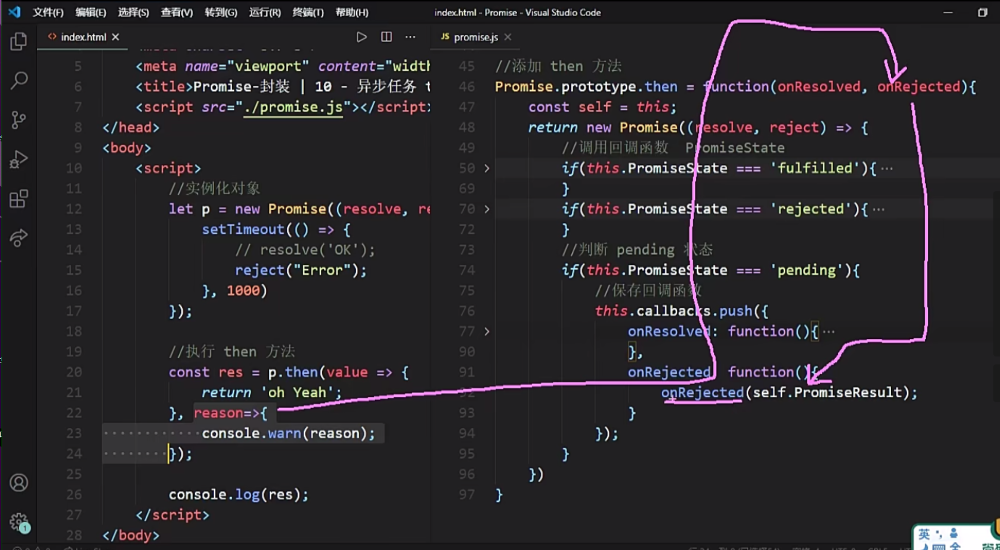

this.callbacks.push 没有一次push两个属性，看执行then方法调用的是onResolve还是onReject 对应传递哪个

因为第二个回调函数return了undefined 所以then方法返回的promise对象的状态变成了成功

异步修改状态then方法结果返回稍微难点，异步状态不会进前面两个if 需要在pending调resolve和reject 需要重写pending情况中属性（onResolved和onRejected以及throw的情况）的方法

**index.html**

```html
<!DOCTYPE html>
<html lang="en">
<head>
    <meta charset="UTF-8">
    <meta name="viewport" content="width=device-width, initial-scale=1.0">
    <title>Promise-封装 | 10 - 异步任务 then 返回结果</title>
    <script src="./promise.js"></script>
</head>
<body>
    <script>
        //实例化对象
        let p = new Promise((resolve, reject) => {
            setTimeout(() => {
                // resolve('OK');
                reject("Error");
            }, 1000)
        });

        //执行 then 方法
        const res = p.then(value => {
            // return 'oh Yeah';
            throw 'error';
        }, reason=>{
            // console.warn(reason);
            throw 'error';
        });

        console.log(res);
    </script>
</body>
</html>
```

**promise.js**

```js
//声明构造函数
function Promise(executor){
    //添加属性
    this.PromiseState = 'pending';
    this.PromiseResult = null;
    //声明属性
    this.callbacks = [];
    //保存实例对象的 this 的值
    const self = this;// self _this that
    //resolve 函数
    function resolve(data){
        //判断状态
        if(self.PromiseState !== 'pending') return;
        //1. 修改对象的状态 (promiseState)
        self.PromiseState = 'fulfilled';// resolved
        //2. 设置对象结果值 (promiseResult)
        self.PromiseResult = data;
        //调用成功的回调函数
        self.callbacks.forEach(item => {
            item.onResolved(data);
        });
    }
    //reject 函数
    function reject(data){
        //判断状态
        if(self.PromiseState !== 'pending') return;
        //1. 修改对象的状态 (promiseState)
        self.PromiseState = 'rejected';// 
        //2. 设置对象结果值 (promiseResult)
        self.PromiseResult = data;
        //执行失败的回调
        self.callbacks.forEach(item => {
            item.onRejected(data);
        });
    }
    try{
        //同步调用『执行器函数』
        executor(resolve, reject);
    }catch(e){
        //修改 promise 对象状态为『失败』
        reject(e);
    }
}

//添加 then 方法
Promise.prototype.then = function(onResolved, onRejected){
    const self = this;
    return new Promise((resolve, reject) => {
        //调用回调函数  PromiseState
        if(this.PromiseState === 'fulfilled'){
            try{
                //获取回调函数的执行结果
                let result = onResolved(this.PromiseResult);
                //判断
                if(result instanceof Promise){
                    //如果是 Promise 类型的对象
                    result.then(v => {
                        resolve(v);
                    }, r=>{
                        reject(r);
                    })
                }else{
                    //结果的对象状态为『成功』
                    resolve(result);
                }
            }catch(e){
                reject(e);
            }
        }
        if(this.PromiseState === 'rejected'){
            onRejected(this.PromiseResult);
        }
        //判断 pending 状态
        // 异步状态不会进前面两个if 需要在pending调resolve和reject
        if(this.PromiseState === 'pending'){
            //保存回调函数
            this.callbacks.push({
                onResolved: function(){
                    try{
                        //执行成功回调函数
                        let result = onResolved(self.PromiseResult);
                        //判断
                        if(result instanceof Promise){
                            result.then(v => {
                                resolve(v);
                            }, r=>{
                                reject(r);
                            })
                        }else{
                            resolve(result);
                        }
                    }catch(e){
                        reject(e);
                    }
                },
                onRejected: function(){
                    try{
                        //执行成功回调函数
                        let result = onRejected(self.PromiseResult);
                        //判断
                        if(result instanceof Promise){ //result是promise类型
                            result.then(v => {
                                resolve(v);
                            }, r=>{
                                reject(r);
                            })
                        }else{
                            resolve(result);
                        }
                    }catch(e){
                        reject(e);
                    }
                }
            });
        }
    })
}
```

​	

# 35 Promise自定义封装-then方法完善与优化

将回调函数的代码部分封装成一个函数 方便维护

注意this的作用域

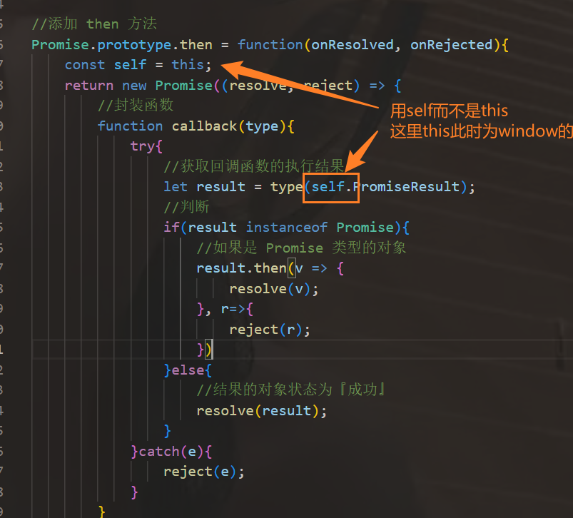

**index.html**

```html
<!DOCTYPE html>
<html lang="en">
<head>
    <meta charset="UTF-8">
    <meta name="viewport" content="width=device-width, initial-scale=1.0">
    <title>Promise-封装 | 10 - 异步任务 then 返回结果</title>
    <script src="./promise.js"></script>
</head>
<body>
    <script>
        //实例化对象
        let p = new Promise((resolve, reject) => {
            setTimeout(() => {
                resolve('ok');
                // reject('Error');
            }, 100);
        });

        //执行 then 方法
        const res = p.then(value => {
            console.log(value);
        }, reason=>{
            console.warn(reason);
        });

        console.log(res);
    </script>
</body>
</html>
```

**promise.js**

```js
//声明构造函数
function Promise(executor){
    //添加属性
    this.PromiseState = 'pending';
    this.PromiseResult = null;
    //声明属性
    this.callbacks = [];
    //保存实例对象的 this 的值
    const self = this;// self _this that
    //resolve 函数
    function resolve(data){
        //判断状态
        if(self.PromiseState !== 'pending') return;
        //1. 修改对象的状态 (promiseState)
        self.PromiseState = 'fulfilled';// resolved
        //2. 设置对象结果值 (promiseResult)
        self.PromiseResult = data;
        //调用成功的回调函数
        self.callbacks.forEach(item => {
            item.onResolved(data);
        });
    }
    //reject 函数
    function reject(data){
        //判断状态
        if(self.PromiseState !== 'pending') return;
        //1. 修改对象的状态 (promiseState)
        self.PromiseState = 'rejected';// 
        //2. 设置对象结果值 (promiseResult)
        self.PromiseResult = data;
        //执行失败的回调
        self.callbacks.forEach(item => {
            item.onRejected(data);
        });
    }
    try{
        //同步调用『执行器函数』
        executor(resolve, reject);
    }catch(e){
        //修改 promise 对象状态为『失败』
        reject(e);
    }
}

//添加 then 方法
Promise.prototype.then = function(onResolved, onRejected){
    const self = this;
    return new Promise((resolve, reject) => {
        //封装函数
        function callback(type){
            try{
                //获取回调函数的执行结果
                let result = type(self.PromiseResult);
                //判断
                if(result instanceof Promise){
                    //如果是 Promise 类型的对象
                    result.then(v => {
                        resolve(v);
                    }, r=>{
                        reject(r);
                    })
                }else{
                    //结果的对象状态为『成功』
                    resolve(result);
                }
            }catch(e){
                reject(e);
            }
        }
        //调用回调函数  PromiseState
        if(this.PromiseState === 'fulfilled'){
            callback(onResolved);
        }
        if(this.PromiseState === 'rejected'){
            callback(onRejected);
        }
        //判断 pending 状态
        if(this.PromiseState === 'pending'){
            //保存回调函数
            this.callbacks.push({
                onResolved: function(){
                    callback(onResolved);
                },
                onRejected: function(){
                    callback(onRejected);
                }
            });
        }
    })
}
```

​	

# 36 Promise自定义封装-catch方法-异常穿透与值传递

难

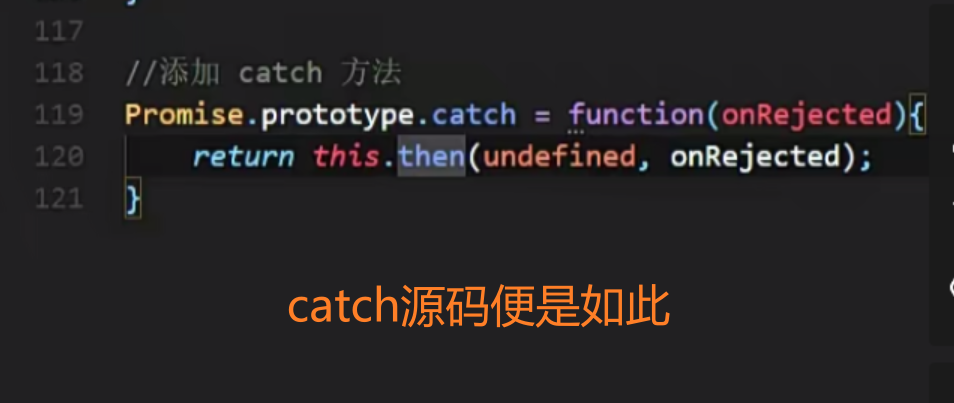

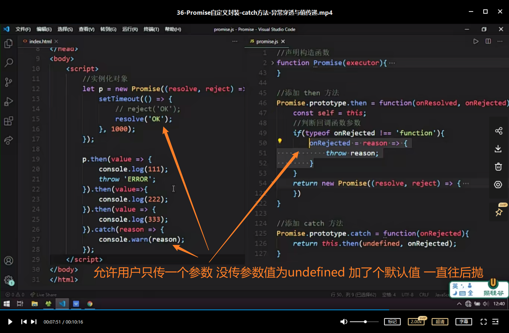

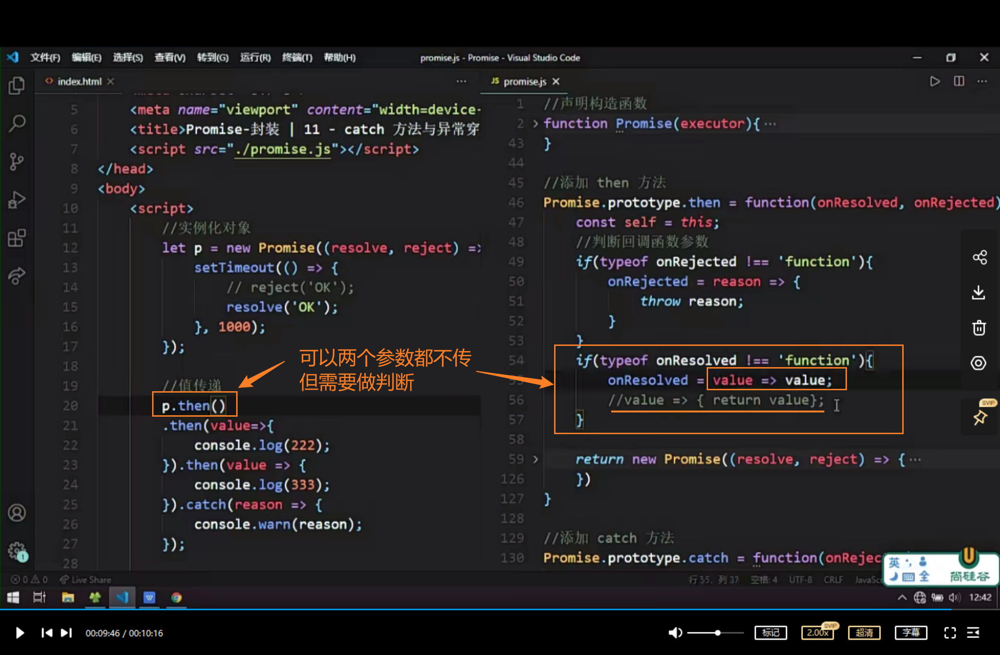

​	

**index.html**

```html
<!DOCTYPE html>
<html lang="en">
<head>
    <meta charset="UTF-8">
    <meta name="viewport" content="width=device-width, initial-scale=1.0">
    <title>Promise-封装 | 11 - catch 方法与异常穿透</title>
    <script src="./promise.js"></script>
</head>
<body>
    <script>
        //实例化对象
        let p = new Promise((resolve, reject) => {
            setTimeout(() => {
                // reject('OK');
                resolve('OK');
            }, 1000);
        });

        //值传递
        p.then()
        .then(value=>{
            console.log(222);
        }).then(value => {
            console.log(333);
        }).catch(reason => {
            console.warn(reason);
        });


    </script>
</body>
</html>
```

**promise.js**

```js
//声明构造函数
function Promise(executor){
    //添加属性
    this.PromiseState = 'pending';
    this.PromiseResult = null;
    //声明属性
    this.callbacks = [];
    //保存实例对象的 this 的值
    const self = this;// self _this that
    //resolve 函数
    function resolve(data){
        //判断状态
        if(self.PromiseState !== 'pending') return;
        //1. 修改对象的状态 (promiseState)
        self.PromiseState = 'fulfilled';// resolved
        //2. 设置对象结果值 (promiseResult)
        self.PromiseResult = data;
        //调用成功的回调函数
        self.callbacks.forEach(item => {
            item.onResolved(data);
        });
    }
    //reject 函数
    function reject(data){
        //判断状态
        if(self.PromiseState !== 'pending') return;
        //1. 修改对象的状态 (promiseState)
        self.PromiseState = 'rejected';// 
        //2. 设置对象结果值 (promiseResult)
        self.PromiseResult = data;
        //执行失败的回调
        self.callbacks.forEach(item => {
            item.onRejected(data); //如果then/catch没传参数的话 值为undefined 不是一个函数 所以执行不了 但不传不代表没有 内置的promise就过得去 我们要自己补充
        });
    }
    try{
        //同步调用『执行器函数』
        executor(resolve, reject);
    }catch(e){
        //修改 promise 对象状态为『失败』
        reject(e);
    }
}

//添加 then 方法
Promise.prototype.then = function(onResolved, onRejected){
    const self = this;
    //判断回调函数参数
    if(typeof onRejected !== 'function'){ //没传参数相当于加了这样的一个回调 给你throw抛出来进入下一个
        onRejected = reason => {
            throw reason;
        }
    }
    if(typeof onResolved !== 'function'){ //要有onResolved也传一个 因为如果then两个参数都没传的话  第一个参数就不是函数 变为undefined了 执行不了 我们要默认没传参给它自动创建一个函数
        onResolved = value => value; //es6写法
        //value => { return value};
    }
    return new Promise((resolve, reject) => {
        //封装函数
        function callback(type){
            try{
                //获取回调函数的执行结果
                let result = type(self.PromiseResult);
                //判断
                if(result instanceof Promise){
                    //如果是 Promise 类型的对象
                    result.then(v => {
                        resolve(v);
                    }, r=>{
                        reject(r);
                    })
                }else{
                    //结果的对象状态为『成功』
                    resolve(result);
                }
            }catch(e){
                reject(e);
            }
        }
        //调用回调函数  PromiseState
        if(this.PromiseState === 'fulfilled'){
            callback(onResolved);
        }
        if(this.PromiseState === 'rejected'){
            callback(onRejected);
        }
        //判断 pending 状态
        if(this.PromiseState === 'pending'){
            //保存回调函数
            this.callbacks.push({
                onResolved: function(){
                    callback(onResolved);
                },
                onRejected: function(){
                    callback(onRejected);
                }
            });
        }
    })
}

//添加 catch 方法
Promise.prototype.catch = function(onRejected){
    return this.then(undefined, onRejected);
}
```

​	

# 37 Promise自定义封装 resolve方法封装

**index.html**

```html
<!DOCTYPE html>
<html lang="en">
<head>
    <meta charset="UTF-8">
    <meta name="viewport" content="width=device-width, initial-scale=1.0">
    <title>Promise-封装 | 12 - Promise.resolve 封装</title>
    <script src="./promise.js"></script>
</head>
<body>
    <script>
        const p = Promise.resolve('OK');
        const p2 = Promise.resolve(new Promise((resolve, reject) => {
            // resolve('Success');
            reject("error");
        }));
        const p3 = Promise.resolve(Promise.resolve('Oh Yeah'));

        console.log(p3);
    </script>
</body>
</html>
```

**promise.js**

```js
//添加 resolve 方法
Promise.resolve = function(value){
    //返回promise对象
    return new Promise((resolve, reject) => {
        if(value instanceof Promise){
            value.then(v=>{
                resolve(v);
            }, r=>{
                reject(r);
            })
        }else{
            //状态设置为成功
            resolve(value);
        }
    });
}
```

​	

# 38 Promise自定义封装-reject方法封装

reject返回的就是失败的Promise对象 即使里面的是成功的resolve

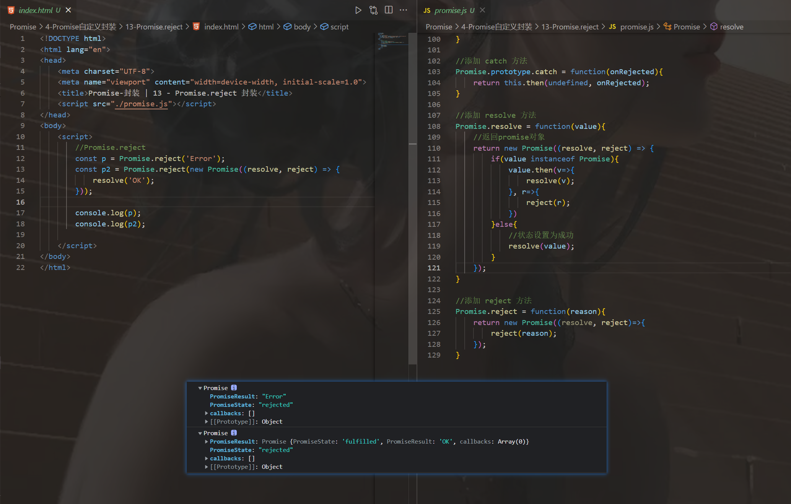

**index.html**

```html
<!DOCTYPE html>
<html lang="en">
<head>
    <meta charset="UTF-8">
    <meta name="viewport" content="width=device-width, initial-scale=1.0">
    <title>Promise-封装 | 13 - Promise.reject 封装</title>
    <script src="./promise.js"></script>
</head>
<body>
    <script>
        //Promise.reject
        const p = Promise.reject('Error');
        const p2 = Promise.reject(new Promise((resolve, reject) => {
            resolve('OK');
        }));

        console.log(p);
        console.log(p2);

    </script>
</body>
</html>
```

**promise.js**

```js
//添加 reject 方法
Promise.reject = function(reason){
    return new Promise((resolve, reject)=>{
        reject(reason);
    });
}
```

​	

# 39 Promise自定义封装-all方法封装

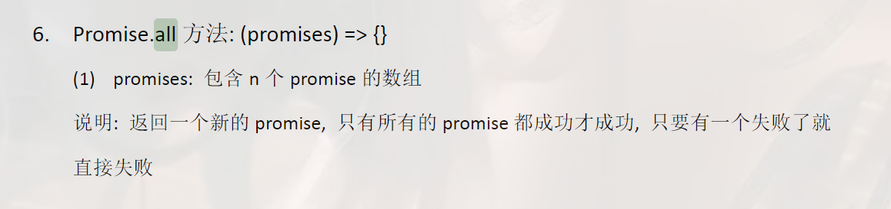

全部都成功的话 返回的是所有promise对象的值 用一个数组承接 

失败的话返回的是失败的结果值 只返回一个失败值 如果有2个及以上是reject的 只返回最先执行的那一个

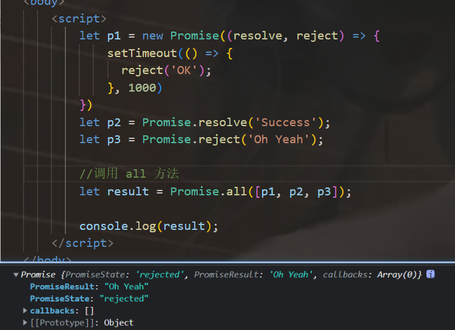

**index.html**

```html
<!DOCTYPE html>
<html lang="en">
<head>
    <meta charset="UTF-8">
    <meta name="viewport" content="width=device-width, initial-scale=1.0">
    <title>Promise-封装 | 14 - Promise.all 封装</title>
    <script src="./promise.js"></script>
</head>
<body>
    <script>
        let p1 = new Promise((resolve, reject) => {
            setTimeout(() => {
              reject('OK');
            }, 1000)
        })
        let p2 = Promise.resolve('Success');
        let p3 = Promise.reject('Oh Yeah');

        //调用 all 方法
        let result = Promise.all([p1, p2, p3]);

        console.log(result);
    </script>
</body>
</html>
```
**promise.js**

```js
//添加 all 方法
Promise.all = function(promises){
    //返回结果为promise对象
    return new Promise((resolve, reject) => {
        //声明变量
        let count = 0;
        let arr = [];
        //遍历
        for(let i=0;i<promises.length;i++){
            //
            promises[i].then(v => {
                //得知对象的状态是成功
                //每个promise对象 都成功
                count++;
                //将当前promise对象成功的结果 存入到数组中
                arr[i] = v; //这里我们如果要顺序输出结果值 用arr.push不妥因为他们执行的顺序不一定是从上到下（同步异步）所以我们用索引给他们排位置是最合适的
                //判断
                if(count === promises.length){
                    //修改状态
                    resolve(arr);
                }
            }, r => {
                reject(r);
            });
        }
    });
}
```

​	

# 40 Promise自定义封装-race方法封装

在第一遍for循环直接遍历输出就行 谁第一个执行由系统自己决定

**index.html**

```html
<!DOCTYPE html>
<html lang="en">
<head>
    <meta charset="UTF-8">
    <meta name="viewport" content="width=device-width, initial-scale=1.0">
    <title>Promise-封装 | 15 - Promise.race 封装</title>
    <script src="./promise.js"></script>
</head>
<body>
    <script>
        let p1 = new Promise((resolve, reject) => {
            setTimeout(() => {
                resolve('OK');
            });
        });
        let p2 = Promise.reject('Success');
        let p3 = Promise.resolve('Oh Yeah');

        //调用 race 方法
        let result = Promise.race([p1, p2, p3]);

        console.log(result);
    </script>
</body>
</html>
```

**promise.js**

```js
//添加 race 方法
Promise.race = function(promises){
    return new Promise((resolve, reject) => {
        for(let i=0;i<promises.length;i++){
            promises[i].then(v => {
                //修改返回对象的状态为 『成功』
                resolve(v);
            },r=>{
                //修改返回对象的状态为 『失败』
                reject(r);
            })
        }
    });
}
```

​	

# 41 Promise自定义封装-then方法回调的异步执行

这节来实现一个细节

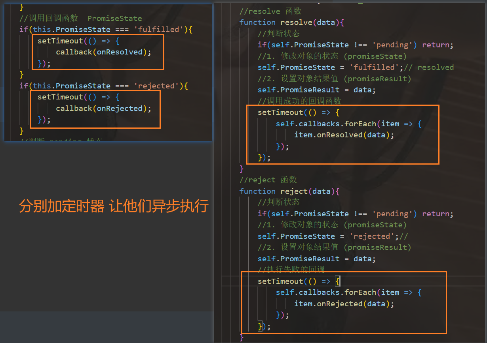

有些方法需要加static，例如：

> // resolve不属于实例对象 它属于Promise类 要加static

​	

**index.html**

```html
<!DOCTYPE html>
<html lang="en">
<head>
    <meta charset="UTF-8">
    <meta name="viewport" content="width=device-width, initial-scale=1.0">
    <title>Promise-封装 | 16 - 回调函数『异步执行』</title>
    <script src="./promise.js"></script>
</head>
<body>
    <script>
        let p1 = new Promise((resolve, reject) => {
            reject('OK');
            console.log(111);
        });

        // then里面的代码是异步执行 得等同步代码全部执行完毕后它才能去执行
        p1.then(value => {
            console.log(222);
        }, reason => {
            console.log(444);
        });

        console.log(333);
    </script>
</body>
</html>
```

**promise.js**

```js
//声明构造函数
function Promise(executor){
    //添加属性
    this.PromiseState = 'pending';
    this.PromiseResult = null;
    //声明属性
    this.callbacks = [];
    //保存实例对象的 this 的值
    const self = this;// self _this that
    //resolve 函数
    function resolve(data){
        //判断状态
        if(self.PromiseState !== 'pending') return;
        //1. 修改对象的状态 (promiseState)
        self.PromiseState = 'fulfilled';// resolved
        //2. 设置对象结果值 (promiseResult)
        self.PromiseResult = data;
        //调用成功的回调函数
        setTimeout(() => {
            self.callbacks.forEach(item => {
                item.onResolved(data);
            });
        });
    }
    //reject 函数
    function reject(data){
        //判断状态
        if(self.PromiseState !== 'pending') return;
        //1. 修改对象的状态 (promiseState)
        self.PromiseState = 'rejected';// 
        //2. 设置对象结果值 (promiseResult)
        self.PromiseResult = data;
        //执行失败的回调
        setTimeout(() => {
            self.callbacks.forEach(item => {
                item.onRejected(data);
            });
        });
    }
    try{
        //同步调用『执行器函数』
        executor(resolve, reject);
    }catch(e){
        //修改 promise 对象状态为『失败』
        reject(e);
    }
}

//添加 then 方法
Promise.prototype.then = function(onResolved, onRejected){
    const self = this;
    //判断回调函数参数
    if(typeof onRejected !== 'function'){
        onRejected = reason => {
            throw reason;
        }
    }
    if(typeof onResolved !== 'function'){
        onResolved = value => value;
        //value => { return value};
    }
    return new Promise((resolve, reject) => {
        //封装函数
        function callback(type){
            try{
                //获取回调函数的执行结果
                let result = type(self.PromiseResult);
                //判断
                if(result instanceof Promise){
                    //如果是 Promise 类型的对象
                    result.then(v => {
                        resolve(v);
                    }, r=>{
                        reject(r);
                    })
                }else{
                    //结果的对象状态为『成功』
                    resolve(result);
                }
            }catch(e){
                reject(e);
            }
        }
        //调用回调函数  PromiseState
        if(this.PromiseState === 'fulfilled'){
            setTimeout(() => {
                callback(onResolved);
            });
        }
        if(this.PromiseState === 'rejected'){
            setTimeout(() => {
                callback(onRejected);
            });
        }
        //判断 pending 状态
        if(this.PromiseState === 'pending'){
            //保存回调函数
            this.callbacks.push({
                onResolved: function(){
                    callback(onResolved);
                },
                onRejected: function(){
                    callback(onRejected);
                }
            });
        }
    })
}

//添加 catch 方法
Promise.prototype.catch = function(onRejected){
    return this.then(undefined, onRejected);
}

//添加 resolve 方法
Promise.resolve = function(value){
    //返回promise对象
    return new Promise((resolve, reject) => {
        if(value instanceof Promise){
            value.then(v=>{
                resolve(v);
            }, r=>{
                reject(r);
            })
        }else{
            //状态设置为成功
            resolve(value);
        }
    });
}

//添加 reject 方法
Promise.reject = function(reason){
    return new Promise((resolve, reject)=>{
        reject(reason);
    });
}

//添加 all 方法
Promise.all = function(promises){
    //返回结果为promise对象
    return new Promise((resolve, reject) => {
        //声明变量
        let count = 0;
        let arr = [];
        //遍历
        for(let i=0;i<promises.length;i++){
            //
            promises[i].then(v => {
                //得知对象的状态是成功
                //每个promise对象 都成功
                count++;
                //将当前promise对象成功的结果 存入到数组中
                arr[i] = v;
                //判断
                if(count === promises.length){
                    //修改状态
                    resolve(arr);
                }
            }, r => {
                reject(r);
            });
        }
    });
}

//添加 race 方法
Promise.race = function(promises){
    return new Promise((resolve, reject) => {
        for(let i=0;i<promises.length;i++){
            promises[i].then(v => {
                //修改返回对象的状态为 『成功』
                resolve(v);
            },r=>{
                //修改返回对象的状态为 『失败』
                reject(r);
            })
        }
    });
}
```

​	

# 42 Promise自定义封装-class版本的实现

我们通过以上章节已经全部做完了其功能 现在我们要把它封装成类

**index.html**

```html
<!DOCTYPE html>
<html lang="en">
<head>
    <meta charset="UTF-8">
    <meta name="viewport" content="width=device-width, initial-scale=1.0">
    <title>Promise-封装 | 17 - class版本封装</title>
    <script src="./promise.js"></script>
</head>
<body>
    <script>
        // let p1 = new Promise((resolve, reject) => {
        //     setTimeout(() => {
        //         // resolve("OK");
        //         reject("Eror");
        //     })
        // });

        // p1.then(value => {
        //     console.log(value);
        // }, reason => {
        //     console.warn(reason);
        // });

        console.log(Promise.resolve('OK'));
    </script>
</body>
</html>
```

**promise.js**

```js

class Promise{
    //构造方法
    constructor(executor){
        //添加属性
        this.PromiseState = 'pending';
        this.PromiseResult = null;
        //声明属性
        this.callbacks = [];
        //保存实例对象的 this 的值
        const self = this;// self _this that
        //resolve 函数
        function resolve(data){
            //判断状态
            if(self.PromiseState !== 'pending') return;
            //1. 修改对象的状态 (promiseState)
            self.PromiseState = 'fulfilled';// resolved
            //2. 设置对象结果值 (promiseResult)
            self.PromiseResult = data;
            //调用成功的回调函数
            setTimeout(() => {
                self.callbacks.forEach(item => {
                    item.onResolved(data);
                });
            });
        }
        //reject 函数
        function reject(data){
            //判断状态
            if(self.PromiseState !== 'pending') return;
            //1. 修改对象的状态 (promiseState)
            self.PromiseState = 'rejected';// 
            //2. 设置对象结果值 (promiseResult)
            self.PromiseResult = data;
            //执行失败的回调
            setTimeout(() => {
                self.callbacks.forEach(item => {
                    item.onRejected(data);
                });
            });
        }
        try{
            //同步调用『执行器函数』
            executor(resolve, reject);
        }catch(e){
            //修改 promise 对象状态为『失败』
            reject(e);
        }
    }

    //then 方法封装
    then(onResolved,onRejected){
        const self = this;
        //判断回调函数参数
        if(typeof onRejected !== 'function'){
            onRejected = reason => {
                throw reason;
            }
        }
        if(typeof onResolved !== 'function'){
            onResolved = value => value;
            //value => { return value};
        }
        return new Promise((resolve, reject) => {
            //封装函数
            function callback(type){
                try{
                    //获取回调函数的执行结果
                    let result = type(self.PromiseResult);
                    //判断
                    if(result instanceof Promise){
                        //如果是 Promise 类型的对象
                        result.then(v => {
                            resolve(v);
                        }, r=>{
                            reject(r);
                        })
                    }else{
                        //结果的对象状态为『成功』
                        resolve(result);
                    }
                }catch(e){
                    reject(e);
                }
            }
            //调用回调函数  PromiseState
            if(this.PromiseState === 'fulfilled'){
                setTimeout(() => {
                    callback(onResolved);
                });
            }
            if(this.PromiseState === 'rejected'){
                setTimeout(() => {
                    callback(onRejected);
                });
            }
            //判断 pending 状态
            if(this.PromiseState === 'pending'){
                //保存回调函数
                this.callbacks.push({
                    onResolved: function(){
                        callback(onResolved);
                    },
                    onRejected: function(){
                        callback(onRejected);
                    }
                });
            }
        })
    }

    //catch 方法
    catch(onRejected){
        return this.then(undefined, onRejected);
    }

    // resolve不属于实例对象 它属于Promise类 要加static
    //添加 resolve 方法
    static resolve(value){
        //返回promise对象
        return new Promise((resolve, reject) => {
            if(value instanceof Promise){
                value.then(v=>{
                    resolve(v);
                }, r=>{
                    reject(r);
                })
            }else{
                //状态设置为成功
                resolve(value);
            }
        });
    }

    //添加 reject 方法
    static reject(reason){
        return new Promise((resolve, reject)=>{
            reject(reason);
        });
    }

    //添加 all 方法
    static all(promises){
        //返回结果为promise对象
        return new Promise((resolve, reject) => {
            //声明变量
            let count = 0;
            let arr = [];
            //遍历
            for(let i=0;i<promises.length;i++){
                //
                promises[i].then(v => {
                    //得知对象的状态是成功
                    //每个promise对象 都成功
                    count++;
                    //将当前promise对象成功的结果 存入到数组中
                    arr[i] = v;
                    //判断
                    if(count === promises.length){
                        //修改状态
                        resolve(arr);
                    }
                }, r => {
                    reject(r);
                });
            }
        });
    }

    //添加 race 方法
    static race (promises){
        return new Promise((resolve, reject) => {
            for(let i=0;i<promises.length;i++){
                promises[i].then(v => {
                    //修改返回对象的状态为 『成功』
                    resolve(v);
                },r=>{
                    //修改返回对象的状态为 『失败』
                    reject(r);
                })
            }
        });
    }
}   

```

​	

# 43 async函数

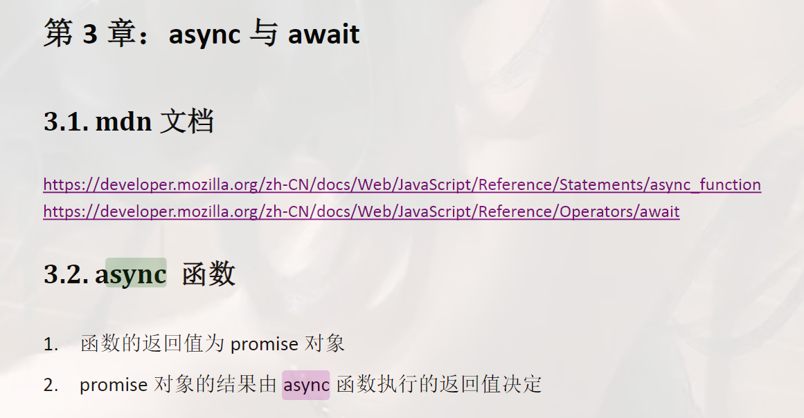

**1-async.html**

```html
<!DOCTYPE html>
<html lang="en">
<head>
  <meta charset="UTF-8">
  <meta http-equiv="X-UA-Compatible" content="IE=edge">
  <meta name="viewport" content="width=device-width, initial-scale=1.0">
  <title>async函数</title>
</head>
<body>
  <script>
    //跟then实现效果一样
    async function main(){
      // 1.如果返回值是一个非Promise类型的数据
      // return 521;
      // 2.如果返回的是一个Promise对象
      // return new Promise((resolve,reject)=>{
        // resolve('OK');
        // reject('Error');
      // });
      throw 'Oh No';
    }

    let result = main();

    console.log(result);
  </script>
</body>
</html>
```

​	

# 44 await表达式

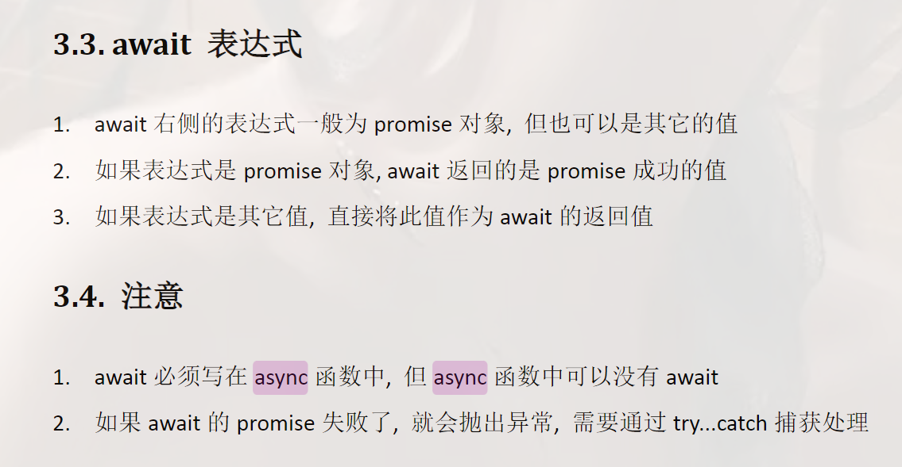

**2-await.html**

```html
<!DOCTYPE html>
<html lang="en">
<head>
  <meta charset="UTF-8">
  <meta http-equiv="X-UA-Compatible" content="IE=edge">
  <meta name="viewport" content="width=device-width, initial-scale=1.0">
  <title>await</title>
</head>
<body>
  <script>
    async function main(){
      let p = new Promise((resolve,reject)=>{
        // resolve('OK');
        reject('Error');
      })
      // 1.右侧为promise的情况
      // let res = await p;
      // console.log(res);
      // 2.右侧为其他类型的情况
      // let res2 = await 20;
      // console.log(res2);
      // 3.如果promise是失败的状态
      try{
        let res3 = await p;
      }catch(e){
        console.log(e);
      }
    }

    main();

  </script>
</body>
</html>
```

​	

# 45 async与await结合实践

**3-async与await结合.js**

```js
/**
 * resource 1.html 2.html 3.html 文件内容
 */

const fs = require('fs');
const util = require('util');
const mineReadFile = util.promisify(fs.readFile);

// 回调函数的方式
// fs.readFile('./resource/1.html', (err, data1)=>{
//   if(err) throw err;
//   fs.readFile('./resource/2.html', (err, data2)=>{
//     if(err) throw err;
//     fs.readFile('./resource/3.html', (err, data3)=>{
//       if(err) throw err;
//       console.log(data1 + data2 + data3);
//     })
//   })
// })

// async 与 await (看不到回调函数 像写同步函数一般 但内部执行的异步的)
async function main(){
  try{
      // 读取第一个文件的内容
      let data1 = await mineReadFile('./resource/1.html');
      let data2 = await mineReadFile('./resource/2.html');
      let data3 = await mineReadFile('./resource/3.html');
      console.log(data1 + data2 + data3);
  }catch(e){
    // console.log(e);
    console.log(e.code);
  }
}

main();

```

**运行截图**

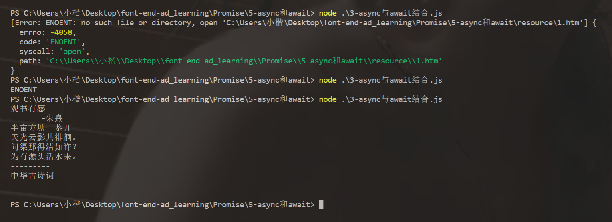

​	

# 46 async与await结合发送AJAX请求

我们通过代码可以发现 有了async和await以后 获取数据是特别方便的 书写方式也非常简单 没有任何回调函数

**4-async与await结合.html**

```html
<!DOCTYPE html>
<html lang="en">
<head>
    <meta charset="UTF-8">
    <meta name="viewport" content="width=device-width, initial-scale=1.0">
    <title>async与await结合发送AJAX</title>
</head>
<body>
    <button id="btn">点击获取段子</button>
    <script>
        //axios 这个函数也不用封装 有现成的工具库axios调用 它就是基于promise操作方式的一个axios封装的包 我们拿过来直接去发送axios 前边放一个await就可以非常轻松拿到结果
        function sendAJAX(url){
            return new Promise((resolve, reject) => {
                const xhr = new XMLHttpRequest();
                xhr.responseType = 'json';
                xhr.open("GET", url);
                xhr.send();
                //处理结果
                xhr.onreadystatechange = function(){
                    if(xhr.readyState === 4){
                        //判断成功
                        if(xhr.status >= 200 && xhr.status < 300){
                            //成功的结果
                            resolve(xhr.response);
                        }else{
                            reject(xhr.status);
                        }
                    }
                }
            });
        }

        //段子接口地址 https://api.apiopen.top/getJoke
        let btn = document.querySelector('#btn');

        btn.addEventListener('click',async function(){
            //获取段子信息
            let duanzi = await sendAJAX('https://api.apiopen.top/getJoke');
            console.log(duanzi);
        });
    </script>
</body>
</html>
```

​	

> 完结撒花❀
