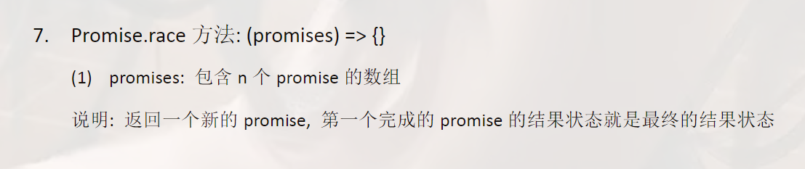

# 01-Promise视频简介

Promise是es6进行异步编程的新解决方案 从语法来说 它是一个构造函数 可以封装异步的任务 对结果进行处理 Promise最大的好处是解决回调递的问题 并且它在指定回调与进行错误处理这块 要更加灵活与方便 而且Promise在现在项目中 不过是Web还是app都应用得十分广泛 无论前端还是后端 都有Promise的身影


第三的关键问题是我们封装的基础

第五的async与await是我们异步的终极解决方案 它俩完全摒弃了回调函数

​	

# 02 Promise介绍


异步编程

- fs 文件操作 fs是node.js下边的模块可以对计算机的磁盘进行读写操作

- Mongodb数据库操作
- AJAX 网络请求
- 定时器 例如setTimeout也是一个异步编程

Promise之前都是纯回调函数进行处理


【面试考点】Promise支持链式调用 可以解决回调地狱问题


一个回调函数套着另外一个异步任务 无限套娃


Promise是构造函数 可以实例化对象封装异步操作 获取成功和失败的结果 其优势是支持链式调用 可以解决回调地狱问题

Promise可以包裹一个异步操作

​	

# 03 Promise初体验（1）

# 04 Promise初体验（2）

增加了传参打印随机生成抽奖数 传给 .then() 作为resolve/reject

**1-初体验.html**

```html
<!doctype html>
<html lang="en">
<head>
    <meta charset="UTF-8">
    <title>基本使用</title>
    <link crossorigin='anonymous' href="https://cdn.bootcss.com/twitter-bootstrap/3.3.7/css/bootstrap.min.css" rel="stylesheet">
</head>
<body>
    <div class="container">
        <h2 class="page-header">Promise 初体验</h2>
        <button class="btn btn-primary" id="btn">点击抽奖</button>
    </div>
    <script>
        //生成随机数
        function rand(m,n){
            return Math.ceil(Math.random() * (n-m+1)) + m-1;
        }
        /**
            点击按钮,  1s 后显示是否中奖(30%概率中奖)
                若中奖弹出    恭喜恭喜, 奖品为 10万 RMB 劳斯莱斯优惠券
                若未中奖弹出  再接再厉
        */
        //获取元素对象
        const btn = document.querySelector('#btn');
        //绑定单击事件
        btn.addEventListener('click', function(){
            //定时器
            // setTimeout(() => {
            //     //30%  1-100  1 2 30
            //     //获取从1 - 100的一个随机数
            //     let n = rand(1, 100);
            //     //判断
            //     if(n <= 30){
            //         alert('恭喜恭喜, 奖品为 10万 RMB 劳斯莱斯优惠券');
            //     }else{
            //         alert('再接再厉');
            //     }
            // }, 1000);

            //Promise 形式实现
            // resolve 解决  函数类型的数据
            // reject  拒绝  函数类型的数据
            const p = new Promise((resolve, reject) => { //Promise实例化对象需要接收参数 这个参数是一个函数类型的值 而且函数还有两个形参 叫resolve和reject 当然你写a和b也行 潜规则叫resolve和reject
                setTimeout(() => {
                    //30%  1-100  1 2 30
                    //获取从1 - 100的一个随机数
                    let n = rand(1, 100);
                    //判断
                    if(n <= 30){
                        resolve(n); // 将 promise 对象的状态设置为 『成功』
                    }else{
                        reject(n); // 将 promise 对象的状态设置为 『失败』
                    }
                }, 1000);
            });

            console.log(p);
            //调用 then 方法 执行时会接收两个【函数参数】 第一个函数参数对象是对象成功时的回调，第二个是对象失败时的回调
            // value 值
            // reason 理由
            // 写value和reason也是潜规则 你写a和b也没问题
            p.then((value) => {
                alert('恭喜恭喜, 奖品为 10万 RMB 劳斯莱斯优惠券, 您的中奖数字为 ' + value);
            }, (reason) => {
                alert('再接再厉, 您的号码为 ' + reason);
            });

        });

    </script>
</body>

</html>
```

​	

# 05 Promise实践练习-fs读取文件

用Promise的好处就是你可以先写Promise的事件处理逻辑 写完再在下面写事件处理内容

**2-Promise实践练习-fs模块.js**

```js
//
const fs = require('fs');

//回调函数的形式 没有带Promise的形式
// fs.readFile('./resource/content.txt',(err,data)=>{
//   // 如果出错 则抛出错误
//   if(err) throw err;
//   //没有错误 输出文件内容
//   // console.log(data); // 只输出Buffer流
//   console.log(data.toString()); //将Buffer流转成字符串
// });

//Promise形式
let p = new Promise((resolve,reject) => {
  fs.readFile('./resource/content.txt',(err,data)=>{
    //如果出错
    if(err) reject(err);
    //如果成功
    resolve(data);
  });
});

//调用 then 对结果进行处理
// 第一个函数参数为成功情况
// 第二个函数参数为失败情况
p.then(value=>{
  console.log(value.toString());
},reason=>{
  console.log(reason);
});
```

​	

# 06 Promise实践练习-AJAX请求

参考文章

[Http status:0 通常是什么原因引起的](https://www.publiccms.com/question/2020/03-26/509.html)

[【译】3种解决CORS错误的方式与Access-Control-Allow-Origin的作用原理](https://segmentfault.com/a/1190000022506474)

​	

**3-Promise实践练习-AJAX请求.html**

```HTML
<!DOCTYPE html>
<html lang="en">
<head>
    <meta charset="UTF-8">
    <!-- <meta name="viewport" content="width=device-width, initial-scale=1.0"> -->
    <title>Promise 封装 AJAX</title>
    <link crossorigin='anonymous' href="https://cdn.bootcss.com/twitter-bootstrap/3.3.7/css/bootstrap.min.css" rel="stylesheet">
</head>
<body>
    <div class="container">
        <h2 class="page-header">Promise 封装 AJAX 操作</h2>
        <button class="btn btn-primary" id="btn">点击发送 AJAX</button>
    </div>
    <script>
        //接口地址 https://api.apiopen.top/getJoke
        //获取元素对象
        const btn = document.querySelector('#btn');

        btn.addEventListener('click', function(){
            //创建 Promise
            const p = new Promise((resolve, reject) => {
                //1.创建对象
                const xhr = new XMLHttpRequest();
                //2. 初始化
                xhr.open('GET', 'https://cors-anywhere.herokuapp.com/https://api.apiopen.top/getJoke');
                //3. 发送
                xhr.send();
                //4. 处理响应结果
                xhr.onreadystatechange = function(){
                    if(xhr.readyState === 4){
                        //判断响应状态码 2xx   
                        if(xhr.status >= 200 && xhr.status < 300){
                            //控制台输出响应体
                            resolve(xhr.response); // xhr.response里面存的就是响应体
                        }else{
                            //控制台输出响应状态码
                            reject(xhr.status);
                        }
                    }
                }
            });
            //调用then方法
            p.then(value=>{
                console.log(value);
            }, reason=>{
                console.warn(reason); // warn颜色区分log
            });
        });
    </script>
</body>
</html>
```

​	

# 07 Promise封装fs读取文件操作


**4-Promise封装练习-fs模块.js**

```js
/**
 * 封装一个函数 mineReadFile 读取文件内容
 * 参数：path 文件路径
 * 返回：promise 对象
 */
function mineReadFile(path){
  return new Promise((resolve,reject)=>{
    //读取文件 这里用用一个来变量接收实例化对象比较好 这里懒了 没接收直接写
    require('fs').readFile(path,(err,data)=>{
      //判断
      if(err) reject(err);
      //成功
      resolve(data);
    })
  })
}

mineReadFile('./resource/content.txt') //then可以回车到下一行 可以的
.then(value=>{
  //输出文件内容
  console.log(value.toString());
},reason=>{
  console.log(reason);
}); // 直接跟.then 因为它返回的结果是一个promise对象

```

​	

# 08 util.promisify方法进行promise风格转化


也就是错误优先的回调

异步的API基本上回调函数都是error

​	

**5-util.promisify方法.js**

```js
/**
 * util.promisify 方法  (node.js内置的方法)
 * 也就是错误优先的回调
 */
//引入 util 模块
const util = require('util');
//引入 fs 模块
const fs = require('fs');
// 返回一个新的函数
let mineReadFile = util.promisify(fs.readFile);

mineReadFile('./resource/content.txt').then(value=>{
  console.log(value.toString());
})

/**
 * 对于以后使用promise 我们不需要每一个都手动封装 
 * 而是可以借助于util.promisify这个方法 将原来那种回调函数风格的方法转变成一个promise风格的函数
 * 这样使用起来会更加方便一些
 */

```

​	

# 09 Promise封装AJAX请求

**6-Promise封装练习.html**

```html
<!DOCTYPE html>
<html lang="en">
<head>
  <meta charset="UTF-8">
  <meta http-equiv="X-UA-Compatible" content="IE=edge">
  <meta name="viewport" content="width=device-width, initial-scale=1.0">
  <title>Promise封装AJAX操作</title>
</head>
<body>
  <script>
    /** 
     * 封装一个函数 sendAJAX 发送 GET AJAX请求
     * 参数 URL
     * 返回结果 Promise 对象
     */
    function sendAJAX(url){
      return new Promise((resolve,reject)=>{
        const xhr = new XMLHttpRequest();
        xhr.responseType = 'json'; // 格式是可以调整的
        xhr.open("GET",url);
        xhr.send();
        //处理结果
        xhr.onreadystatechange = function(){
          if(xhr.readyState === 4){ // readyState为4是所有结果都返回时的这么一个状态
            //判断成功 状态码为2xx的时候为成功
            if(xhr.status >= 200 && xhr.status < 300){
              // 成功的结果
              resolve(xhr.response);
            }else{
              reject(xhr.status);
            }
          }
        }
      })
    }

    // 这么一封装 AJAX请求也变得简单起来
    sendAJAX('https://api.apiopen.top/getJoke')
    .then(value=>{
      console.log(value);
    }, reason=>{
      console.warn(reason);
    });
  </script>
</body>
</html>
```

​	

# 10 promise对象状态属性介绍

【重点】

状态是promise实例对象当中的一个属性 它叫做promiseStatus

pending 待定的


它不可能由成功变为失败也不可以从失败变为成功 且状态只能改变一次


promiseStatus是内置的我们不能直接去对这个属性做操作

​	

# 11 promise对象结果值属性介绍

【重点】属性：promiseResult


resolve和reject可以对promiseResult的值进行赋值和修改 别人是不可以的

promiseResult保存的是我们异步任务成功或失败的结果


​	

# 12 Promise工作流程


then()方法返回的也是一个promise对象 后面会讲

​	

# 13 Promise的API-构造函数-then-catch

需要接收一个函数参数 可以使用箭头函数去声明 也可以使用匿名函数去申请


catch只能指定失败的回调

**7-Promise的API-1.html**

```html
<!DOCTYPE html>
<html lang="en">
<head>
  <meta charset="UTF-8">
  <meta http-equiv="X-UA-Compatible" content="IE=edge">
  <meta name="viewport" content="width=device-width, initial-scale=1.0">
  <title>Document</title>
</head>
<body>
  <script>
    //
    let p = new Promise((resolve,reject)=>{
      //同步调用
      // console.log(111);
      // 修改 promise 对象的状态
      reject('error');
    });

    // console.log(222);

    //执行 catch 方法
    p.catch(reason=>{
      console.log(reason);
    });
  </script>
</body>
</html>
```

​	

# 14 Promise.resolve方法

resolve相较于then和catch来说不太一样，它是属于Promise函数对象的 它并不属于实例对象 能快速封装一个值 转换成Promise对象


**8-Promise的API-resolve.html**

```html
<!DOCTYPE html>
<html lang="en">
<head>
  <meta charset="UTF-8">
  <meta http-equiv="X-UA-Compatible" content="IE=edge">
  <meta name="viewport" content="width=device-width, initial-scale=1.0">
  <title>Promise API - resolve</title>
</head>
<body>
  <script>
    //
    let p1 = Promise.resolve(521);
    /** 
     * 如果传入的参数为 非Promise类型的对象 则返回的结果为成功promise对象
     * 如果传入的参数为 Promise对象 则参数的结果（也就是这个Promise参数对象的结果）决定了外层 resolve 的结果
    */
   let p2 = Promise.resolve(new Promise((resolve, reject)=>{
    // resolve('OK');
    reject('Error');
   }));
    console.log(p2);
    //如果是resolve则不用then或catch来处理 但如果是reject则必须要有 回调处理error 否则控制台会报错
    p2.catch(reason=>{
    });
  </script>
</body>
</html>
```

​	

# 15 Promise.reject方法

> resolve产出的Promise对象可以是成功的也可以是失败的 但reject产出的一定是失败的

**9-Promise的API-reject.html**

```html
<!DOCTYPE html>
<html lang="en">
<head>
  <meta charset="UTF-8">
  <meta http-equiv="X-UA-Compatible" content="IE=edge">
  <meta name="viewport" content="width=device-width, initial-scale=1.0">
  <title>Promise API - reject</title>
</head>
<body>
  <script>
    //
    // let p = Promise.reject(521);
    // let p2 = Promise.reject('I Love U');
    // console.log(p);
    // console.log(p2);

    let p3 = Promise.reject(new Promise((resolve, reject)=>{ // 匿名函数
      resolve('OK');
    }));

    console.log(p3);
    p3.catch(reason=>{
      reason.then(value=>{
        console.log(value); // OK  嵌套Promise获取里面的值 因为嵌套里的Promise是resolve 所以用value 而不是reason
      })
      console.log(reason); // 返回一个Promise对象
    })
  </script>
</body>
</html>
```

​	

# 16 Promise.all方法


**10-Promise的API-all.html**

```html
<!DOCTYPE html>
<html lang="en">
<head>
  <meta charset="UTF-8">
  <meta http-equiv="X-UA-Compatible" content="IE=edge">
  <meta name="viewport" content="width=device-width, initial-scale=1.0">
  <title>Promise API - all</title>
</head>
<body>
  <script>
    let p1 = new Promise((resolve,reject)=>{
      resolve('OK');
    })
    // let p2 = Promise.resolve('success');
    let p2 = Promise.reject('Error');
    let p3 = Promise.resolve('Oh yeah!');

    //
    const result = Promise.all([p1,p2,p3]);
    console.log(result); //一个失败 all就都失败 且失败的结果值为那个失败Promise对象的结果值（也就是p2的结果值：Error）

  </script>
</body>
</html>
```

​	

# 17 Promise.race方法



race是竞赛 赛跑的意思

**11-Promise的API-race.html**

```html
<!DOCTYPE html>
<html lang="en">
<head>
  <meta charset="UTF-8">
  <meta http-equiv="X-UA-Compatible" content="IE=edge">
  <meta name="viewport" content="width=device-width, initial-scale=1.0">
  <title>Promise API - race</title>
</head>
<body>
  <script>
    let p1 = new Promise((resolve,reject)=>{
      setTimeout(()=>{
        resolve('OK');
      },1000);
    })
    let p2 = Promise.resolve('Success');
    let p3 = Promise.resolve('Oh yeah');

    //调用
    const result = Promise.race([p1,p2,p3]);

    console.log(result);
  </script>
</body>
</html>
```

​	

# 18 Promise关键问题-如何修改对象的状态

不了解关键问题我们写代码时可能会不完整或不完善

**1-状态修改.html**

```html
<!DOCTYPE html>
<html lang="en">
<head>
  <meta charset="UTF-8">
  <meta http-equiv="X-UA-Compatible" content="IE=edge">
  <meta name="viewport" content="width=device-width, initial-scale=1.0">
  <title>Promise关键问题 - Promise 对象状态改变的方式</title>
</head>
<body>
  <script>
    let p = new Promise((resolve,reject)=>{
      //1.resolve 函数
      // resolve('ok'); // pending => fulfilled(resolved)
      //2.reject 函数
      // reject('error'); // pending => rejected
      //3.抛出错误
      throw '出问题了'; //也可以改变Promise对象状态 pending => rejected
    })

    console.log(p);
  </script>
</body>
</html>
```

​	

# 19 Promise关键问题-能否执行多个回调


意思就是当Promise是A状态的时候 A状态的回调就都会调用

**2-能否执行多个回调.html**

```html
<!DOCTYPE html>
<html lang="en">
<head>
  <meta charset="UTF-8">
  <meta http-equiv="X-UA-Compatible" content="IE=edge">
  <meta name="viewport" content="width=device-width, initial-scale=1.0">
  <title>Promise关键问题 - Promise 指定多个回调</title>
</head>
<body>
  <script>
    let p = new Promise((resolve,reject)=>{
      // resolve('OK')
    })

    //指定回调 - 1
    p.then(value=>{
      console.log(value);
    })

    //指定回调 - 2
    p.then(value=>{
      alert(value);
    })
  </script>
</body>
</html>
```

​	

# 20 Promise关键问题-改变状态与指定回调的顺序问题


result指定promise状态先执行还是指定回调then/catch先执行？

同步任务时resolve比then先执行

异步任务时resolve比then后执行（例如加setTimeout包裹）

> 如果先指定的回调 那当状态发生改变时 回调函数就会调用 得到数据

​	

# 21 Promise关键问题-then方法返回结果由什么决定


**4-then方法的返回结果由什么决定.html**

```html
<!DOCTYPE html>
<html lang="en">
<head>
  <meta charset="UTF-8">
  <meta http-equiv="X-UA-Compatible" content="IE=edge">
  <meta name="viewport" content="width=device-width, initial-scale=1.0">
  <title>Promise关键问题 - Promise then方法的返回结果特点</title>
</head>
<body>
  <script>
    let p = new Promise((resolve,reject)=>{
      resolve('ok');
    });
    //执行 then 方法
    let result = p.then(value=>{
      // console.log(value);
      // 1.抛出错误
      // throw '出了问题';
      // 2.返回结果是 非Promise 类型的对象
      // return 521;
      // 3.返回结果是 Promise 对象
      return new Promise((resolve,reject)=>{
        // resolve('success');
        reject('error');
      })
    },reason=>{
      console.warn(reason);
    })

    console.log(result);
  </script>
</body>
</html>
```

​	

# 22 Promise关键问题-串联多个任务


原理就是then的返回结果也是一个promise对象