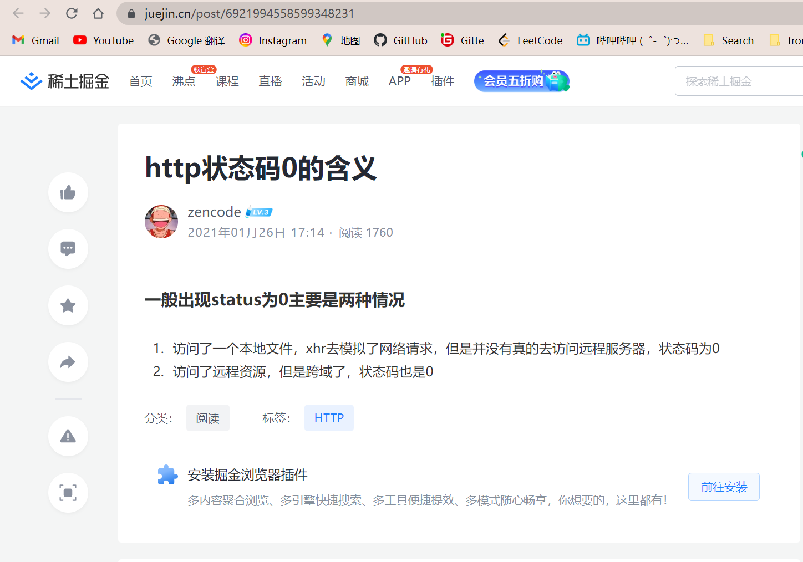

```html
10月20日 【Ben】

遇到的问题
1. .then() 究竟是个什么东西
2. querySelector重新学下
今日小结
1. 学习了1-Promise基本使用、2-Promise-API、3-关键问题
2.【Promise】P1看到了P22
3. 在终端使用node运行js文件时 不必node全名 node名字前缀然后Tab智能补全即可
4. 除了node 终端在进入指定路径时也可以用Tab自动补全 复制文件路径粘贴也很快
5. 利用同源策略只会作用于浏览器-服务之间，而不限制服务-服务的通信。你只需要建立自己的代理，而且不用与别人共享，能很大程度上消除延迟的影响，并且能用在你所有的服务上。
6. 403状态码：403 Forbidden是HTTP协议中的一个状态码(Status Code)。 可以简单的理解为没有权限访问此站。 该状态表示服务器理解了本次请求但是拒绝执行该任务，该请求不该重发给服务器
7. 打开CORS插件 看不了Youtube 跨域请求限制被完全开放出了问题
8. resolve产出的Promise对象可以是成功的也可以是失败的 但reject产出的一定是失败的

明日计划
1.【Promise】学到P46
```

​	



​	

参考文章

[Http status:0 通常是什么原因引起的](https://www.publiccms.com/question/2020/03-26/509.html)

[【译】3种解决CORS错误的方式与Access-Control-Allow-Origin的作用原理](https://segmentfault.com/a/1190000022506474)

[什么是502错误？该如何进行解决？](http://www.lymeisou.com/nd.jsp?id=111)

[502 Bad Gateway](https://developer.mozilla.org/en-US/docs/Web/HTTP/Status/502)