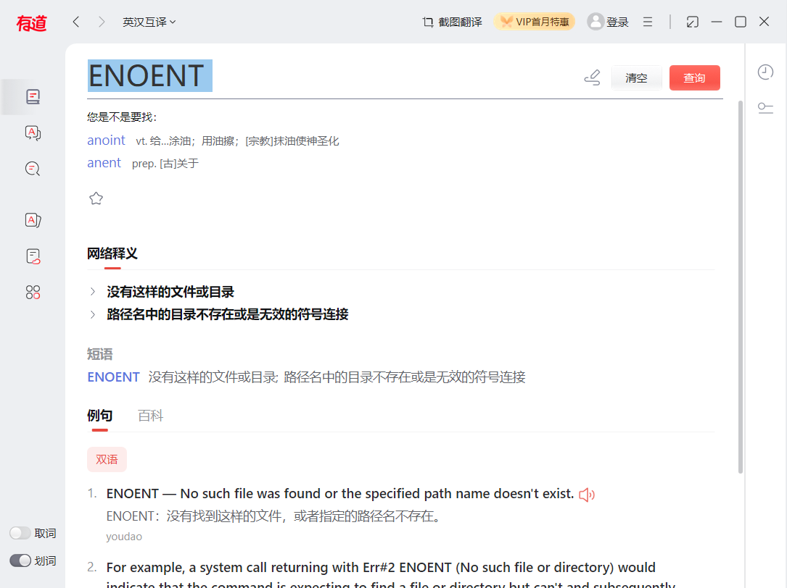

```html
10月21日 【Ben】

遇到的问题
Xxxxxx

今日小结
1. 学习了自定义封装promise、async和await
2.【Promise】P23看到了P46
3.【Promise】完结小结 Promise让我对库函数了解、学习及掌握变得不再排斥，视频从教你使用promise内置函数到教你一步步手写实现一个promise 需要考虑的东西真的多了很多 状态改变时onresolved与onrejected应该如何实现、异步情况如何进一步更改功能、同步/异步修改状态then如何实现、封装为类等等 从底层了解promise的实现机制 我相信这对于我以后学习新的知识点 会有更深入的思考和学习 respect！
4. 建议</script>上边留一行 像2-await.html中调用main() 被忽视...
5. 重新复习一下：
const util = require('util');
const mineReadFile = util.promisify(fs.readFile);
6. ENOENT 没有这样的文件或目录路径名中的目录不存在或是无效的符号连接


明日计划
1.【TS】学到P10
```

​	

参考文章

[Promise.prototype.catch()](https://developer.mozilla.org/zh-CN/docs/Web/JavaScript/Reference/Global_Objects/Promise/catch)


