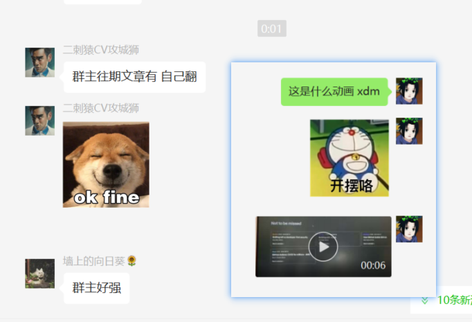

```html
10月21日 【Ben】

遇到的问题
Xxxxxx

今日小结
1. 学习了xxx
2.【Promise】P23看到了第xx集
3. xxx

明日计划
1.【Promise】学到第xx集
```

​	

参考文章

[Promise.prototype.catch()](https://developer.mozilla.org/zh-CN/docs/Web/JavaScript/Reference/Global_Objects/Promise/catch)

