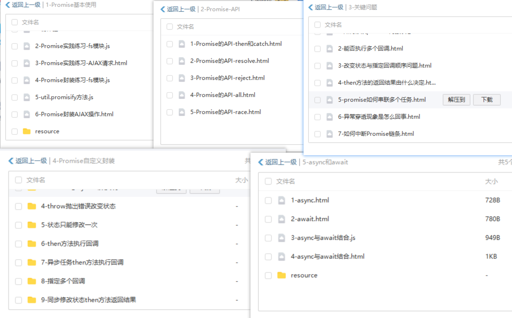

# 前端进阶

冒险者你好！欢迎你来到前端进阶路线，首先 恭喜你成功通关小米商城的项目学习！

​	

**学习进度汇报模板**

```apl
x月xx日 【Ben】

遇到的问题
Xxxxxx

今日小结
1. 学习了xxx
2.【自定义工具函数库】P1看到了第xx集
3. xxx

明日计划
1.【自定义工具函数库】学到第xx集
```

​	

*本项目学习目录如下：*

1. [Promise](https://www.bilibili.com/video/BV1GA411x7z1?spm_id_from=333.999.0.0)
2. [TS学习](https://www.bilibili.com/video/BV1Xy4y1v7S2?spm_id_from=333.999.0.0)
3. [Leetcode刷题](https://www.bilibili.com/video/BV1wA411b7qZ?spm_id_from=333.999.0.0)
4. [JS工具库](https://www.bilibili.com/video/BV1Cy4y117vt?spm_id_from=333.999.0.0)
5. [mustache](https://www.bilibili.com/video/BV1EV411h79m?spm_id_from=333.999.0.0)
6. [vue响应式](https://www.bilibili.com/video/BV1G54y1s7xV?spm_id_from=333.999.0.0)
7. [AST](https://www.bilibili.com/video/BV1GK4y1W7fi?spm_id_from=333.999.0.0)
8. [vue指令生命周期](https://www.bilibili.com/video/BV1Av411478T?spm_id_from=333.999.0.0)

​	

Promise-章节-文件分类

