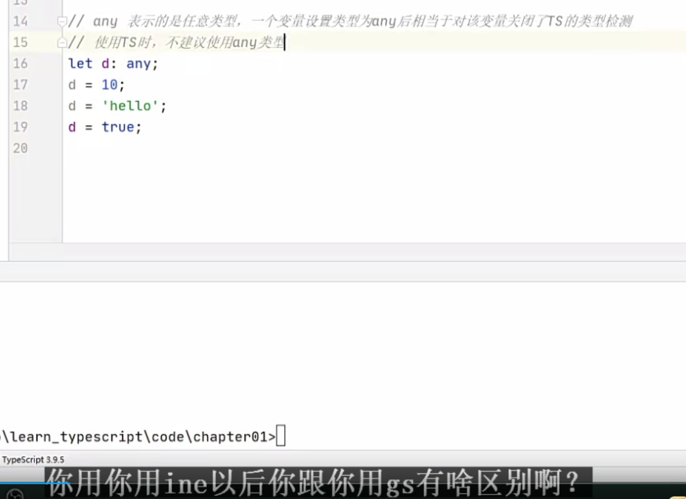

# 00_TS简介


JS最令人头疼的就是变量没有类型且不容易报错 后期工作的时候 变量类型发送改变（例如四则运算变成了字符串拼接）但项目又不报错就会令人会头疼 只能一点点排查 第3行出错的代码可能在第30000行报错

TS最主要的功能就是在JS里引入类型的概念 让JS从动态类型的语言变成一个静态类型的语言 给变量赋予类型


TS目前不能在我们的浏览器里面直接执行 所以我们要做一步编译 把TS代码编译成JS代码 然后最终执行的还是JS代码 只是我们写的时候是以TS形式去写（TS完全支持JS JS有的TS都有 TS还增加了很多新特性 相当于JS Pro）


TS转JS需要编译器

TS的严格限制是可以配置的 像让他规范严格就严格点 宽松点就宽松点


我们TS可以被编译成各种语法的JS 需要兼容老浏览器版本 可以编译成es3 不需要的话可以编译成es6 想用2020的新特性可以编译成es2020 配置可以自己选


TS和vscode都是微软研发的（同家公司搭配起来顺畅点，搭配webstorm也很不错） JS是网警公司研发的

微软现在也抛弃了IE内核转入chrome的内核

写代码JS没有提示 TS有！有提示实际上就是ts

TS可以帮助我们编辑器去识别我们变量的类型 才导致我们现在有了提示

​	

# 01_TS开发环境搭建

TS解析器是用我们node.js去写的 所以这个时候我们想要装TS解析器 我们需要先安装node.js

32位的比起64位的内存小 以后开发限制多

教学可以用数字开头给文件按视频进度命名 但实际开发最好不要 以字母开头最好

tsc是ts编译成js的编译器


​	

**01_helloTS.ts**

```ts
console.log('Hello TS');
```

​	

# 02_TS的类型声明


ts编写文件 即使有错误也可以通过编译生成js文件（js运行的规范就行）为什么可以？有意义吗？让习惯写js的同学一个适应 也得以让ts方便推广 不过我们可以修改其配置 让它有错误编译不通过 不生成相应的js文件

因为ts文件可以编译成任意版本的js文件 所以ts用let定义变量 编译成js都会变成var（let是es6的写法）通过配置可以指定配置成哪一个版本的


自动去判断

js给我们造成困扰往往不是变量 而是函数


更重要的是 我们的类型声明可以用在这个参数 还有返回值的身上


**02_types.ts**

```ts
// 声明一个变量a，同时指定它的类型为number
let a: number;

// a 的类型设置为了number，在以后的使用过程中a的值只能是数字
a = 10;
a = 33;
// a = 'hello'; // 此行代码会报错，因为变量a的类型是number，不能赋值字符串
let b: string; //不要写成String String是interface接口了
b = 'hello';
// b = 123;

// 声明完变量直接进行赋值
// let c: boolean = false;

// 如果变量的声明和赋值是同时进行的，TS可以自动对变量进行类型检测
let c = false;
c = true;
// c = 123;

// JS中的函数是不考虑参数的类型和个数的
// function sum(a, b){
//     return a + b;
// }

// console.log(sum(123, 456)); // 579
// console.log(sum(123, "456")); // "123456"

function sum(a: number, b: number): number{
    return a + b;
}

let result = sum(123, 456);
// let result2 = sum(123, '456');

console.log(result);
// console.log(result2);


```

​	

# 03 TS中类型（1）

使用字面量赋值确实有const常量那意思


但字面量用的范围不广 就那么几个场景



用any跟js没区别了

不到万不得已 尽量避免使用any


any除了关闭自己的ts检测 赋值给别的变量的时候 还关闭了别人的ts检测 祸害自己又祸害他人

所以我们这里可以用unknown类型


e是unknown类型 可以任意类型值赋值给它 然后我们定义了一个string类型的s 即使e被string类型的值赋值 e也不能赋给s 因为检测的是变量类型 e就是unknown类型 不能赋给string类型


**03_types.ts**

```ts
// 也可以直接使用字面量进行类型声明
let a: 10;
a = 10;

// 可以使用 | 来连接多个类型（联合类型）
let b: "male" | "female";
b = "male";
b = "female";

let c: boolean | string;
c = true;
c = 'hello';

// any 表示的是任意类型，一个变量设置类型为any后相当于对该变量关闭了TS的类型检测
// 使用TS时，不建议使用any类型
// let d: any;

// 声明变量如果不指定类型，则TS解析器会自动判断变量的类型为any （隐式的any）
let d;
d = 10;
d = 'hello';
d = true;

// unknown 表示未知类型的值
let e: unknown;
e = 10;
e = "hello";
e = true;

let s:string;
s = '茵仔';

// d的类型是any，它可以赋值给任意变量
// s = d;

e = 'hello 百变小茵';
console.log('第一次检测：');
// console.log(typeof e === "string"); //truelog
console.log(typeof e);

e = 521;
console.log(typeof e);

// s = e;

// unknown 实际上就是一个类型安全的any
// unknown类型的变量，不能直接赋值给其他变量
if(typeof e === "string"){ //怎么这句if把e从uknown变为string了？
    s = e;
}
// console.log('s = '+ s);
// console.log('第二次检测：');
// console.log(typeof e === "string");

// s = e; // e还是unknown

// 类型断言，可以用来告诉解析器变量的【实际】类型 不再报错处理 但ts对下面变量e的自动检测还是unknown 这是一开始就定好的
/*
* 语法：
*   变量 as 类型   （用法一）
*   <类型>变量     （用法二）
*
* */
s = e as string;
s = <string>e;
// 上面两行表达的都是一样的

// void 用来表示空，以函数为例，就表示没有返回值的函数 返回（空值）undefined、null 实际上也是一种返回值 下面never类型才是什么都没有
function fn(): void{
}

// never 表示永远不会返回结果 这种函数我们通常用来当作进行报错的程序执行 因为报错是不用返回任何值的
// never 用的比较少
function fn2(): never{
    throw new Error('报错了！');
}

```

​	

# 04 TS中的类型（2）

一切皆为对象 对象太广泛了 一般开发的时候不用对象

我们限制对象 应该是限制对象的属性怎么写

js的属性名就是一个字符串 所以 `let c: {name: string, [propName: string]: any};` 中的[propName: string]表示任意字符串类型的属性名 后面的any表示属性值的类型是any 

所以 `[propName: string]: any` 也就是表示任意属性


数组里如果什么类型都存的话 处理起来会有点麻烦 或者说它的存储性能并不是特别的好 所以我们一般数组都存相同类型的值


用type关键字给类型起别名

​	

**04_types.ts**

```ts
// object表示一个js对象
let a: object;
a = {};
a = function () {
};

// {} 用来指定对象中可以包含哪些属性
// 语法：{属性名:属性值,属性名:属性值}
// 在属性名后边加上?，表示属性是可选的
let b: {name: string, age?: number};
b = {name: '孙悟空', age: 18};

// [propName: string]: any 表示任意类型的属性
let c: {name: string, [propName: string]: any};
c = {name: '猪八戒', age: 18, gender: '男'};

/*
*   设置函数结构的类型声明：
*       语法：(形参:类型, 形参:类型 ...) => 返回值
* */ 
let d: (a: number ,b: number)=>number;
// d = function (n1: string, n2: string): number{
//     return 10;
// }


/*
*   数组的类型声明：
*       类型[]
*       Array<类型>
* */
// string[] 表示字符串数组
let e: string[];
e = ['a', 'b', 'c'];

// number[] 表示数值数值
let f: number[];

let g: Array<number>;
g = [1, 2, 3];

/*
*   元组，元组就是固定长度的数组
*       语法：[类型, 类型, 类型]
* */
let h: [string, number];
h = ['hello', 123];

/*
* enum 枚举
*
* */
enum Gender{
    Male,
    Female
}

let i: {name: string, gender: Gender};
i = {
    name: '孙悟空',
    gender: Gender.Male // 'male'
}

// console.log(i.gender === Gender.Male);
// &表示同时
let j: { name: string } & { age: number };
// j = {name: '孙悟空', age: 18};


// 类型的别名
type myType = 1 | 2 | 3 | 4 | 5;
let k: myType;
let l: myType;
let m: myType;

k = 2;
```

​	

# 05 TS编译选项（1）

`tsc app.ts -w` 这里的参数 `-w` 是watch 我们的ts编译器它会自动的去监视我们的文件变化 进行重新自动编译