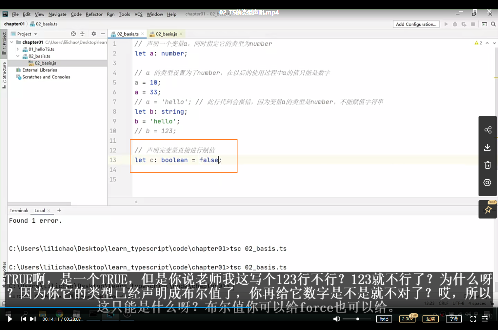
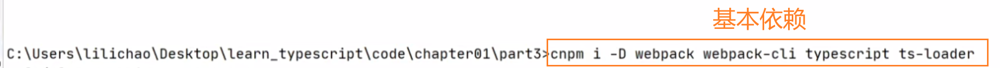

# 00_TS简介


JS最令人头疼的就是变量没有类型且不容易报错 后期工作的时候 变量类型发送改变（例如四则运算变成了字符串拼接）但项目又不报错就会令人会头疼 只能一点点排查 第3行出错的代码可能在第30000行报错

TS最主要的功能就是在JS里引入类型的概念 让JS从动态类型的语言变成一个静态类型的语言 给变量赋予类型


TS目前不能在我们的浏览器里面直接执行 所以我们要做一步编译 把TS代码编译成JS代码 然后最终执行的还是JS代码 只是我们写的时候是以TS形式去写（TS完全支持JS JS有的TS都有 TS还增加了很多新特性 相当于JS Pro）


TS转JS需要编译器

TS的严格限制是可以配置的 像让他规范严格就严格点 宽松点就宽松点


我们TS可以被编译成各种语法的JS 需要兼容老浏览器版本 可以编译成es3 不需要的话可以编译成es6 想用2020的新特性可以编译成es2020 配置可以自己选


TS和vscode都是微软研发的（同家公司搭配起来顺畅点，搭配webstorm也很不错） JS是网警公司研发的

微软现在也抛弃了IE内核转入chrome的内核

写代码JS没有提示 TS有！有提示实际上就是ts

TS可以帮助我们编辑器去识别我们变量的类型 才导致我们现在有了提示

​	

# 01_TS开发环境搭建

TS解析器是用我们node.js去写的 所以这个时候我们想要装TS解析器 我们需要先安装node.js

32位的比起64位的内存小 以后开发限制多

教学可以用数字开头给文件按视频进度命名 但实际开发最好不要 以字母开头最好

tsc是ts编译成js的编译器


​	

**01_helloTS.ts**

```ts
console.log('Hello TS');
```

​	

# 02_TS的类型声明


ts编写文件 即使有错误也可以通过编译生成js文件（js运行的规范就行）为什么可以？有意义吗？让习惯写js的同学一个适应 也得以让ts方便推广 不过我们可以修改其配置 让它有错误编译不通过 不生成相应的js文件

因为ts文件可以编译成任意版本的js文件 所以ts用let定义变量 编译成js都会变成var（let是es6的写法）通过配置可以指定配置成哪一个版本的




自动去判断

js给我们造成困扰往往不是变量 而是函数


更重要的是 我们的类型声明可以用在这个参数 还有返回值的身上


**02_types.ts**

```ts
// 声明一个变量a，同时指定它的类型为number
let a: number;

// a 的类型设置为了number，在以后的使用过程中a的值只能是数字
a = 10;
a = 33;
// a = 'hello'; // 此行代码会报错，因为变量a的类型是number，不能赋值字符串
let b: string; //不要写成String String是interface接口了
b = 'hello';
// b = 123;

// 声明完变量直接进行赋值
// let c: boolean = false;

// 如果变量的声明和赋值是同时进行的，TS可以自动对变量进行类型检测
let c = false;
c = true;
// c = 123;

// JS中的函数是不考虑参数的类型和个数的
// function sum(a, b){
//     return a + b;
// }

// console.log(sum(123, 456)); // 579
// console.log(sum(123, "456")); // "123456"

function sum(a: number, b: number): number{
    return a + b;
}

let result = sum(123, 456);
// let result2 = sum(123, '456');

console.log(result);
// console.log(result2);


```

​	

# 03 TS中类型（1）

使用字面量赋值确实有const常量那意思


但字面量用的范围不广 就那么几个场景


用any跟js没区别了

不到万不得已 尽量避免使用any


any除了关闭自己的ts检测 赋值给别的变量的时候 还关闭了别人的ts检测 祸害自己又祸害他人

所以我们这里可以用unknown类型


e是unknown类型 可以任意类型值赋值给它 然后我们定义了一个string类型的s 即使e被string类型的值赋值 e也不能赋给s 因为检测的是变量类型 e就是unknown类型 不能赋给string类型


**03_types.ts**

```ts
// 也可以直接使用字面量进行类型声明
let a: 10;
a = 10;

// 可以使用 | 来连接多个类型（联合类型）
let b: "male" | "female";
b = "male";
b = "female";

let c: boolean | string;
c = true;
c = 'hello';

// any 表示的是任意类型，一个变量设置类型为any后相当于对该变量关闭了TS的类型检测
// 使用TS时，不建议使用any类型
// let d: any;

// 声明变量如果不指定类型，则TS解析器会自动判断变量的类型为any （隐式的any）
let d;
d = 10;
d = 'hello';
d = true;

// unknown 表示未知类型的值
let e: unknown;
e = 10;
e = "hello";
e = true;

let s:string;
s = '茵仔';

// d的类型是any，它可以赋值给任意变量
// s = d;

e = 'hello 百变小茵';
console.log('第一次检测：');
// console.log(typeof e === "string"); //truelog
console.log(typeof e);

e = 521;
console.log(typeof e);

// s = e;

// unknown 实际上就是一个类型安全的any
// unknown类型的变量，不能直接赋值给其他变量
if(typeof e === "string"){ //怎么这句if把e从uknown变为string了？
    s = e;
}
// console.log('s = '+ s);
// console.log('第二次检测：');
// console.log(typeof e === "string");

// s = e; // e还是unknown

// 类型断言，可以用来告诉解析器变量的【实际】类型 不再报错处理 但ts对下面变量e的自动检测还是unknown 这是一开始就定好的
/*
* 语法：
*   变量 as 类型   （用法一）
*   <类型>变量     （用法二）
*
* */
s = e as string;
s = <string>e;
// 上面两行表达的都是一样的

// void 用来表示空，以函数为例，就表示没有返回值的函数 返回（空值）undefined、null 实际上也是一种返回值 下面never类型才是什么都没有
function fn(): void{
}

// never 表示永远不会返回结果 这种函数我们通常用来当作进行报错的程序执行 因为报错是不用返回任何值的
// never 用的比较少
function fn2(): never{
    throw new Error('报错了！');
}

```

​	

# 04 TS中的类型（2）

一切皆为对象 对象太广泛了 一般开发的时候不用对象

我们限制对象 应该是限制对象的属性怎么写

js的属性名就是一个字符串 所以 `let c: {name: string, [propName: string]: any};` 中的[propName: string]表示任意字符串类型的属性名 后面的any表示属性值的类型是any 

所以 `[propName: string]: any` 也就是表示任意属性


数组里如果什么类型都存的话 处理起来会有点麻烦 或者说它的存储性能并不是特别的好 所以我们一般数组都存相同类型的值


用type关键字给类型起别名

​	

**04_types.ts**

```ts
// object表示一个js对象
let a: object;
a = {};
a = function () {
};

// {} 用来指定对象中可以包含哪些属性
// 语法：{属性名:属性值,属性名:属性值}
// 在属性名后边加上?，表示属性是可选的
let b: {name: string, age?: number};
b = {name: '孙悟空', age: 18};

// [propName: string]: any 表示任意类型的属性
let c: {name: string, [propName: string]: any};
c = {name: '猪八戒', age: 18, gender: '男'};

/*
*   设置函数结构的类型声明：
*       语法：(形参:类型, 形参:类型 ...) => 返回值
* */ 
let d: (a: number ,b: number)=>number;
// d = function (n1: string, n2: string): number{
//     return 10;
// }


/*
*   数组的类型声明：
*       类型[]
*       Array<类型>
* */
// string[] 表示字符串数组
let e: string[];
e = ['a', 'b', 'c'];

// number[] 表示数值数值
let f: number[];

let g: Array<number>;
g = [1, 2, 3];

/*
*   元组，元组就是固定长度的数组
*       语法：[类型, 类型, 类型]
* */
let h: [string, number];
h = ['hello', 123];

/*
* enum 枚举
*
* */
enum Gender{
    Male,
    Female
}

let i: {name: string, gender: Gender};
i = {
    name: '孙悟空',
    gender: Gender.Male // 'male'
}

// console.log(i.gender === Gender.Male);
// &表示同时
let j: { name: string } & { age: number };
// j = {name: '孙悟空', age: 18};


// 类型的别名
type myType = 1 | 2 | 3 | 4 | 5;
let k: myType;
let l: myType;
let m: myType;

k = 2;
```

​	

# 05 TS编译选项（1）

`tsc app.ts -w` 这里的参数 `-w` 是watch 我们的ts编译器它会自动的去监视我们的文件变化 进行重新自动编译


开启监视模式


使用tsc可以编译我们项目所有ts文件 但我们首先需要有一个 `tsconfig.json` 来配置我们一些相关信息 只要有tsconfig.json 我们的tsc命令就能用 即使tsconfig.json里面什么都没有 这时候我们用 tsc -w 可以监视所有文件 这时候我们就不需要再一个个文件手动去单独执行命令编译了

通常的一些json文件是不能写注释的 但我们ts的json文件里可以写注释

files是一个文件一个文件列出来 通常用在比较小的文件


compilerOptions是重点 下节课讲

​	

# 06 TS编译选项（2）

从es6起新增了module模块化的规范 导致自从模块化规范每年都在增多 需要指定用什么模块化规范 

ts很聪明 import { xx } from xxx 只导入不使用 ts编辑器是不会理睬的

**lib**：一般情况下 我们不需要改 如果代码部署在浏览器的环境里运行的 而是在node.js里运行的 它里面没有dom那你可以去改一下 如果是我们正常的在前端在浏览器当中去运行代码 这里lib我们是不需要去设置的

如果想要把多个模块化规范的文件合并成一个文件 必须是amd或是system的规范


outFile用得不多 一般我们这种东西要用的话 都会结合一些打包工具去做 实际上这种事都应该是交给打包工具去给我们做 所以后边会介绍怎么去结合打包工具实现这个功能 outFile了解一下就行

`target` 和 `module` 是必用的

**tsconfig.json**

```json
{
/*
  tsconfig.json是ts编译器的配置文件，ts编译器可以根据它的信息来对代码进行编译
    "include" 用来指定哪些ts文件需要被编译
      路径：** 表示任意目录
            * 表示任意文件
    "exclude" 不需要被编译的文件目录
        默认值：["node_modules", "bower_components", "jspm_packages"]

*/
  "include": [
    "./src/**/*" // 表示src下的任意目录任意文件都会被编译
  ],
//  "exclude": [
//    "./src/hello/**/*"
//  ]

  /*
    compilerOptions 编译器的选项 （最重要的东西）
  */
  "compilerOptions": {

    // target 用来指定ts被编译为的ES的版本
    // 'es3', 'es5', 'es6', 'es2015', 'es2016', 'es2017', 'es2018', 'es2019', 'es2020', 'esnext'
    "target": "es2015",
    // module 指定要使用的模块化的规范 从es6起新增了module模块化的规范 导致自从模块化规范每年都在增多 需要指定用什么模块化规范 ts很聪明 import { xx } from xxx 只导入不使用 ts编辑器是不会理睬的
    // 'none', 'commonjs', 'amd', 'system', 'umd', 'es6', 'es2015', 'es2020', 'esnext'
    "module": "es2015",
    // lib用来指定项目中要使用的库
    //'es5', 'es6', 'es2015', 'es7', 'es2016', 'es2017', 'es
    //2018', 'es2019', 'es2020', 'esnext', 'dom', 'dom.iterable', 'webworker', 'webworker.importscripts', 'webworker.iterable', 'scri
    //pthost', 'es2015.core', 'es2015.collection', 'es2015.generator', 'es2015.iterable', 'es2015.promise', 'es2015.proxy', 'es2015.r
    //eflect', 'es2015.symbol', 'es2015.symbol.wellknown', 'es2016.array.include', 'es2017.object', 'es2017.sharedmemory', 'es2017.st
    //ring', 'es2017.intl', 'es2017.typedarrays', 'es2018.asyncgenerator', 'es2018.asynciterable', 'es2018.intl', 'es2018.promise', '
    //es2018.regexp', 'es2019.array', 'es2019.object', 'es2019.string', 'es2019.symbol', 'es2020.bigint', 'es2020.promise', 'es2020.s
    //haredmemory', 'es2020.string', 'es2020.symbol.wellknown', 'es2020.intl', 'esnext.array', 'esnext.symbol', 'esnext.asynciterable
    //', 'esnext.intl', 'esnext.bigint', 'esnext.string', 'esnext.promise', 'esnext.weakref'
//    "lib": ["es6", "dom"]


    // outDir 用来指定编译后文件所在的目录 这样就会让生成的js文件和我们的ts文件分离开来
    "outDir": "./dist",

    // 将代码合并为一个文件
    // 设置outFile后，所有的全局作用域中的代码会合并到同一个文件中
    //"outFile": "./dist/app.js" // 生成的代码合并到dist目录下的app.js里

    // 是否对js文件进行编译，默认是false
//    "allowJs": true,
    // 是否检查js代码是否符合语法规范，默认是false
//    "checkJs": true,
    // 是否移除注释
    "removeComments": true,
    // 不生成编译后的文件
    "noEmit": false,


    // 当有错误时不生成编译后的文件
    "noEmitOnError": true,

    // 所有严格检查的总开关
    "strict": true,

    // 用来设置编译后的文件是否使用严格模式，默认false
    "alwaysStrict": true,

    // 不允许隐式的any类型
    "noImplicitAny": true,

    // 不允许不明确类型的this
    "noImplicitThis": true,

    // 严格的检查空值
    "strictNullChecks": true


  }
}
```

​	

# 07 TS编译选项（3）

# 08 TS编译选项（4）

下面讲的是跟语法检查相关的选项


当我们js文件里有export、import模块的时候 它实际上就已经默认就在严格模式下了 所以才没看到生成的 `"use strict";`


把this指定好是谁的 就可以用了


​	

# 09 使用webpack打包ts代码（1）

实际开发中 直接使用ts编译器去编译代码的情况比较少 因为我们一般开发大型项目时都需要用到打包工具 不可能说脱离打包工具是使用ts 所以我们ts是要结合打包工具去使用的 用的比较多的是webpack 这节课主要讲ts怎么跟webpack整合到一起 如何通过webpack对我们ts代码进行编译


对项目进行初始化 pack.json就是用来管理我们的项目

-D表示开发依赖 也就是--dev的简写

webpack-cli是我们的webpack的命令行工具

typescript 是typescript的核心包

ts-loader是我们webpack的加载器




​	

# 10 使用webpack打包ts代码（2）（模板）

手动建一个index.html 然后script引入文件很不方便！很不优雅 而且要是引入多个文件 且有发生更改的话 就很不方便 我们希望这个html文件可以由我们webpack去自动创建 这个网页引入哪些资源都是由它根据我们项目的实际情况去做的调整 我有两个js文件 它就可以自动给我们引入两个js文件


装它就等于在外面项目里面安装了一个内置的服务器 装上以后外面可以让我们的项目直接在这个服务器当中运行 且这个服务器跟我们webpack他们之间是关联的 它可以根据你的项目改变自动去刷新（自动构建自动刷新浏览器 这样我们开发调试的时候就很爽！）


webpack-dev-server yyds


​	

我们引入m1模块 然后import到index.ts中 这时候它实际上会存在一些问题


为什么会报错？因为我们现在引入m1 m1是一个模块（export m1.ts的内容就知道了）拓展名是ts webpack默认情况不知道你这个ts是可以当作模块使用的 也就是说它不知道哪些文件可以被引入 所以这个时候我们必须要做一个配置告诉webpack哪些文件可以作为模块去使用 作为模块被引入 所以这个时候我们需要对它做一个配置 哪个属性用来配置呢？resolve 用来设置我们这个模块的

part3的源代码可以作为以后项目配置的模板

因为编译后的代码可以会有新语法规范的写法（例如箭头函数） 我们需要去转成老版本的写法以便兼容更多浏览器 这时候就需要引入Babel插件 详细看下一章

​	

# 11 使用webpack打包ts代码（3）

babel可以把新语法转成旧语法 可以把一些新的类、对象 在浏览器里不支持的 它可以通过一些方式让它支持（这一点是ts做不到的转换 所以需要借助babe） 来帮助我们解决这个兼容性问题（例如写ES2020的代码在IE浏览器运行）


看到有什么loader都是跟webpack做一个结合的工具

code-js是运行环境 模拟运行环境的代码 它的好处就是可以让老版本浏览器用到新版本的这个新标准 code-js插件比较大 我们可以按需加载

安装插件：


【注意】这里我们加载器的执行顺序是从后往前执行 也就是谁写在后边谁先执行 所以是 先用ts-loader把ts转成js 然后再用babel把这个js新版本的js转换成我们这个旧版的

我们使用一个promise 希望能兼容到IE11（没有promise） core-js会帮我们那自己的promise代码写入 自己手写一个promise 兼容到IE11（视频会报错的原因是 打包的代码出现了箭头函数 IE11是没有箭头函数的语法的 所以报了箭头函数的错误）


而这一个是webpack帮我们自动创建的立即执行函数（箭头函数的写法）（自动生成的压根就没有经过babel的处理，所以它会出问题）作用是创建作用域 让代码之间不互相干扰 但由于不是我们手写的 所以babel没有帮我们（从箭头函数）转换成普通函数

到此webpack、ts和babel这三个东西基本配置就完备了 这时候再写js代码就没什么问题了 后面想编译js打包图片 后面可以再去补充 这个基本结构一定要给它记住了

​	

# 12 面向对象简介

TS和JS都是面向对象语言 但很多时候我们用JS写面向对象的感觉并不好 更多的是当成面向过程来使用

面向对象：我们任何操作都是通过这个对象去操作

程序是对现实生活的抽象（游戏和平精英是对现实战争的抽象）

我们把任何事物都抽象为两部分：属性（数据）和 方法（行为）

难点在于怎么创建对象和定义对象

​	

# 13 类的简介

类是对象的模型 我们可以通过类创建对象 要实例化一个对象首先要有类

类属性/静态属性 不需要创建对象就可以调用的属性（通过类名）在属性名前加一个static 这会再通过实例化对象是访问不到的 只能通过类名


静态只读属性 static要写在最前面  不然会报错 只能写 `static readonly age` 不能写 `readonly static age`

​	

# 14 构造函数和this


this表示当前对象


​	

# 15 继承简介

**03_继承.ts**

```ts
(function (){

    // 定义一个Animal类
    class Animal{
        name: string;
        age: number;

        constructor(name: string, age: number) {
            this.name = name;
            this.age = age;
        }

        sayHello(){
            console.log('动物在叫~');
        }
    }

    /*
    * Dog extends Animal
    *   - 此时，Animal被称为父类，Dog被称为子类
    *   - 使用继承后，子类将会拥有父类所有的方法和属性
    *   - 通过继承可以将多个类中共有的代码写在一个父类中，
    *       这样只需要写一次即可让所有的子类都同时拥有父类中的属性和方法
    *       如果希望在子类中添加一些父类中没有的属性或方法直接加就行
    *   - 如果在子类中添加了和父类相同的方法，则子类方法会覆盖掉父类的方法
    *       这种子类覆盖掉父类方法的形式，我们称为方法重写
    *
    * */
    // 定义一个表示狗的类
    // 使Dog类继承Animal类
    class Dog extends Animal{

        run(){
            console.log(`${this.name}在跑~~~`);
        }

        sayHello() {
            console.log('汪汪汪汪！');
        }

    }

    // 定义一个表示猫的类
    // 使Cat类继承Animal类
    class Cat extends Animal{
        sayHello() {
            console.log('喵喵喵喵！');
        }
    }

    const dog = new Dog('旺财', 5);
    const cat = new Cat('咪咪', 3);
    console.log(dog);
    dog.sayHello();
    dog.run();
    console.log(cat);
    cat.sayHello();


})();
```

​	

# 16 super关键字

通过super调用父类方法

```ts
sayHello() {
    // 在类的方法中 super就表示当前类的父类
    //super.sayHello();

    console.log('汪汪汪汪！');
}
```

​	

在子类构造函数必须把父类构造函数再调用一遍 不然新增属性的对象初始化完成不了 继承会出问题 比较麻烦 算是ts/js遗留的问题


super代表的是我们当前类的父类

​	

# 17 抽象类

> 抽象类生来就是给别人当父类的

**05_抽象类.ts**

```ts
(function () {

    /*
    *   以abstract开头的类是抽象类，
    *       抽象类和其他类区别不大，只是不能用来创建对象
    *       抽象类就是专门用来被继承的类
    *
    *       抽象类中可以添加抽象方法
    * */
    abstract class Animal {
        name: string;

        constructor(name: string) {
            this.name = name;
        }

        // 定义一个抽象方法
        // 抽象方法使用 abstract开头，没有方法体
        // 抽象方法只能定义在抽象类中，子类必须对抽象方法进行重写
        abstract sayHello():void;
    }

    class Dog extends Animal{

        sayHello() {
            console.log('汪汪汪汪！');
        }

    }

    class Cat extends Animal{
        sayHello() {
            console.log('喵喵喵喵！');
        }

    }

    const dog = new Dog('旺财');
    dog.sayHello();

})();
```

​	

# 18 接口

```ts
(function(){
	//立即执行函数 在局部作用域下 不跟全局作用域名称起冲突
})()
```


interface和type的区别是 type不能重复声明 而interface可以

举个例子 定义一个interface a 重复声明了interface a 并且每次都往里加了新的属性或方法

当类型声明使用a时 a所包含的属性和方法是所有重复声明加一起为准的


**implements** **实现**

> 接口用实现 抽象用继承

接口就是定义的一个规范 对类的限制

**06_接口.ts**

```ts
(function () {

    // 描述一个对象的类型
    type myType = {
        name: string,
        age: number
    };

    /*
    *   接口用来定义一个类结构，用来定义一个类中应该包含哪些属性和方法
    *       同时接口也可以当成类型声明去使用
    * */
    interface myInterface {
        name: string;
        age: number;
    }

    interface myInterface {
        gender: string;
    }

    // const obj: myInterface = {
    //     name: 'sss',
    //     age: 111,
    //     gender: '男'
    // };

    /*
    * 接口可以在定义类的时候去限制类的结构，
    *   接口中的所有的属性都不能有实际的值
    *   接口只定义对象的结构，而不考虑实际值
    *       在接口中所有的方法都是抽象方法
    *   而抽象类中既可以有抽象方法也可以有实质方法（具体数值）
    * */
    interface myInter{
        name: string;

        sayHello():void;
    }

    /*
    * 定义类时，可以使类去实现一个接口,
    *   实现接口就是使类满足接口的要求
    * */
    class MyClass implements myInter{
        name: string;

        constructor(name: string) {
            this.name = name;
        }

        sayHello(){
            console.log('大家好~~');
        }

    }

})();
```

​	

# 19 属性的封装

private 私有属性，私有属性只能在类内部进行访问（修改）TS独有的 JS没有 所以没有配置tsconfig文件信息的话 虽然有标红但编译仍能通过 我们要设置TS有错误提示时 编译通过不了 `"noEmitOnError": true`

使属性私有化 通过暴露方法使得外界可以间接访问到属性 这时候控制权完全在我们手上


使用场景：当你属性容易被修改错 或者说他对这个计算要求比较高的时候 最好用一下

没写修饰符 默认是public


封装是为了让我们属性更加安全 不然外界直接访问属性 而是间接通过getter和setter访问 确保我们数据变得更加安全

**07_属性的封装.ts**

```ts
(function (){
    // 定义一个表示人的类
    class Person{
        // TS可以在属性前添加属性的修饰符
        /*
        *   public 修饰的属性可以在任意位置访问（修改） 默认值
        *   private 私有属性，私有属性只能在类内部进行访问（修改）TS独有的 JS没有 所以没有配置tsconfig文件信息的话 虽然有标红但编译仍能通过 我们要设置TS有错误提示时 编译通过不了 "noEmitOnError": true
        *       - 通过在类中添加方法使得私有属性可以被外部访问
        *   protected 受包含的属性，只能在当前类和当前类的子类中访问（修改）
        *
        * */
        private _name: string;
        private _age: number;

        constructor(name: string, age: number) {
            this._name = name;
            this._age = age;
        }

        /*
        *   getter方法用来读取属性
        *   setter方法用来设置属性
        *       - 它们被称为属性的存取器
        * */

        // 定义方法，用来获取name属性
        // getName(){
        //     return this._name;
        // }
        //
        // // 定义方法，用来设置name属性
        // setName(value: string){
        //     this._name = value;
        // }
        //
        // getAge(){
        //     return this._age;
        // }
        //
        // setAge(value: number){
        //     // 判断年龄是否合法
        //     if(value >= 0){
        //         this._age = value;
        //     }
        // }

        // TS中设置getter方法的方式 这些是存取器使用
        get name(){
            // console.log('get name()执行了！！');
            return this._name;
        }

        set name(value){
            this._name = value;
        }

        get age(){
            return this._age;
        }

        set age(value){
            if(value >= 0){
                this._age = value
            }
        }
    }

    const per = new Person('孙悟空', 18);

    /*
    * 现在属性是在对象中设置的，属性可以任意的被修改,
    *   属性可以任意被修改将会导致对象中的数据变得非常不安全
    * */

    // per.setName('猪八戒');
    // per.setAge(-33);

    per.name = '猪八戒';
    per.age = -33;

    // console.log(per);


    class A{
        protected num: number;

        constructor(num: number) {
            this.num = num;
        }
    }

    class B extends A{

        test(){
            console.log(this.num);
        }

    }

    const b = new B(123);
    // b.num = 33;


   /* class C{

        name: string;
        age: number

        // 可以直接将属性定义在构造函数中
        constructor(name: string, age: number) {
            this.name = name;
             this.age = age;
        }

    }*/

    class C{

        // 可以直接将属性定义在构造函数中
        constructor(public name: string, public age: number) {
        }

    }

    const c = new C('xxx', 111);

    console.log(c);

})();
```

​	

# 20 泛型


泛型的作用就是在我们类型不明确的时候给我们整一个变量 用这个变量来表示

**08_泛型.ts**

```ts
/*
function fn(a: any): any{
    return a;
}*/

/*
*   在定义函数或是类时，如果遇到类型不明确就可以使用泛型
*   泛型就是不确定的类型 需要根据具体调用判断
* */

function fn<T>(a: T): T{
    return a;
}

// 可以直接调用具有泛型的函数
let result = fn(10); // 不指定泛型，TS可以自动对类型进行推断 但并不是所有情况都推断得出来
let result2 = fn<string>('hello'); // 指定泛型 降低出错几率

// 泛型可以同时指定多个
function fn2<T, K>(a: T, b: K):T{
    console.log(b);
    return a;
}
fn2<number, string>(123, 'hello');

interface Inter{
    length: number;
}

// T extends Inter 表示泛型T必须时Inter实现类（子类）
function fn3<T extends Inter>(a: T): number{
    return a.length;
}

class MyClass<T>{
    name: T;
    constructor(name: T) {
        this.name = name;
    }
}

const mc = new MyClass<string>('孙悟空');

```

​	

# 21 练习-项目搭建

