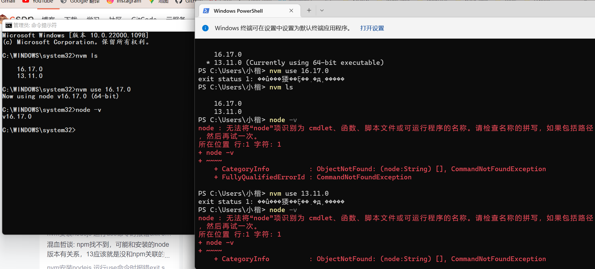

```html
10月22日 【Ben】

遇到的问题
【问题】
1. powershell中无法通过nvm use切换node版本
2.如何直接在命令提示框提升管理员权限？
3..accelerate文件夹作用和处理方法
4. Notepad++重新学下
5. typeof返回的是变量值的类型 而不是变量类型是吗？
6. 控制流分析 了解一下

【解决】
1. 通过管理员权限运行cmd 在cmd里面执行命令便可以解决
2.
3. 作用： 这个文件夹应该是用来作为上传和下载的高速缓存，用来存放临时文件用的，p2p加速缓存文件夹。 处理方法： 设置百度云下载的默认文件夹。 如果你设置下载到桌面就会在桌面有一个名为.accelerate的加速文件夹。
4.
5.

今日小结
1. 学习了xxx
2.【TS】P1看到了第xx集
3. vscode的git不能上传太多（累计占内存大）的文件 不然push不上 只能交给git bash帮忙push（改过配置 应该传输内存也变大了 不知道跟这个有没有关系）
4. typeof检测的是变量值类型 ts自动检测的是变量类型 这两个东西是半分开的
类型断言，可以用来告诉解析器变量的【实际】类型 不再报错处理 但ts对下面变量e的自动检测还是unknown 这是一开始就定好的
5. unknow和any区别只在于unknown定义的变量无法去调用属性和方法
6. snipaste启动时会检测屏幕范围进行锁定 但你启动完再接外接屏的时候（或者启动时连接但中间拔掉HDMI再重新插 连接） 此时是无法在外接屏上用snipaste截图的 需要退出重新启动锁定屏幕

明日计划
1.【TS】学到P20
```

​	

powershell中无法通过nvm use切换node版本



参考文章：

[nvm安装nodejs 运行use命令时报错exit status 1: ��û���㹻��Ȩ��ִ�д˲�����](https://blog.csdn.net/qq_18881987/article/details/120362561)

[.accelerate是什么文件夹 accelerate文件夹怎么删除](https://product.pconline.com.cn/itbk/software/dnyw/1703/8922326.html)

[TypeScript 中的类型控制流分析演进](https://zhuanlan.zhihu.com/p/461842201?utm_medium=social&utm_oi=1005238543836327936&utm_psn=1567154592827236352&utm_source=wechat_session)
