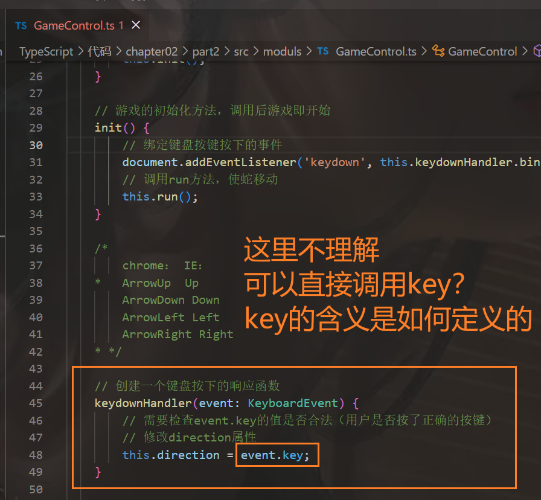
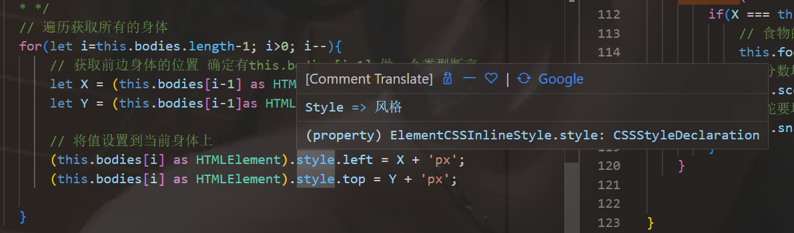

```html
10月25日 【Ben】

遇到的问题
【问题】
1.如何获取mp3文件的外链
2.给网页标题添加icon小图标
3.insertAdjacentHTML MDN一下
4.this.keydownHandler.bind(this) TS的bind函数了解一下
5.try catch 学习一下 JS里用得比较少 TS用的多

【解决】
1.网易云音乐文件下载公式：（只需要知道音乐的id是多少 代入进去就OK啦~）
http://music.163.com/song/media/outer/url?id=ID数字.mp3
2.
第一种：
在 html 文件的 head 部分添加下面这一行代码
rel参数：根据我的理解，这应该是一个标志，固定使用“shortcut icon”字符串，它将被多数遵守标准的浏览器识别为列出可能的关键词(“shortcut”将被忽略,而仅适用“icon”);而 Internet Explorer 将会把它作为一个单独的名称(“shortcut icon”)。这样做的结果是所有浏览器都可以理解此代码。

<link
  rel="shortcut icon"
  href="http://xxx.xxx/usr/themes/default/img/favicon.ico"
  type="image/x-icon"
/>

href参数：这个是图片所在的路径。
type参数：这个是图片的类型，在今时今日所有浏览器已经能正确识别，所以实际使用中可以省略。
一般来说图标格式最好是.ico 格式的，不过试了一下其实 png，jpg，bmp 的格式都可以。

第二种：
制作一个 ico 格式的图标，命名为favicon.ico。把这个图标放到网站的根目录下就可以了，页面加载时浏览器会自动检索这个图标然后把它加到标题上。

3.
4.
5.

今日小结
1. 学习了xxx
2.【TS】P15看到了P29
3.【感悟】讲一下从大一到现在接触编程 思考过程中的一个误区 这种情况碰见了很多次了 感觉也是自己代码编写水平提高的一个瓶颈 就是在处理代码逻辑或写业务代码的时候 封装好的代码可以直接用（源码也看得懂）逻辑代码原理什么的都很清楚 但就是有点钻牛角尖 拼写函数名的时候就会想它源码是怎么实现的 但经常性的情况的无法在短时间在脑海中编译出来 我觉得这是一个很正常的现象 并不是说通过这件事反映你脑子不好使 没别人好使或者怎么这么样 我觉得这应该是一种普遍现象 只要你封装的函数源码当时编写或学习时能理清头绪 理解了思路 直接用就行 业务代码有自己实现的思路并编写出来就达成目标（这个我认为比较重要 同时这个也是相较简单的 要注意好边界问题和极端问题 （后续的优化和扩展 我觉得就OK了 照我目前的水准来说）） 手撸代码和理解代码又是两种不同的境界 但现在要做的是尽可能短的时间内扩展自己的广度 等形成框架再深入深度的学习 后期再锤炼一下自己的数据结构和算法水平 提高代码编写的思想和实现思路

明日计划
1.【TS】学到第xx集
```

​	

参考文章

[网易云音乐mp3外链、真实地址下载](https://developer.aliyun.com/article/880115)

[给网页标题添加icon小图标](https://rabbitfeet.net/archives/add-icon-to-page-title)

​	

键盘按键对应的key值就是按键名称吗？



​	

style属性了解一下

