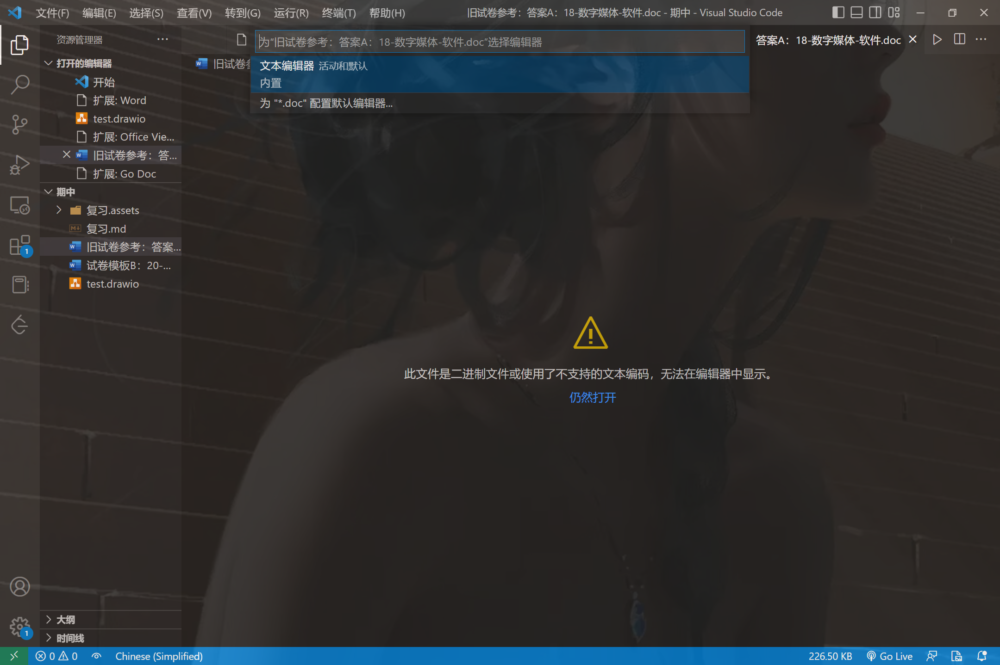
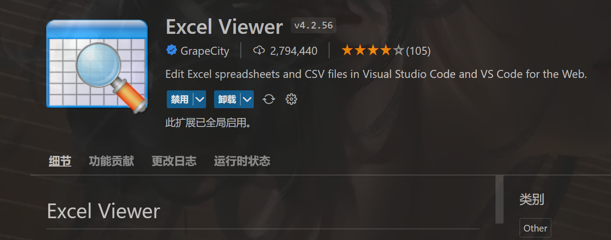
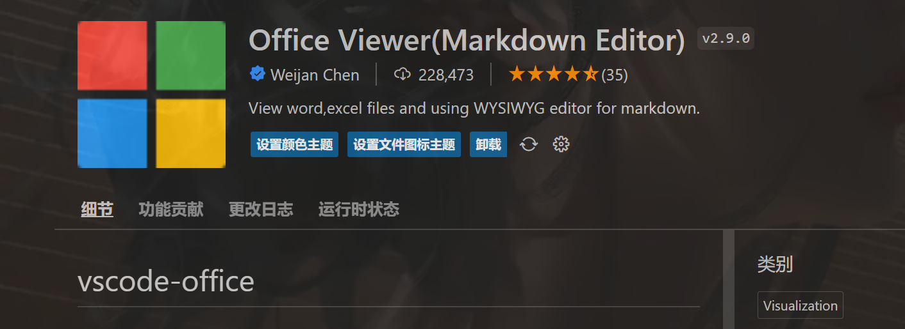

```html
11月10日 【Ben】

遇到的问题
Xxxxxx

今日小结
1. 学习了xxx
2.【Vue-响应式】P1看到了第xx集
3. Axure原型设计可以学习一下~

明日计划
1.【Vue-响应式】学到第xx集
```

​	

Vue-响应式【参考文章】

[Vue 数据响应式的简单实现](https://github.com/Joey-Coder/front-end-example/tree/master/study-data-reactive)

[0年前端的Vue响应式原理学习总结1：基本原理](https://juejin.cn/post/6932659815424458760)

[0年前端的Vue响应式原理学习总结2：数组的处理](https://juejin.cn/post/6932843824515383303)

[0年前端的Vue响应式原理学习总结3：渲染watcher](https://juejin.cn/post/6933041656765612039)

[0年前端的Vue响应式原理学习总结4：最终章](https://juejin.cn/post/6933142007489658894)

Axure【参考链接】

[Axure教程视频，0基础入门](https://www.bilibili.com/video/BV1Yx411f7d6/?spm_id_from=333.337.search-card.all.click&vd_source=1f9072e850dde202d6ddd4c60d9d334d)

UML【参考视频】

[StarUML 下载](https://staruml.io/)

[UML统一建模语言绘图工具软件StarUML，永久、免费、放心使用](https://www.bilibili.com/video/BV1R3411T7ii/?spm_id_from=333.337.search-card.all.click&vd_source=1f9072e850dde202d6ddd4c60d9d334d)

> 亲测有效！！my god！

​	

- [ ] JavaWeb考试考到第13章

​	



解决vscode打开doc文件




解决vscode打开office三件套格式文件（除去doc，word只能打开docx(因为docx是压缩文件，doc是二进制文件)）

