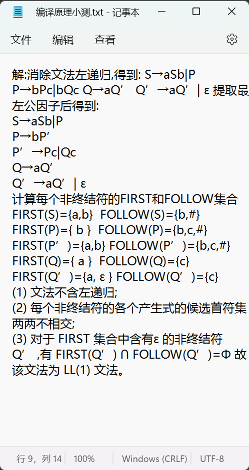
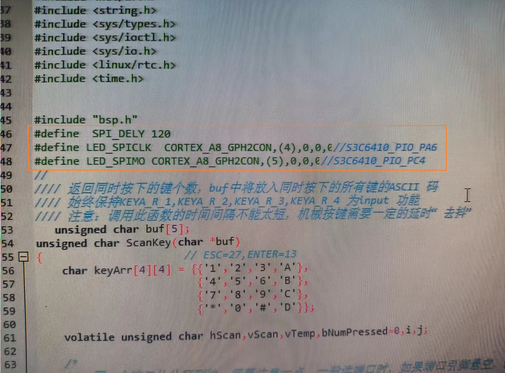
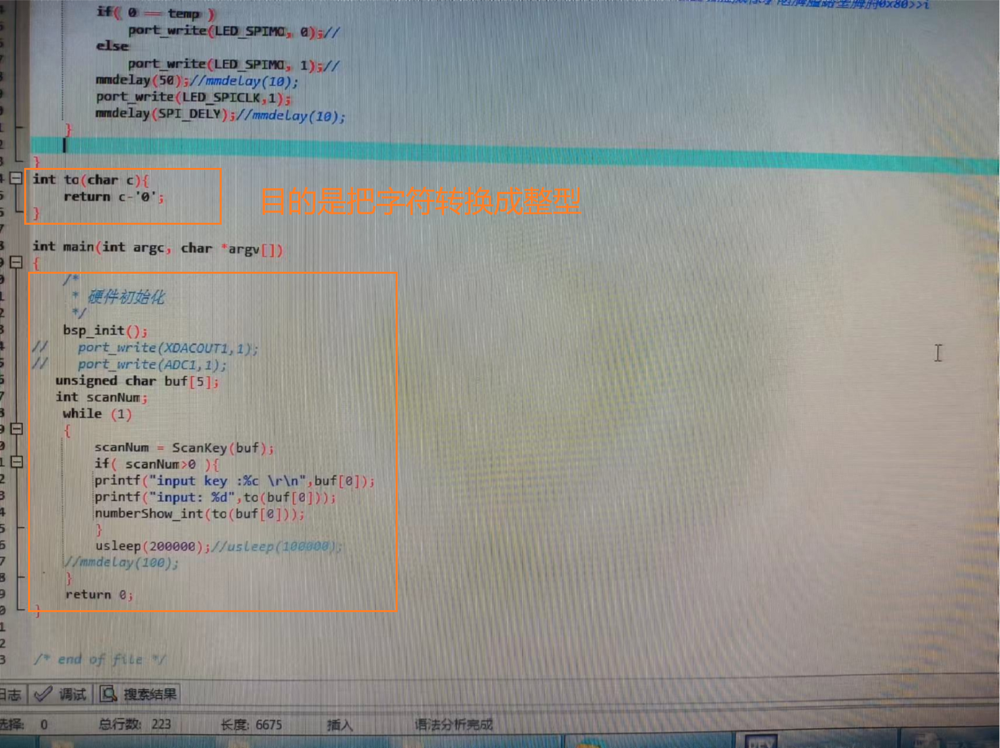
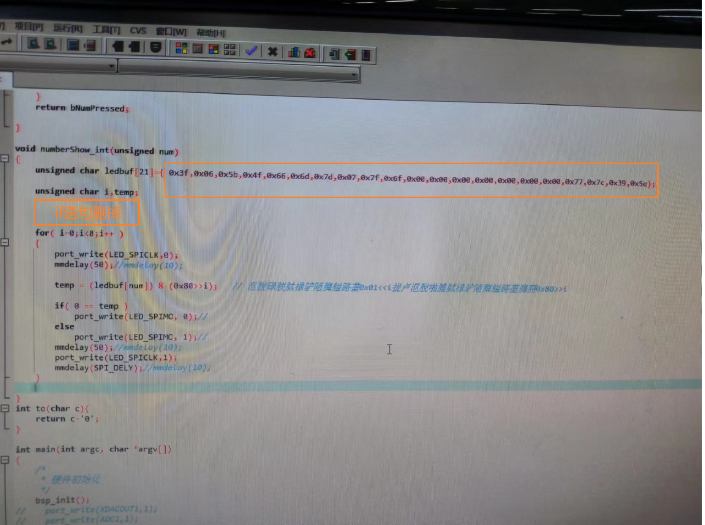

```html
11月14日 【Ben】

遇到的问题
Xxxxxx

今日小结
1. 学习了xxx
2.【Vue-响应式】看到了第xx集
3. hexo g 生成（public）静态文件

明日计划
1.【Vue-响应式】学到第xx集
```

​	

参考文章

[编译原理 消除左递归，直接左递归、间接左递归](https://blog.csdn.net/jsx_SEVEN/article/details/92849314)








