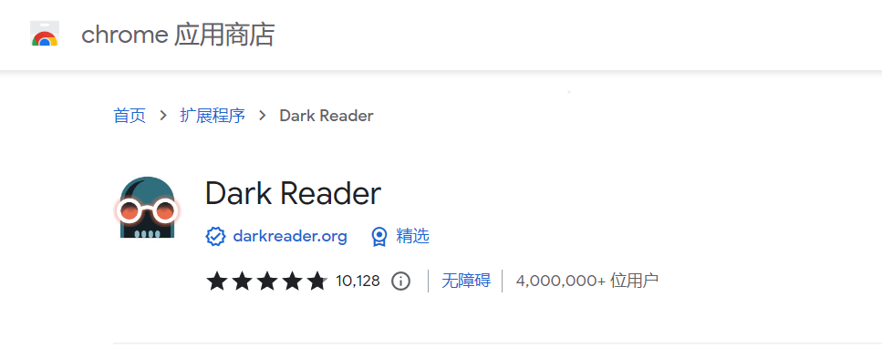
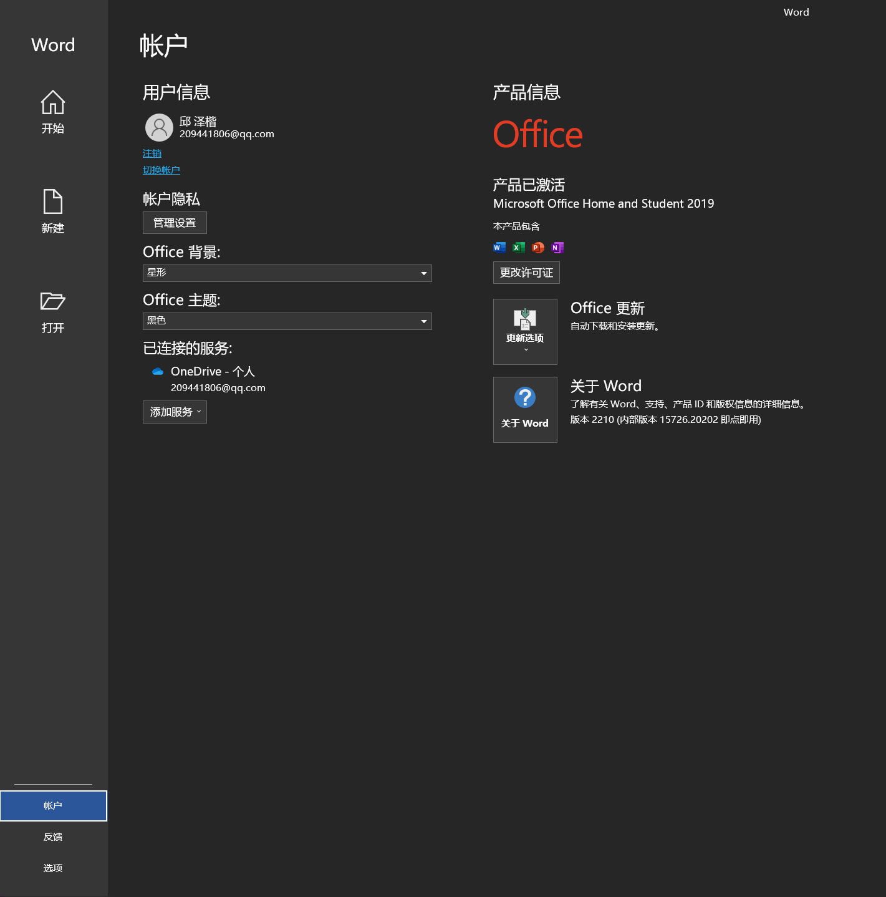
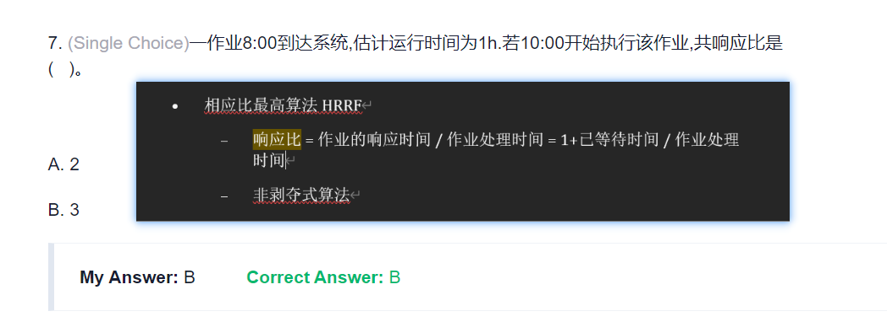
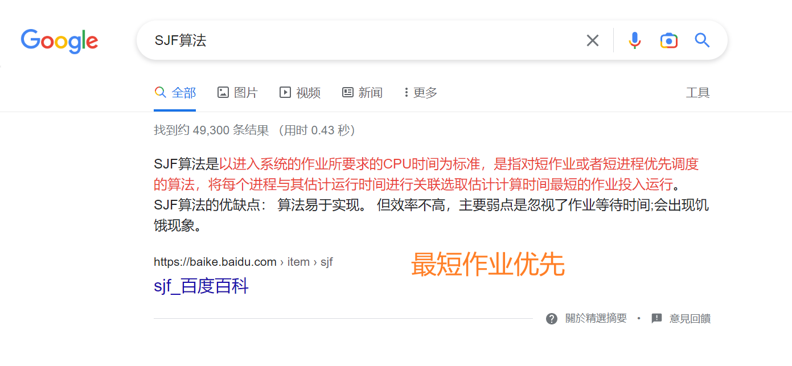
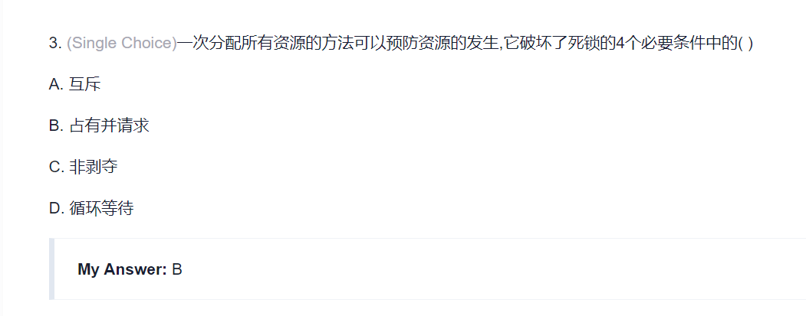
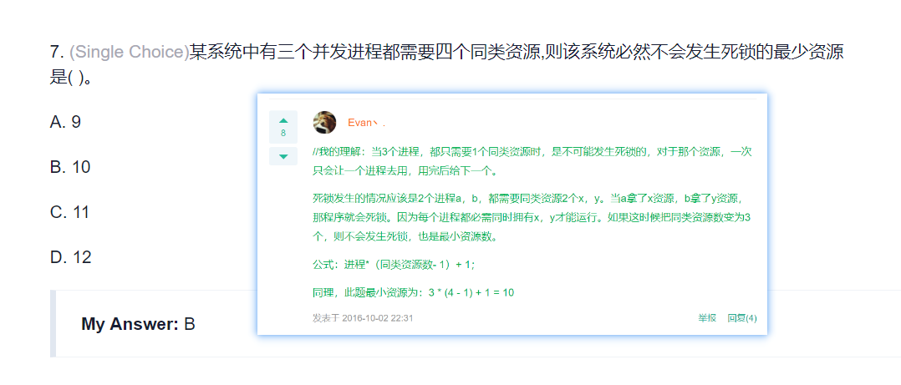
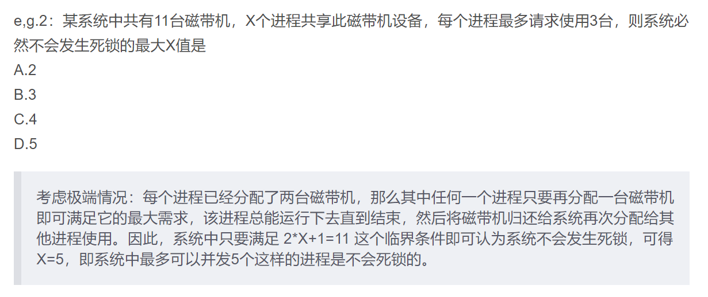

```html
11月17日 【Ben】

遇到的问题
Xxxxxx

今日小结
1. 学习了xxx
2.【Vue-响应式】看到了第xx集
3. xxx

明日计划
1.【Vue-响应式】学到第xx集
```

​    

**[darkreader帮助文档](https://darkreader.org/help/zh-CN/#filter-settings)**





**进程和线程的区别**

> **进程**是对运行时程序的封装，是系统进行资源调度和分配的的基本单位，实现了操作系统的并发； **线程**是**进程**的子任务，是CPU调度和分派的基本单位，用于保证程序的实时性，实现**进程**内部的并发；**线程**是操作系统可识别的最小执行和调度单位。 每个**线程**都独自占用一个虚拟处理器：独自的寄存器组，指令计数器和处理器状态。

​    











​	

**Hexo-Next参考文章**

- [基于Hexo-Next主题博客的美化](https://lvyihao0319.github.io/2019/05/14/%E5%9F%BA%E4%BA%8EHexo-Next%E4%B8%BB%E9%A2%98%E5%8D%9A%E5%AE%A2%E7%9A%84%E7%BE%8E%E5%8C%96/)
- [Hexo 博客 NexT 主题的安装使用](http://home.ustc.edu.cn/~liujunyan/blog/hexo-next-theme-config/#%E7%94%9F%E6%88%90%E7%AB%99%E7%82%B9%E5%9C%B0%E5%9B%BE)
- [hexo的next主题个性化教程:打造炫酷网站](http://shenzekun.cn/hexo%E7%9A%84next%E4%B8%BB%E9%A2%98%E4%B8%AA%E6%80%A7%E5%8C%96%E9%85%8D%E7%BD%AE%E6%95%99%E7%A8%8B.html)
- [Hexo博客优化之Next主题美化](https://blog.csdn.net/nightmare_dimple/article/details/86661502?spm=1001.2101.3001.6661.1&utm_medium=distribute.pc_relevant_t0.none-task-blog-2%7Edefault%7ECTRLIST%7ERate-1-86661502-blog-100138838.pc_relevant_3mothn_strategy_and_data_recovery&depth_1-utm_source=distribute.pc_relevant_t0.none-task-blog-2%7Edefault%7ECTRLIST%7ERate-1-86661502-blog-100138838.pc_relevant_3mothn_strategy_and_data_recovery&utm_relevant_index=1)
- [Hexo-Next 主题博客个性化配置超详细，超全面(两万字)](https://blog.csdn.net/as480133937/article/details/100138838)
- [NexT主题优化](https://hugoji.cn/2019/09/19/next-themes-modify/)
- [Hexo的Next主题美化设置](https://blog.mrzorg.top/Hexo/2020-02-12-hero-next-theme-settings/)
- [hexo博客next主题美化](http://47.108.95.237/2020/10/26/next%E4%B8%BB%E9%A2%98%E5%8D%9A%E5%AE%A2%E7%9A%84%E7%BE%8E%E5%8C%96/)
- [NexT Highlight Theme Preview](https://theme-next.js.org/highlight/)
- [Next 主题设置代码高亮](https://blog.wudinaonao.com/2020/04/27/Next-%E4%B8%BB%E9%A2%98%E8%AE%BE%E7%BD%AE%E4%BB%A3%E7%A0%81%E9%AB%98%E4%BA%AE/)
