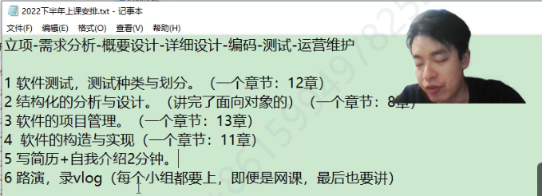
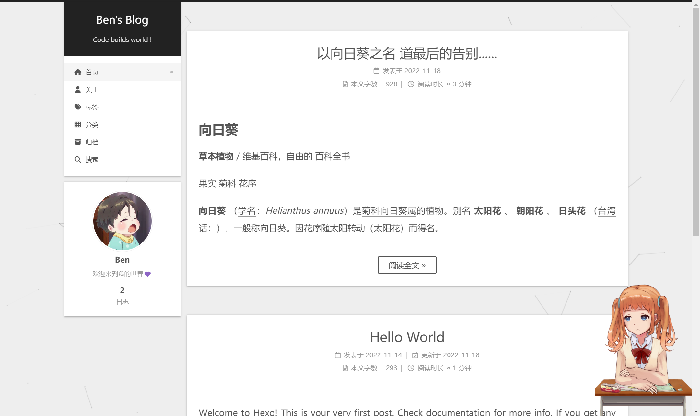
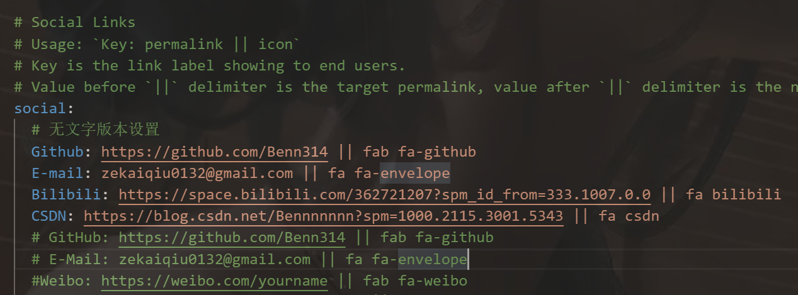
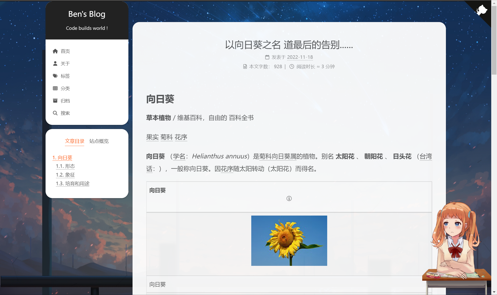
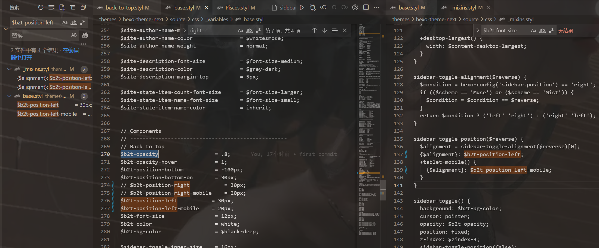
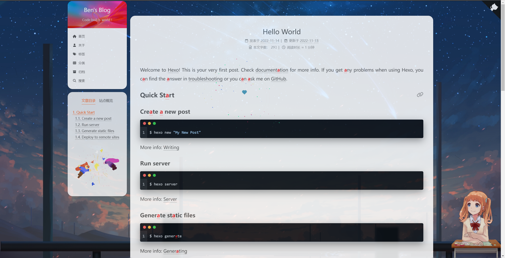
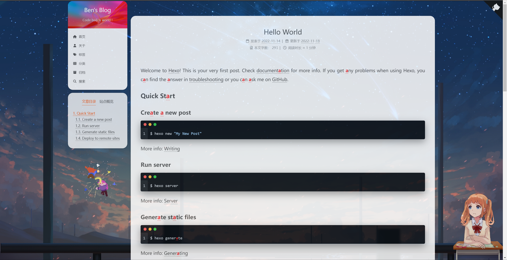
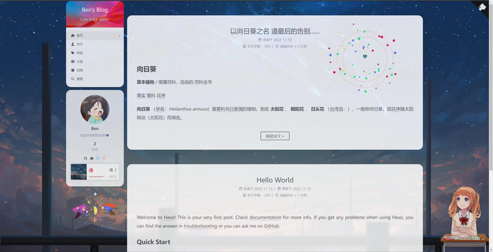
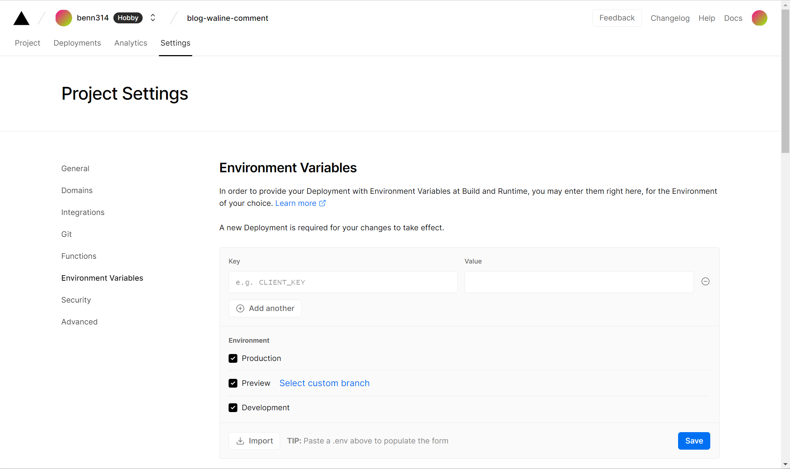
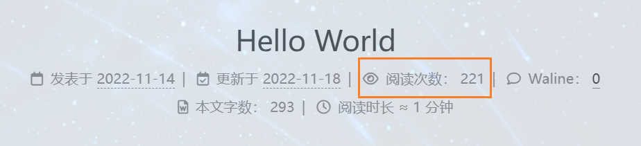

```html
11月18日 【Ben】

遇到的问题
【问题】
1. njk和swig格式有什么不同？
2. next 如何把回到顶部按钮移至左边？
3. 博客添加夜间（暗色调）模式？
4. _mixins.styl 用来干嘛的
5. 【优化】更改因加载了烟花点击动画而出现新的sidebar标签加载动画（影响了加载速度）
6. avif是什么格式？
7. 自定义鼠标样式
8. 如何让百度收录自己的blog
9. 如何把www.xxx.cn xxx.cn 转换成https://xxx.cn
如何把https://www.xxx.cn 转成https://xxx.cn
10. 网站底部添加备案信息(可选)
11. 增加图片懒加载插件

【解决】
6.AVIF 是一种基于开源AV1 视频编解码器的新型开放图像格式。 这种格式非常灵活，因为它支持任何图像编解码器，支持有损和无损编码，能够使用alpha 通道，甚至能够存储一系列动画帧，就像高质量gif 动画一样。 它也是最早支持HDR 颜色的图像格式之一，提供更高的亮度、颜色位深度和颜色色域。

今日小结
1. 学习了xxx
2.【Vue-响应式】看到了第xx集
3. ctrl F5 强制刷新（即不使用缓存加载页面 相当于第一次加载此页面）mouceinc可以倒V直接强制刷新

明日计划
1.【Vue-响应式】学到第xx集
```

[unsplash](https://source.unsplash.com/)是一个高清大图免费下载的好网站，提供了大量的图片和外链API，可以用来当作自己的博客背景

npm config list -l

metrics-registry = "https://registry.npmjs.org/" 

下载cnpm淘宝源 npm install -g cnpm --registry=https://registry.npm.taobao.org

安装shizuku模型时用cnpm很快！且我用npm安装这个模型总会出现 [network error](javascript:;)




软工作业

> 路演，录vlog（每个小组都要上，即便是网课，最后也要讲）今天布置作业
> 下周开始，每次课3个组，每个组15分钟，ppt是上交的，每个人都要交，请注明小组的名字
> 和成员的分工，模板在超星学习通，11.17上传的ppt）

​	

**hexo-next 部分参考文章**

- [基于Hexo-Next主题博客的美化](https://lvyihao0319.github.io/2019/05/14/%E5%9F%BA%E4%BA%8EHexo-Next%E4%B8%BB%E9%A2%98%E5%8D%9A%E5%AE%A2%E7%9A%84%E7%BE%8E%E5%8C%96/)
- [Hexo 博客 NexT 主题的安装使用](http://home.ustc.edu.cn/~liujunyan/blog/hexo-next-theme-config/#%E7%94%9F%E6%88%90%E7%AB%99%E7%82%B9%E5%9C%B0%E5%9B%BE)
- [hexo的next主题个性化教程:打造炫酷网站](http://shenzekun.cn/hexo%E7%9A%84next%E4%B8%BB%E9%A2%98%E4%B8%AA%E6%80%A7%E5%8C%96%E9%85%8D%E7%BD%AE%E6%95%99%E7%A8%8B.html)
- [Hexo博客优化之Next主题美化](https://blog.csdn.net/nightmare_dimple/article/details/86661502?spm=1001.2101.3001.6661.1&utm_medium=distribute.pc_relevant_t0.none-task-blog-2%7Edefault%7ECTRLIST%7ERate-1-86661502-blog-100138838.pc_relevant_3mothn_strategy_and_data_recovery&depth_1-utm_source=distribute.pc_relevant_t0.none-task-blog-2%7Edefault%7ECTRLIST%7ERate-1-86661502-blog-100138838.pc_relevant_3mothn_strategy_and_data_recovery&utm_relevant_index=1)
- [Hexo-Next 主题博客个性化配置超详细，超全面(两万字)](https://blog.csdn.net/as480133937/article/details/100138838)
- [NexT主题优化](https://hugoji.cn/2019/09/19/next-themes-modify/)
- [Hexo的Next主题美化设置](https://blog.mrzorg.top/Hexo/2020-02-12-hero-next-theme-settings/)
- [hexo博客next主题美化](http://47.108.95.237/2020/10/26/next%E4%B8%BB%E9%A2%98%E5%8D%9A%E5%AE%A2%E7%9A%84%E7%BE%8E%E5%8C%96/)
- [NexT Highlight Theme Preview](https://theme-next.js.org/highlight/)
- [Next 主题设置代码高亮](https://blog.wudinaonao.com/2020/04/27/Next-%E4%B8%BB%E9%A2%98%E8%AE%BE%E7%BD%AE%E4%BB%A3%E7%A0%81%E9%AB%98%E4%BA%AE/)

- [Hexo搭建博客NexT主题之AddThis分享文章的配置](https://jasonssun.github.io/2019/06/15/Hexo%E6%90%AD%E5%BB%BA%E5%8D%9A%E5%AE%A2NexT%E4%B8%BB%E9%A2%98%E4%B9%8BAddThis%E5%88%86%E4%BA%AB%E6%96%87%E7%AB%A0%E7%9A%84%E9%85%8D%E7%BD%AE/)
- [hexo笔记四：next主题添加作者头像](https://blog.csdn.net/Awt_FuDongLai/article/details/107424098)
- [next主题如何添加动态背景canvas_nest](https://hdu-zky.github.io/2019/11/27/2019-11-27-add-background-canvas-nest/)
- [next主题博客添加canvas_nest动画背景](https://momogugu.github.io/2017/05/05/next%E4%B8%BB%E9%A2%98%E5%8D%9A%E5%AE%A2%E6%B7%BB%E5%8A%A0canvas-nest%E5%8A%A8%E7%94%BB%E8%83%8C%E6%99%AF.html)
- [next主题自定义侧边栏链接图标（新方法）](https://blog.csdn.net/lhh2333/article/details/126935545)
- [nexT主题更改背景图片和边框圆角](https://zhuanlan.zhihu.com/p/280784973)
- [Hexo博客第三方主题next进阶教程](https://www.jianshu.com/p/1ff2fcbdd155)
- [「通知」博客已添加夜间（暗色调）模式](https://blog.bill.moe/dark-mode/)
- [next主题配置透明色等](https://blog.qsong.fun/2018/01/31/next%E4%B8%BB%E9%A2%98%E9%85%8D%E7%BD%AE%E9%80%8F%E6%98%8E%E8%89%B2%E7%AD%89/)
- [next主题美化——背景图片、动画](https://www.snowmoon.top/2021/02/21/next%E4%B8%BB%E9%A2%98%E7%BE%8E%E5%8C%96/)
- [Hexo Next主题中使用gitment评论功能](https://hjxlog.com/posts/20190907a1.html)
- [Hexo+NexT8.1+Waline踩坑记录](https://www.xygblog.com/p/2fdb9925/)
- [Hexo博客的优化-提升访问速度，SEO](https://www.zyskys.com/posts/60945.html)
- [pjax原理和使用](https://www.jianshu.com/p/f67f2e69d4de)
- [Hexo: Next 主题使用 Waline 评论系统](https://www.zuicy.party/2022/05/03/Hexo_Next_%E4%B8%BB%E9%A2%98%E4%BD%BF%E7%94%A8_Waline%E8%AF%84%E8%AE%BA%E7%B3%BB%E7%BB%9F/)
- [[不蒜子]文章阅读次数](https://blog-website-building-guide.readthedocs.io/zh_CN/latest/next/advanced/[%E4%B8%8D%E8%92%9C%E5%AD%90]%E6%96%87%E7%AB%A0%E9%98%85%E8%AF%BB%E6%AC%A1%E6%95%B0/)
- [修补hexo-next不蒜子不显示问题](https://muyuuuu.github.io/2019/11/22/busuanzi-notdisplay/)
- [【python】smtp发送邮件（账号密码+账号授权码说明）](https://blog.csdn.net/pompom86/article/details/118964520)
- [Fluid -15- Waline 邮件通知](https://www.zywvvd.com/notes/hexo/theme/fluid/fluid-waline-mail-notify/waline-mail-notify/)

​	

#### 我的hexo配置

##### 1 配置menu和主题(Gemini)

##### 2 隐藏网页底部 powered By Hexo / 强力驱动

- ```njk
  <!-- 删除 “由 Hexo & NexT.Gemini 强力驱动” -->
  <!-- 
    <div class="powered-by">
      
      {{- __('footer.powered', next_url('https://hexo.io', 'Hexo') + ' & ' + next_url(next_site, 'NexT.' + theme.scheme)) }}
    </div>
   -->

##### 3 配置代码块高亮风格

##### 4 文章添加阴影

- ```styl
  # 路径：blog\themes\hexo-theme-next\source\css\_common\components\post\index.styl
  
  if (hexo-config('motion.transition.post_block')) {
      .post-block {
        visibility: hidden;
        margin-top: 60px;
        margin-bottom: 60px;
        padding: 25px;
        border-radius: 20px 20px 20px 20px;
        -webkit-box-shadow: 0 0 5px rgba(202, 203, 203, .5);
        -moz-box-shadow: 0 0 5px rgba(202, 203, 204, .5);
      }
      .pagination, .comments {
        visibility: hidden;
      }
    }

##### 5 浏览页面显示当前浏览进度 

- scrollpercent 由于配置了live-e2d 所以把sidebar也设置为true

- > ```html
  > back2top:
  >   enable: true
  >   # Back to top in sidebar.
  >   sidebar: true
  >   # Scroll percent label in b2t button.
  >   scrollpercent: true
  > ```


##### 6 文章分享功能

- （等有了域名以后才能在addthis中配置）


##### 7 Local Search本地搜索

- ````html
  安装插件hexo-generator-searchdb,执行以下命令:
  npm install hexo-generator-searchdb --save
  
  修改hexo/_config.yml站点配置文件，新增以下内容到任意位置：
  search:
  path: search.xml
  field: post
  format: html
  limit: 10000
  
  编辑 主题配置文件，启用本地搜索功能：
  # Local search
  local_search:
  enable: true
  ````

##### 8 设置网站图标

- (没找到满意的 所以还是用官方默认的图标)

- ```html
  在 EasyIcon 中找一张（32 * 32）的 ico 图标，或者去别的网站下载或者制作，并将图标名称改为 favicon.ico，然后把图标放在 /themes/next/source/images 里，并且修改主题配置文件：
  
  favicon:
    small: /images/favicon-16x16-next.png
    medium: /images/favicon-32x32-next.png
    apple_touch_icon: /images/apple-touch-icon-next.png
    safari_pinned_tab: /images/logo.svg
    #android_manifest: /manifest.json
  ```

##### 9 修改文章底部的#号的标签

- ，改为图标(尚未修改，先做个记号) 


##### 10 增加文章字数统计及阅读时长功能

- ```
  Installation
  npm install hexo-word-counter
  
  Usage
  You can set options of hexo-word-counter in the Hexo's _config.yml (which locates in the root dir of your blog):
  symbols_count_time:
    symbols: true
    time: true
    total_symbols: true
    total_time: true
    exclude_codeblock: false
    wpm: 275
    suffix: "mins."
    
    link: https://github.com/next-theme/hexo-word-counter
  ```

##### 11 修改 阅读全文 前显示文字数量

- 即位置(留个记号 尚未更改) 已更改 看下面 `首页文章不展示全文显示摘要`


##### 12 添加作者头像

- ```html
  cd 进入博客目录 themes/next/_config.yml
  
  找到下面这行，取消注释
  avatar: /images/avatar.gif
  
  上传自定义的图片到下列目录：
  博客目录/themes/next/source/images/
  更改avatar路径完成！
  
  rounded: true // 设置头像为圆形显示
  rotated: true // 当鼠标选中头像后 头像会旋转一周
  ```

##### 13 修改加载特动画

- 全局搜索 pace 然后设置 `pace: true` 开启


##### 14 首页文章不展示全文显示摘要

> 官方公告：auto_excerpt 可以自动截断文章内容作为摘要。此功能不是一个 Hexo 主题应当负责的，这为主题的维护者带来了太大压力。自 7.6.0 版本开始，此功能被移除，请自行安装第三方插件，或阅读 Hexo 有关文档。当然，我们仍然建议通过 <!-- more --> 来精确控制 Read More 的位置。因此，这个功能在新版的 NexT 已经被废弃了，大家可以直接在文章中添加 <!-- more --> 来精确控制摘要内容。
>
> 
>
> 我们可以添加前言引用来对文章进行总结提炼 详情可点击阅读全文~
>
> 

##### 15 添加本站运行时间

- ```html
  修改/blog/themes/next/layout/_partials/footer.swig文件，在末尾加入如下代码：
  <!-- <br /> -->
  <!-- 网站运行时间的设置 -->
  <span id="timeDate">载入天数...</span>
  <!-- <span id="times">载入时分秒...</span> -->
  <script>
      var now = new Date();
      function createtime() {
          var grt= new Date("11/17/2022 8:00:00");//此处修改你的建站时间或者网站上线时间
          now.setTime(now.getTime()+250);
          days = (now - grt ) / 1000 / 60 / 60 / 24; dnum = Math.floor(days);
          hours = (now - grt ) / 1000 / 60 / 60 - (24 * dnum); hnum = Math.floor(hours);
          if(String(hnum).length ==1 ){hnum = "0" + hnum;} minutes = (now - grt ) / 1000 /60 - (24 * 60 * dnum) - (60 * hnum);
          mnum = Math.floor(minutes); if(String(mnum).length ==1 ){mnum = "0" + mnum;}
          seconds = (now - grt ) / 1000 - (24 * 60 * 60 * dnum) - (60 * 60 * hnum) - (60 * mnum);
          snum = Math.round(seconds); 
          if(String(snum).length ==1 ){snum = "0" + snum;}
          // var times = document.getElementById("times").innerHTML = hnum + " 小时 " + mnum + " 分 " + snum + " 秒";
          document.getElementById("timeDate").innerHTML = "本站已安全运行 "+dnum+" 天 "+hnum + " 小时 " + mnum + " 分 " + snum + " 秒";
      }
  setInterval("createtime()",250);
  </script>

- **评论、标签样式、各板块透明度和样式还未修改 以及右上角跳转到GitHub的猫猫(√)未设置**
- **live2d(√) 动态背景(√) 鼠标点击动画(√)  联系方式(√)同样未完成 以及左上角的Blog背景可更换 尚未更换**

##### 16 鼠标点击动画

- ```html
  红心特效
  在/themes/next/source/js/下新建文件 clicklove.js ，接着把下面的代码拷贝粘贴到 clicklove.js 文件中：
  
  !function(e,t,a){function n(){c(".heart{width: 10px;height: 10px;position: fixed;background: #f00;transform: rotate(45deg);-webkit-transform: rotate(45deg);-moz-transform: rotate(45deg);}.heart:after,.heart:before{content: '';width: inherit;height: inherit;background: inherit;border-radius: 50%;-webkit-border-radius: 50%;-moz-border-radius: 50%;position: fixed;}.heart:after{top: -5px;}.heart:before{left: -5px;}"),o(),r()}function r(){for(var e=0;e<d.length;e++)d[e].alpha<=0?(t.body.removeChild(d[e].el),d.splice(e,1)):(d[e].y--,d[e].scale+=.004,d[e].alpha-=.013,d[e].el.style.cssText="left:"+d[e].x+"px;top:"+d[e].y+"px;opacity:"+d[e].alpha+";transform:scale("+d[e].scale+","+d[e].scale+") rotate(45deg);background:"+d[e].color+";z-index:99999");requestAnimationFrame(r)}function o(){var t="function"==typeof e.onclick&&e.onclick;e.onclick=function(e){t&&t(),i(e)}}function i(e){var a=t.createElement("div");a.className="heart",d.push({el:a,x:e.clientX-5,y:e.clientY-5,scale:1,alpha:1,color:s()}),t.body.appendChild(a)}function c(e){var a=t.createElement("style");a.type="text/css";try{a.appendChild(t.createTextNode(e))}catch(t){a.styleSheet.cssText=e}t.getElementsByTagName("head")[0].appendChild(a)}function s(){return"rgb("+~~(255*Math.random())+","+~~(255*Math.random())+","+~~(255*Math.random())+")"}var d=[];e.requestAnimationFrame=function(){return e.requestAnimationFrame||e.webkitRequestAnimationFrame||e.mozRequestAnimationFrame||e.oRequestAnimationFrame||e.msRequestAnimationFrame||function(e){setTimeout(e,1e3/60)}}(),n()}(window,document);
  
  在\themes\next\layout\_layout.njk文件末尾添加：
  <!-- 页面点击小红心 -->
  <script type="text/javascript" src="/js/src/clicklove.js"></script>
  ```

- ```html
  球球烟花动画
  跟那个红心是差不多的，首先在themes/next/source/js/里面建一个叫fireworks.js的文件，代码如下：
  
  "use strict"; function updateCoords(e) { pointerX = (e.clientX || e.touches[0].clientX) - canvasEl.getBoundingClientRect().left, pointerY = e.clientY || e.touches[0].clientY - canvasEl.getBoundingClientRect().top } function setParticuleDirection(e) { var t = anime.random(0, 360) * Math.PI / 180, a = anime.random(50, 180), n = [-1, 1][anime.random(0, 1)] * a; return { x: e.x + n * Math.cos(t), y: e.y + n * Math.sin(t) } } function createParticule(e, t) { var a = {}; return a.x = e, a.y = t, a.color = colors[anime.random(0, colors.length - 1)], a.radius = anime.random(16, 32), a.endPos = setParticuleDirection(a), a.draw = function () { ctx.beginPath(), ctx.arc(a.x, a.y, a.radius, 0, 2 * Math.PI, !0), ctx.fillStyle = a.color, ctx.fill() }, a } function createCircle(e, t) { var a = {}; return a.x = e, a.y = t, a.color = "#F00", a.radius = 0.1, a.alpha = 0.5, a.lineWidth = 6, a.draw = function () { ctx.globalAlpha = a.alpha, ctx.beginPath(), ctx.arc(a.x, a.y, a.radius, 0, 2 * Math.PI, !0), ctx.lineWidth = a.lineWidth, ctx.strokeStyle = a.color, ctx.stroke(), ctx.globalAlpha = 1 }, a } function renderParticule(e) { for (var t = 0; t < e.animatables.length; t++) { e.animatables[t].target.draw() } } function animateParticules(e, t) { for (var a = createCircle(e, t), n = [], i = 0; i < numberOfParticules; i++) { n.push(createParticule(e, t)) } anime.timeline().add({ targets: n, x: function (e) { return e.endPos.x }, y: function (e) { return e.endPos.y }, radius: 0.1, duration: anime.random(1200, 1800), easing: "easeOutExpo", update: renderParticule }).add({ targets: a, radius: anime.random(80, 160), lineWidth: 0, alpha: { value: 0, easing: "linear", duration: anime.random(600, 800) }, duration: anime.random(1200, 1800), easing: "easeOutExpo", update: renderParticule, offset: 0 }) } function debounce(e, t) { var a; return function () { var n = this, i = arguments; clearTimeout(a), a = setTimeout(function () { e.apply(n, i) }, t) } } var canvasEl = document.querySelector(".fireworks"); if (canvasEl) { var ctx = canvasEl.getContext("2d"), numberOfParticules = 30, pointerX = 0, pointerY = 0, tap = "mousedown", colors = ["#FF1461", "#18FF92", "#5A87FF", "#FBF38C"], setCanvasSize = debounce(function () { canvasEl.width = 2 * window.innerWidth, canvasEl.height = 2 * window.innerHeight, canvasEl.style.width = window.innerWidth + "px", canvasEl.style.height = window.innerHeight + "px", canvasEl.getContext("2d").scale(2, 2) }, 500), render = anime({ duration: 1 / 0, update: function () { ctx.clearRect(0, 0, canvasEl.width, canvasEl.height) } }); document.addEventListener(tap, function (e) { "sidebar" !== e.target.id && "toggle-sidebar" !== e.target.id && "A" !== e.target.nodeName && "IMG" !== e.target.nodeName && (render.play(), updateCoords(e), animateParticules(pointerX, pointerY)) }, !1), setCanvasSize(), window.addEventListener("resize", setCanvasSize, !1) } "use strict"; function updateCoords(e) { pointerX = (e.clientX || e.touches[0].clientX) - canvasEl.getBoundingClientRect().left, pointerY = e.clientY || e.touches[0].clientY - canvasEl.getBoundingClientRect().top } function setParticuleDirection(e) { var t = anime.random(0, 360) * Math.PI / 180, a = anime.random(50, 180), n = [-1, 1][anime.random(0, 1)] * a; return { x: e.x + n * Math.cos(t), y: e.y + n * Math.sin(t) } } function createParticule(e, t) { var a = {}; return a.x = e, a.y = t, a.color = colors[anime.random(0, colors.length - 1)], a.radius = anime.random(16, 32), a.endPos = setParticuleDirection(a), a.draw = function () { ctx.beginPath(), ctx.arc(a.x, a.y, a.radius, 0, 2 * Math.PI, !0), ctx.fillStyle = a.color, ctx.fill() }, a } function createCircle(e, t) { var a = {}; return a.x = e, a.y = t, a.color = "#F00", a.radius = 0.1, a.alpha = 0.5, a.lineWidth = 6, a.draw = function () { ctx.globalAlpha = a.alpha, ctx.beginPath(), ctx.arc(a.x, a.y, a.radius, 0, 2 * Math.PI, !0), ctx.lineWidth = a.lineWidth, ctx.strokeStyle = a.color, ctx.stroke(), ctx.globalAlpha = 1 }, a } function renderParticule(e) { for (var t = 0; t < e.animatables.length; t++) { e.animatables[t].target.draw() } } function animateParticules(e, t) { for (var a = createCircle(e, t), n = [], i = 0; i < numberOfParticules; i++) { n.push(createParticule(e, t)) } anime.timeline().add({ targets: n, x: function (e) { return e.endPos.x }, y: function (e) { return e.endPos.y }, radius: 0.1, duration: anime.random(1200, 1800), easing: "easeOutExpo", update: renderParticule }).add({ targets: a, radius: anime.random(80, 160), lineWidth: 0, alpha: { value: 0, easing: "linear", duration: anime.random(600, 800) }, duration: anime.random(1200, 1800), easing: "easeOutExpo", update: renderParticule, offset: 0 }) } function debounce(e, t) { var a; return function () { var n = this, i = arguments; clearTimeout(a), a = setTimeout(function () { e.apply(n, i) }, t) } } var canvasEl = document.querySelector(".fireworks"); if (canvasEl) { var ctx = canvasEl.getContext("2d"), numberOfParticules = 30, pointerX = 0, pointerY = 0, tap = "mousedown", colors = ["#FF1461", "#18FF92", "#5A87FF", "#FBF38C"], setCanvasSize = debounce(function () { canvasEl.width = 2 * window.innerWidth, canvasEl.height = 2 * window.innerHeight, canvasEl.style.width = window.innerWidth + "px", canvasEl.style.height = window.innerHeight + "px", canvasEl.getContext("2d").scale(2, 2) }, 500), render = anime({ duration: 1 / 0, update: function () { ctx.clearRect(0, 0, canvasEl.width, canvasEl.height) } }); document.addEventListener(tap, function (e) { "sidebar" !== e.target.id && "toggle-sidebar" !== e.target.id && "A" !== e.target.nodeName && "IMG" !== e.target.nodeName && (render.play(), updateCoords(e), animateParticules(pointerX, pointerY)) }, !1), setCanvasSize(), window.addEventListener("resize", setCanvasSize, !1) };
  
  打开themes/next/layout/_layout.njk,在</body>上面写下如下代码：
  
     <canvas class="fireworks" style="position: fixed;left: 0;top: 0;z-index: 1; pointer-events: none;" ></canvas> 
     <script type="text/javascript" src="//cdn.bootcss.com/animejs/2.2.0/anime.min.js"></script> 
     <script type="text/javascript" src="/js/fireworks.js"></script>
  
  
  打开主题配置文件，在里面最后写下：
  # 鼠标点击动画 Fireworks
  fireworks: true
  ```

##### 17 背景动画（丝带和网格）

- ```html
  # 丝带背景动画
  # Generate a ribbon in your website with HTML5 canvas.
  # For more information: https://github.com/hustcc/ribbon.js
  canvas_ribbon: # 丝带背景动画
    enable: false
    size: 300 # The width of the ribbon
    alpha: 0.6 # The transparency of the ribbon
    zIndex: -1 # The display level of the ribbon
  ```

- ```html
  # 网格背景动画
  修改主题配置文件
  打开 /next/_config.yml，Ctrl+f找到Canvas-nest，将enable改为true
  # Canvas-nest
  # Dependencies: https://github.com/theme-next/theme-next-canvas-nest
  # For more information: https://github.com/hustcc/canvas-nest.js
  # canvas_nest
  canvas_nest: true //开启动画 老版的不能用enable: true
  canvas_nest: false //关闭动画
  
  
  接下来有两种方法：
  方法一：修改布局文件
  打开 next/layout/_layout.swig，在<body></body>标签内添加以下代码
  
  <script type="text/javascript"
      count="150"
      opacity: 1
      src="//cdn.bootcss.com/canvas-nest.js/1.0.0/canvas-nest.min.js">
  </script>
  
  
  这里怀疑src里的链接配置的count=99 所以设置了内联式count=150（默认也是150） 设置后count的数量明显增加
  
  方法二：下载插件canvas-nest
  git clone https://github.com/theme-next/theme-next-canvas-nest
  themes/next-v7.5.0/source/lib/canvas-nest
  **<!-- 背景网格动画  本地的canvas-nest.min.js 原因不明-->**
  
  然后运行以下代码重新构建
  hexo clean && hexo g && hexo s
  
  配置项
  color：线条颜色, 默认: ‘0,0,0’ ；三个数字分别为(R,G,B)，注意用,分割
  opacity：线条透明度（0～1），默认：0.5
  count：线条的总数量，默认150
  zIndex：背景的z-index属性，css属性用于控制所在层的位置，默认：－1
  所以，大家可以根据自己的喜好配置～
  ```

##### 18 文章结束标志

- ```html
  在路径 \themes\next\layout\_macro 中新建 passage-end-tag.swig 文件,并添加以下内容
  <div>
      
          <div style="text-align:center;color: #ccc;font-size:14px;">-------------已经到底啦！<i class="fa fa-paw"></i>-------------</div>
      
  </div>
  
  接着打开\themes\next\layout\_macro\post.njk文件，在post-body 之后(END POST BODY)， post-footer 之前添加如代码：
  <div>
    
      
    
  </div>
  
  然后打开主题配置文件（_config.yml),在末尾添加：(不加也生效)
  # 文章末尾添加“本文结束”标记
  passage_end_tag:
    enabled: true
  ```

##### 19 配置live-2d模型

- ```html
  npm install -save hexo-helper-live2d（这个默认是shizuku 不用配置 安装了直接在站点显示）
  
  然后在在 hexo 的 _config.yml中添加参数：（想要配置参数的话，需要重新下载专门的模型包）
  live2d:
    enable: true
    scriptFrom: local
    pluginRootPath: live2dw/
    pluginJsPath: lib/
    pluginModelPath: assets/
    tagMode: false
    log: false
    model:
      use: live2d-widget-model-<你喜欢的模型名字>
    display:
      position: right
      # width: 150 # 大小根据模型结构自己调整合适的
      # height: 300
    mobile:
      show: true # 是否在手机端显示
  
  可供选择模型：
  
  live2d-widget-model-chitose
  
  live2d-widget-model-epsilon2_1
  
  live2d-widget-model-gf
  
  live2d-widget-model-haru/01 (use npm install --save live2d-widget-model-haru)
  
  live2d-widget-model-haru/02 (use npm install --save live2d-widget-model-haru)
  
  live2d-widget-model-haruto
  
  live2d-widget-model-hibiki
  
  live2d-widget-model-hijiki
  
  live2d-widget-model-izumi
  
  live2d-widget-model-koharu
  
  live2d-widget-model-miku
  
  live2d-widget-model-ni-j
  
  live2d-widget-model-nico
  
  live2d-widget-model-nietzsche
  
  live2d-widget-model-nipsilon
  
  live2d-widget-model-nito
  
  live2d-widget-model-shizuku
  
  live2d-widget-model-tororo
  
  live2d-widget-model-tsumiki
  
  live2d-widget-model-unitychan
  
  live2d-widget-model-wanko
  
  live2d-widget-model-z16
  
          
  上面模型的选择可在lived2d中选择，并下载相应的模型：
  npm install live2d-widget-model-wanko --save
          
  下载cnpm淘宝源 npm install -g cnpm --registry=https://registry.npm.taobao.org
  安装shizuku模型时用cnpm很快！且我用npm安装这个模型总会出现 network error
          
  个人最喜欢的两个模型 wanko 和 shizuku
         
  hexo-helper-live2d相当于live2d的脚手架 不能只下载model 删除了hexo-helper-live2d live2d模型无法生成
  
  ```



padding值需要调整 位置不太对

##### 20 侧边栏社交链接

- ```html
  在主题配置文件中 开启social
  # Social Links
  # Usage: `Key: permalink || icon`
  # Key is the link label showing to end users.
  # Value before `||` delimiter is the target permalink, value after `||` delimiter is the name of Font Awesome icon.
  social:
    GitHub: https://github.com/Benn314 || fab fa-github
    E-Mail: zekaiqiu0132@gmail.com || fa fa-envelope
  # 如果不想有图标描述文字的话 可以把icons_only设置为true
  social_icons:
    enable: true
    icons_only: true # 设置只显示图标不显示文字
    transition: false
  ```

##### 21 NexT主题右上角添加fork me on github入口

- ```html
  1.首先到GitHub Corners（https://tholman.com/github-corners/）或者GitHub Ribbons（https://github.blog/2008-12-19-github-ribbons/）选择自己喜欢的图标，然后copy相应的代码
  2.然后将刚才复制的代码粘贴到themes/next/layout/_layout.njk文件中
  3.把代码中的href后面的值替换成你要跳转的地址，比如你的GitHub主页
  例如：
    <a href="https://github.com/Benn314" class="github-corner" aria-label="View source on GitHub"><svg width="80" height="80" viewBox="0 0 250 250" style="fill:#151513; color:#fff; position: absolute; top: 0; border: 0; right: 0;" aria-hidden="true"><path d="M0,0 L115,115 L130,115 L142,142 L250,250 L250,0 Z"></path><path d="M128.3,109.0 C113.8,99.7 119.0,89.6 119.0,89.6 C122.0,82.7 120.5,78.6 120.5,78.6 C119.2,72.0 123.4,76.3 123.4,76.3 C127.3,80.9 125.5,87.3 125.5,87.3 C122.9,97.6 130.6,101.9 134.4,103.2" fill="currentColor" style="transform-origin: 130px 106px;" class="octo-arm"></path><path d="M115.0,115.0 C114.9,115.1 118.7,116.5 119.8,115.4 L133.7,101.6 C136.9,99.2 139.9,98.4 142.2,98.6 C133.8,88.0 127.5,74.4 143.8,58.0 C148.5,53.4 154.0,51.2 159.7,51.0 C160.3,49.4 163.2,43.6 171.4,40.1 C171.4,40.1 176.1,42.5 178.8,56.2 C183.1,58.6 187.2,61.8 190.9,65.4 C194.5,69.0 197.7,73.2 200.1,77.6 C213.8,80.2 216.3,84.9 216.3,84.9 C212.7,93.1 206.9,96.0 205.4,96.6 C205.1,102.4 203.0,107.8 198.3,112.5 C181.9,128.9 168.3,122.5 157.7,114.1 C157.9,116.9 156.7,120.9 152.7,124.9 L141.0,136.5 C139.8,137.7 141.6,141.9 141.8,141.8 Z" fill="currentColor" class="octo-body"></path></svg></a><style>.github-corner:hover .octo-arm{animation:octocat-wave 560ms ease-in-out}@keyframes octocat-wave{0%,100%{transform:rotate(0)}20%,60%{transform:rotate(-25deg)}40%,80%{transform:rotate(10deg)}}@media (max-width:500px){.github-corner:hover .octo-arm{animation:none}.github-corner .octo-arm{animation:octocat-wave 560ms ease-in-out}}</style>
  
  ```

##### 22 自定义侧边栏链接图标

- ```html
  把图片放在\themes\next\source\images目录下，然后在\themes\next\source\css目录下的main.styl添加代码
  比如哔哩哔哩，首先去阿里云下载svg格式的图标 https://www.iconfont.cn/
  ```

- 

- ```html
  然后再将下面的代码也添加到main.styl文件中，最后在social项下图片来源设置为 fa bilibili
  
  /* 侧边栏图标格式设置 */
  .bilibili {
    background-image: url('/images/bilibili.svg');
    background-size: 1em 1em;
    opacity: 0.55;
    background-position: 0.05rem 0.2rem;
    background-repeat: no-repeat;
    height: 1rem;
    width: 1rem; 
    border-radius: 0rem;
    /*鼠标停留在图标上时，图标呈现发光效果*/
    &:hover {
        opacity: 1;
      }
  } 
  ```

- 

##### 23 添加博客背景

- 新版本需要新建`hexo/source/_data/styles.styl`，即在`hexo`目录的`source`文件夹下新建`_data`文件夹，文件夹中新建`styles.styl`。

  > ***注意：是新建在hexo目录下source文件夹里，而不是主题文件next目录下的source文件夹。***

  打开`styles.styl`，添加如下：

  ```html
  //背景图片设置
  body {
      background-image: url(/images/background.jpg);
      background-repeat: no-repeat;
      background-attachment: fixed;
      background-size: 100% 100%;
  }
  
  background-image:url 为图片路径，可以直接使用链接，也可以是图片路径（将自定义图片放入hexo\public\images路径下）
  background-repeat：若果背景图片不能全屏，那么是否平铺显示，充满屏幕
  background-attachment：背景是否随着网页上下滚动而滚动，fixed 为固定
  background-size：图片展示大小，这里设置 100%，100% 的意义为：如果背景图片不能全屏，那么是否通过拉伸的方式将背景强制拉伸至全屏显示
  ```

  接下来打开`hexo/themes/next/_config.yml`，即next主题配置文件，修改如下：

  ```html
  将custom_file_path的sytle注释打开
  ```

  记得保存
  
  > [unsplash](https://source.unsplash.com/)是一个高清大图免费下载的好网站，提供了大量的图片和外链API，可以用来当作自己的博客背景
  
  

##### 24 博客页面透明化 （失效）

- 为了更好欣赏背景图片，可将博客页面透明化，在`styles.styl`里添加如下内容：

  ```html
  //文章内容的透明度设置
  .content-wrap {
    opacity: 0.9;
  }
  
  //侧边框的透明度设置
  .sidebar {
    background-color: transparent;
    opacity: 0.9;
  }
  
  //菜单栏的透明度设置
  .header-inner {
    background: rgba(255,255,255,0.9);
  }
  ```

##### 25 边框圆角

- ```html
  custom_file_path:
  
  variable: source/_data/variables.styl

- 在之前新建的`_data`目录下新建`variables.styl`，类似新建`styles.styl`。打开`variables.styl`，添加如下：

- ```html
// 圆角设置
$border-radius-inner     = 20px 20px 20px 20px;
$border-radius           = 20px;

- 有一个问题就是侧边栏的圆角明显有一层阴影，圆角效果不明显

- 回答中有提到黑色背景覆盖了圆角，所以我尝试了下将黑色改为透明，成功实现。具体是修改 /themes/next/source/css/_variables/Gemini.styl 内代码,将 $body-bg-color 赋值为透明 transparent。

- ```html
  // Variables of Gemini scheme
  // ==================================================
  
  @import "Pisces.styl";
  
  // Settings for some of the most global styles.
  // --------------------------------------------------
  $body-bg-color           = #eee;
  // $body-bg-color           = transparent;
  // Borders.
  // --------------------------------------------------
  $box-shadow-inner        = 0 2px 2px 0 rgba(0, 0, 0, .12), 0 3px 1px -2px rgba(0, 0, 0, .06), 0 1px 5px 0 rgba(0, 0, 0, .12);
  $box-shadow              = 0 2px 2px 0 rgba(0, 0, 0, .12), 0 3px 1px -2px rgba(0, 0, 0, .06), 0 1px 5px 0 rgba(0, 0, 0, .12), 0 -1px .5px 0 rgba(0, 0, 0, .09);
  
  // $border-radius-inner     = 20px;
  // $border-radius           = 20px;
  
  $border-radius-inner     = initial;
  $border-radius           = initial;
  // $border-radius-inner     = 0 0 3px 3px;
  // $border-radius           = 3px;
  ```

##### 26 修改侧边栏顶部圆角

- ```html
  在 blog\themes\hexo-theme-next\source\css\_common\outline\header\index.styl 中对site-brand-container进行修改
  
  .site-brand-container {
    display: flex;
    flex-shrink: 0;
    padding: 0 10px;
    border-radius: 18.8px 18.8px 0 0; // 上边圆角 下边尖角 不设置20px 20px 0 0的原因是因为下面的sidebar的class="header"有一点白色溢出 所以把圆角设置小点对其进行覆盖
  }
  ```

##### 27 设置透明度

主体内容block 还设置了布局  不需要可以删掉下面的margin和padding或者修改其值

- ```html
  C:\Users\小楷\Desktop\blog\themes\hexo-theme-next\source\css\_common\components\post\index.styl
  .use-motion {
    if (hexo-config('motion.transition.post_block')) {
      .post-block {
        visibility: hidden;
        margin-top: 60px;
        margin-bottom: 60px;
  	  margin-left: 2px;
        padding-top: 45px;
        // border-radius: 20px 20px 20px 20px;
        -webkit-box-shadow: 0 0 5px rgba(202, 203, 203, .5);
        -moz-box-shadow: 0 0 5px rgba(202, 203, 204, .5);
        opacity: 0.95; // 添加透明度
      }
      .pagination, .comments {
        visibility: hidden;
      }
    }
  ```

- 

目录和站点概览

- ```html
  .sidebar-inner {
    background: var(--content-bg-color);
    border-radius: $border-radius;
    box-shadow: $box-shadow;
    box-sizing: border-box;
    color: var(--text-color);
    margin-top: $sidebar-offset;
    opacity: 0.95; // 添加透明度
  }
  ```

sidebar上边部分

```html
blog\themes\hexo-theme-next\source\css\_schemes\Pisces\_layout.styl

.header {
  background: var(--content-bg-color);
  border-radius: $border-radius-inner;
  box-shadow: $box-shadow-inner;
  opacity: 0.95 // 添加透明度

  +tablet-mobile() {
    border-radius: initial;
  }
}
```

```html
这里有个问题 设置了主体透明度后 搜索框弹出会被覆盖图层 尚不知如何解决只能还原不透明度了（如果想要使用本地搜索的话）
// 搜索框 local-search 的透明度设置
.popup {
  opacity: 1;
}

blog\themes\hexo-theme-next\source\css\_schemes\Pisces\_layout.styl
这里不能设置.header opacity: ; 不然不止搜索栏会透明 搜索弹框也会透明 导致搜索弹框会被覆盖
.header {
  background: var(--content-bg-color);
  border-radius: $border-radius-inner;
  box-shadow: $box-shadow-inner;
  // opacity: 0.5; // 添加透明度

  +tablet-mobile() {
    border-radius: initial;
  }
}
```

---

最理想的透明度设置（推翻上面所有）

```html
在 blog\source\_data\styles.styl 中 直接设置body的透明度为0.85 全体透明化
//背景图片设置
body {
    background-image: url(/images/bg1.jpg);
    background-repeat: no-repeat;
    background-attachment: fixed;
    background-size: 100% 100%;
    opacity: 0.85;
    //可选
    +mobile(){
      background-image: url(https://ziyuan.lruihao.cn/images/bg_cell.png);
      background-size: cover;
    }
}
```

##### 28 Back to top 设置回到顶部按钮的透明度和位置（靠左）

```html
blog\themes\hexo-theme-next\source\css\_variables\Pisces.styl
// 调整透明度
// Back to top
$b2t-opacity  = .94; // 默认 .6
$b2t-opacity-hover  = .99; // 默认 .8

// 调整位置靠左
在blog\themes\hexo-theme-next\source\css\_variables\base.styl中有Back to top的基本参数信息
// Components
// --------------------------------------------------
// Back to top
$b2t-opacity                  = .8;
$b2t-opacity-hover            = 1;
$b2t-position-bottom          = -100px;
$b2t-position-bottom-on       = 30px;
// $b2t-position-right           = 30px; //注释掉 themes\hexo-theme-next\source\css\_mixins.styl的逻辑也可以注释掉 不然可能有warnning
// $b2t-position-right-mobile    = 20px;//注释掉 themes\hexo-theme-next\source\css\_mixins.styl的逻辑也可以注释掉 不然可能有warnning
$b2t-font-size                = 12px;
$b2t-color                    = white;
$b2t-bg-color                 = $black-deep;

$sidebar-toggle-inner-size    = 16px;
$sidebar-toggle-padding       = 5px;
$sidebar-toggle-size          = $sidebar-toggle-inner-size + $sidebar-toggle-padding * 2;

// 然后在themes\hexo-theme-next\source\css\_common\components\back-to-top.styl中添加如下两行代码并注释原有的一行代码
if (hexo-config('back2top.enable')) {
  .back-to-top {
    font-size: $b2t-font-size;

    span {
      //margin-right: 8px; // 注释掉（默认设置是这个 然后我给改成末尾两行）
    }
    ...
    ...
    padding-right: 5px; // 新添加的代码
    left: 30px; // // 新添加的代码
  }
}
```



这里从right修改成left无效的原因是值没有变 只是换了个变量名 当然没用呀 名字只是用来区分而已 你叫右边叫做tan90都没问题

##### 29 添加 README.md 文件

每个项目下一般都有一个 `README.md` 文件，但是使用 hexo 部署到仓库后，项目下是没有 `README.md` 文件的。

在 Hexo 目录下的 `source` 根目录下添加一个 `README.md` 文件，修改站点配置文件 _`config.yml`，将 `skip_render` 参数的值设置为

```
skip_render: README.md
```

保存退出即可。再次使用 `hexo d` 命令部署博客的时候就不会在渲染 README.md 这个文件了。

##### 30 侧栏 Celeste（旋转的小人）

- ```html
  // 放在 blog\themes\hexo-theme-next\layout\_macro\sidebar.njk 是这种效果
  <div class="twopeople">
          <div class="container" style="height:200px;">
              <canvas class="illo" width="800" height="800" style="max-width: 200px; max-height: 200px; touch-action: none; width: 640px; height: 640px;"></canvas>
          </div>
          <script src="https://cdn.jsdelivr.net/gh/Justlovesmile/CDN/js/twopeople1.js"></script>
          <script src="https://cdn.jsdelivr.net/gh/Justlovesmile/CDN/js/zdog.dist.js"></script>
          <script id="rendered-js" src="https://cdn.jsdelivr.net/gh/Justlovesmile/CDN/js/twopeople.js"></script>
          <style>
              .twopeople{
                  margin: 0;
                  align-items: center;
                  justify-content: center;
                  text-align: center;
              }
              canvas {
                  display: block;
                  margin: 0 auto;
                  cursor: move;
              }
          </style>
        </div>
  
        
          <div class="back-to-top animated" role="button" aria-label="{{ __('accessibility.back_to_top') }}">
            <i class="fa fa-arrow-up"></i>
            <span>0%</span>
          </div>
        
      </div>
    </aside>
  

- 

- ```html
  // 放在 blog\themes\hexo-theme-next\layout\_layout.njk
  
  <div class="column">
        <header class="header" itemscope itemtype="http://schema.org/WPHeader">
          
        </header>
        
          
        
  
        <-- 旋转的小人 -->
        <div class="twopeople">
          <div class="container" style="height:200px;">
              <canvas class="illo" width="800" height="800" style="max-width: 200px; max-height: 200px; touch-action: none; width: 640px; height: 640px;"></canvas>
          </div>
          <script src="https://cdn.jsdelivr.net/gh/Justlovesmile/CDN/js/twopeople1.js"></script>
          <script src="https://cdn.jsdelivr.net/gh/Justlovesmile/CDN/js/zdog.dist.js"></script>
          <script id="rendered-js" src="https://cdn.jsdelivr.net/gh/Justlovesmile/CDN/js/twopeople.js"></script>
          <style>
              .twopeople{
                  margin: 0;
                  align-items: center;
                  justify-content: center;
                  text-align: center;
              }
              canvas {
                  display: block;
                  margin: 0 auto;
                  cursor: move;
              }
          </style>
        </div>
      </div>
  ```

- 有一个问题就是 这么放的话 动画位置不会固定在浏览器窗口位置 随着滚动而消失 但也有好处 就是阅读时不会因为动画而分心 故我选择第二种形式

- **添加了旋转小人后 动画性能下降 会有存在动画冲突或者只是单纯动画加载过多导致性能下降**

##### 31 懒加载开启

```html
themes\hexo-theme-next\_config.yml

# Vanilla JavaScript plugin for lazyloading images.
# For more information: https://apoorv.pro/lozad.js/demo/
lazyload: true # 懒加载开启
```

##### 32 加入网易云音乐播放器

首先在网页搜索网易云音乐，选择音乐，并生成外链：

然后得到外链html代码：

```html
<!-- 外链播放器 溯（钢琴版）-->
<iframe frameborder="no" border="0" marginwidth="0" marginheight="0" width=330 height=86 src="//music.163.com/outchain/player?type=2&id=1433584979&auto=1&height=66"></iframe>
```

将代码粘贴到一个合适的位置，建议放在侧边栏，在`Blog/themes/next/layout/_macro/sidebar.njk` 或 `themes\hexo-theme-next\layout\_layout.njk` 文件下，选择位置复制进去，不同位置效果不同



##### 33 添加Aplayer音乐播放器

1. 使用npm先安装aplayer

> npm install aplayer --save

2. dist文件夹
   - 再将文件中的dist文件夹复制到路径：`blog/themes/next/source`

3. 新建music.js

- 在目录`blog/themes/next/source/dist`下添加music.js文件，内容是：

- ```html
  const ap = new APlayer({
      container: document.getElementById('aplayer'),
      fixed: true,
      autoplay: true,
      audio: [
  	  {
          name: '溯（钢琴版）',
          artist: '柳轻颂',
          url: 'http://music.163.com/song/media/outer/url?id=1433584979.mp3',
          cover: '/images/5.jpg',
        },
        {
          name: "星星",
          artist: '张杰',
          url: 'http://music.163.com/song/media/outer/url?id=1399004693.mp3',
          cover: '/images/xingxing.jpg',
        },
        {
          name: '这就是爱吗',
          artist: '十豆',
          url: 'http://music.163.com/song/media/outer/url?id=1412242872.mp3',
          cover: '/images/zjsam.jpg',
        },
        {
          name: 'Alone',
          artist: 'Alan Walker / Noonie Bao',
          url: 'http://music.163.com/song/media/outer/url?id=444269135.mp3',
          cover: '/images/alone.jpg',
        },
  	  {
          name: 'Umbrella (Matte Remix)',
          artist: 'Matte / Ember Island',
          url: 'http://music.163.com/song/media/outer/url?id=164209623.mp3',
          cover: '/images/1.jpg',
        },
  	  {
          name: '大眠 (完整版)原唱：王心凌',
          artist: '小乐哥',
          url: 'http://music.163.com/song/media/outer/url?id=3778678.mp3',
          cover: '/images/2.jpg',
        },
  	  {
          name: '世间美好与你环环相扣',
          artist: '柏松',
          url: 'http://music.163.com/song/media/outer/url?id=1363948882.mp3',
          cover: '/images/3.jpg',
        },
  	  {
          name: '飞',
          artist: '王恩信Est / 二胖u',
          url: 'http://music.163.com/song/media/outer/url?id=1386259535.mp3',
          cover: '/images/4.jpg',
        }
      ]
  });
  
  ```

- 注：里面的代码可以修改，歌曲信息需要手动添加：

  - name：歌曲名称
  - artist：作者
  - url：连接（具体怎样操作看下面步骤）
  - cover：是图片连接，可以是本地图片，也可以是在线图片，本地放在`source/images`然后修改路径即可

4. url添加歌曲方法

   - 网易云网页播放一首歌曲

   -  将网址中的id复制例：https://music.163.com/#/song?id=1411358329
   -  将下面代码中的id修改为你想添加歌曲的id：http://music.163.com/song/media/outer/url?id=.mp3

5. 修改文件_layout.njk

   在路径：`blog/themes/next/layout`下找到_layout.njk文件，然后将下面的代码添加到：`<body itemscope ...>` 在body里面就可以

- ```html
  <link rel="stylesheet" href="/dist/APlayer.min.css">
  <div id="aplayer"></div>
  <script type="text/javascript" src="/dist/APlayer.min.js"></script>
  <script type="text/javascript" src="/dist/music.js"></script>
  ```

6. 结语

- 然后`hexo g`再`hexo d`在网页的左下角就可以看到了，大功告成！

​	

​	因为有了aplayer插件 所有原先的back-to-top会被遮挡 需要重新调试位置

```html
padding-right: 5px;
    // left: 30px; // 原先修改过后的位置 加了aplayer后 重新定义位置如下
    left: 15%
```

##### 34 删除了默认的landscope主题

压缩内存 优化性能内存

##### 35 评论系统

根据网上对国内国外的评价系统对比，可知Valine是近几年大受欢迎的博客评价系统，但由于作者已经放弃了对 Valine 的维护，bug一堆尚未解决，所以最终敲定用基于Valine开发的新版本[Waline](https://waline.js.org/)作为本博客的评价系统

###### LeanCloud 设置 (数据库)

1. [登录open in new window](https://console.leancloud.app/login) 或 [注册open in new window](https://console.leancloud.app/register) `LeanCloud 国际版` 并进入 [控制台open in new window](https://console.leancloud.app/apps)
2. 点击左上角 [创建应用open in new window](https://console.leancloud.app/apps) 并起一个你喜欢的名字 (请选择免费的开发版):

3. 进入应用，选择左下角的 `设置` > `应用 Key`。你可以看到你的 `APP ID`,`APP Key` 和 `Master Key`。请记录它们，以便后续使用。

> 国内版需要完成备案接入
>
> 如果你正在使用 Leancloud 国内版 ([leancloud.cnopen in new window](https://leancloud.cn/))，我们推荐你切换到国际版 ([leancloud.appopen in new window](https://leancloud.app/))。否则，你需要为应用额外绑定**已备案**的域名，同时购买独立 IP 并完成备案接入:
>
> - 登录国内版并进入需要使用的应用
> - 选择 `设置` > `域名绑定` > `API 访问域名` > `绑定新域名` > 输入域名 > `确定`。
> - 按照页面上的提示按要求在 DNS 上完成 CNAME 解析。
> - 购买独立 IP 并提交工单完成备案接入。(独立 IP 目前价格为 ￥ 50/个/月)
>
> 

###### Vercel 部署 (服务端)

[](https://vercel.com/new/clone?repository-url=https%3A%2F%2Fgithub.com%2Fwalinejs%2Fwaline%2Ftree%2Fmain%2Fexample)

1. 点击上方按钮，跳转至 Vercel 进行 Server 端部署。

   > 如果你未登录的话，Vercel 会让你注册或登录，请使用 GitHub 账户进行快捷登录。

2. 输入一个你喜欢的 Vercel 项目名称并点击 `Create` 继续:

3. 此时 Vercel 会基于 Waline 模板帮助你新建并初始化仓库，仓库名为你之前输入的项目名。

一两分钟后，满屏的烟花会庆祝你部署成功。此时点击 `Go to Dashboard` 可以跳转到应用的控制台。

点击顶部的 `Settings` - `Environment Variables` 进入环境变量配置页，并配置三个环境变量 `LEAN_ID`, `LEAN_KEY` 和 `LEAN_MASTER_KEY` 。它们的值分别对应上一步在 LeanCloud 中获得的 `APP ID`, `APP KEY`, `Master Key`。

需要进入项目中的 Settings，而不是总设置里，总设置里没有 `Environment Variables` 选项配置



> 如果你使用 LeanCloud 国内版，请额外配置 `LEAN_SERVER` 环境变量，值为你绑定好的域名。

5. 环境变量配置完成之后点击顶部的 `Deployments` 点击顶部最新的一次部署右侧的 `Redeploy` 按钮进行重新部署。该步骤是为了让刚才设置的环境变量生效。
6. 此时会跳转到 `Overview` 界面开始部署，等待片刻后 `STATUS` 会变成 `Ready`。此时请点击 `Visit` ，即可跳转到部署好的网站地址，此地址即为你的服务端地址。

######  绑定域名 (可选)

1. 点击顶部的 `Settings` - `Domains` 进入域名配置页
2. 输入需要绑定的域名并点击 `Add`
3. 在域名服务器商处添加新的 `CNAME` 解析记录

| Type  | Name    | Value                |
| ----- | ------- | -------------------- |
| CNAME | example | cname.vercel-dns.com |

4. 等待生效，你可以通过自己的域名来访问了🎉

- 评论系统：example.yourdomain.com
- 评论管理：example.yourdomain.com/ui


###### 在Next中配置

先到你hexo的站点目录下安装waline：

```bash
npm install @waline/hexo-next --save
```

找到Next主题配置文件，_config.yml进行如下配置，方便日后升级覆盖：

```yml
# Waline 评论
# For more information: https://waline.js.org, https://github.com/walinejs/waline
waline:
  enable: true #是否开启
  serverURL: blog-waline-comment.vercel.app # Waline #服务端地址，我们这里就是上面部署的 Vercel 地址
  placeholder: 请文明评论呀~ # #评论框的默认文字
  avatar: mm # 头像风格
  meta: [nick, mail, link] # 自定义评论框上面的三个输入框的内容
  pageSize: 10 # 评论数量多少时显示分页
  lang: zh-cn # 语言, 可选值: en, zh-cn
  # Warning: 不要同时启用 `waline.visitor` 以及 `leancloud_visitors`.
  visitor: true # 文章阅读统计
  comment_count: true # 如果为 false , 评论数量只会在当前评论页面显示, 主页则不显示
  requiredFields: [nick, mail] # 设置用户评论时必填的信息，[nick,mail]: [nick] | [nick, mail]
  libUrl: # Set custom library cdn url
  
```

###### 评论-邮箱通知

[详细可查看官方文档](https://waline.js.org/guide/server/notification.html)

当网站有用户发布评论或者用户回复评论时，Waline 支持对博主和回复评论作者进行通知。

- 博主通知支持多种方式，包括 QQ、微信、邮件等。
- 当访客的评论收到回复时，我们会对访客进行邮件通知。

> 这里主要介绍邮件通知

邮件通知需要配置以下环境变量:

- `SMTP_SERVICE`: SMTP 邮件发送服务提供商。（例如：`QQ`）

> 你可以在 [这里](https://github.com/nodemailer/nodemailer/blob/master/lib/well-known/services.json) 查看所有支持的运营商。
>
> 如果你的运营商不受支持，你必须填写 `SMTP_HOST` 和 `SMTP_PORT`。
>
> - `SMTP_HOST`: SMTP 服务器地址，一般可以在邮箱的设置中找到。
> - `SMTP_PORT`: SMTP 服务器端口，一般可以在邮箱的设置中找到。

- `SMTP_USER`: SMTP 邮件发送服务的用户名，一般为登录邮箱。
- `SMTP_PASS`: SMTP 邮件发送服务的密码，一般为邮箱登录密码，部分邮箱(例如 163)是单独的 SMTP 密码。
- `SMTP_SECURE`: 是否使用 SSL 连接 SMTP。
- `SITE_NAME`: 网站名称，用于在消息中显示。
- `SITE_URL`: 网站地址，用于在消息中显示。
- `AUTHOR_EMAIL`: 博主邮箱，用来接收新评论通知。如果是博主发布的评论则不进行提醒通知。

以下是选填的环境变量:

- `SENDER_NAME`: 自定义发送邮件的发件人 （可选项只添加了这个）
- `SENDER_EMAIL`: 自定义发送邮件的发件地址
- `MAIL_SUBJECT`: 自定义评论回复邮件标题
- `MAIL_TEMPLATE`: 自定义评论回复邮件内容
- `MAIL_SUBJECT_ADMIN`: 自定义新评论通知邮件标题
- `MAIL_TEMPLATE_ADMIN`: 自定义新评论通知邮件内容

注：`SMTP_USER` 和 `AUTHOR_EMAIL`都需要是完整的邮箱地址(XXX@XXX.com)

如果你跟我一样使用QQ邮箱作为消息通知的话，使用的`SMTP_PASS` 填入的是授权码而不是邮箱登录密码，`SMTP_PASS` 要到你邮箱开启，填入授权码：

###### 添加评论表情包

在主题配置文件下的 waline 添加如下 emoji 代码

```yml
# Waline 评论
# For more information: https://waline.js.org, https://github.com/walinejs/waline
waline:
  enable: true #是否开启
  ......
  emoji: [
      https://unpkg.com/@waline/emojis@1.1.0/tw-emoji, # 加不加https头都可以
      //unpkg.com/@waline/emojis@1.1.0/bilibili,
      //unpkg.com/@waline/emojis@1.1.0/alus,
      https://unpkg.com/@waline/emojis@1.1.0/weibo,
    ]
```

更多表情参考 [自定义表情](https://waline.js.org/guide/client/emoji.html)

不要忘记了重新部署 `Deployed `喔！不然效果无法显示

---

还有一个问题 就是大伙评论的东西 不翻墙刷新不出来 

> 原因 jsdeliver被墙 参考链接🔗: [jsdelivr被墙,hexo-next切换为自定义CDN](https://www.xygblog.com/p/8ebdba58/)

​	

##### 36 背景图上传CDN图床

由于无缓存刷新（或者第一次加载页面）的时候 背景图片加载很慢（只有900多k）所以上传到CDN图床 https://cdnjson.com/

bg1.jpg 链接：https://cdnjson.com/images/2022/11/21/bg1.jpg

##### 37 解决因live-2d与busuanzi代码冲突导致阅读次数无法显示的问题

位置无法更改（bullshit）



**参考文章**：https://ouuan.moe/post/2022/08/busuanzi-and-live2d

###### 通过修改 busuanzi 的解决

因为 busuanzi 的代码较短，而且本来就是用的外部的代码，改起来比较容易。

把 `scriptTag.parentElement.removeChild(scriptTag)` 修改为 `s=document.querySelector('[src*=BusuanziCallback]'),s.parentElement.removeChild(s)` 即可。可以把修改后的静态文件放在博客里，然后修改 busuanzi `<script>` 的 `src`

**themes\hexo-theme-next\source\js\busuanzi.js**

```js
var bszCaller, bszTag; !function () { var c, d, e, a = !1, b = []; ready = function (c) { return a || "interactive" === document.readyState || "complete" === document.readyState ? c.call(document) : b.push(function () { return c.call(this) }), this }, d = function () { for (var a = 0, c = b.length; c > a; a++)b[a].apply(document); b = [] }, e = function () { a || (a = !0, d.call(window), document.removeEventListener ? document.removeEventListener("DOMContentLoaded", e, !1) : document.attachEvent && (document.detachEvent("onreadystatechange", e), window == window.top && (clearInterval(c), c = null))) }, document.addEventListener ? document.addEventListener("DOMContentLoaded", e, !1) : document.attachEvent && (document.attachEvent("onreadystatechange", function () { /loaded|complete/.test(document.readyState) && e() }), window == window.top && (c = setInterval(function () { try { a || document.documentElement.doScroll("left") } catch (b) { return } e() }, 5))) }(), bszCaller = { fetch: function (a, b) { var c = "BusuanziCallback_" + Math.floor(1099511627776 * Math.random()); window[c] = this.evalCall(b), a = a.replace("=BusuanziCallback", "=" + c), scriptTag = document.createElement("SCRIPT"), scriptTag.type = "text/javascript", scriptTag.defer = !0, scriptTag.src = a, scriptTag.referrerPolicy = "no-referrer-when-downgrade", document.getElementsByTagName("HEAD")[0].appendChild(scriptTag) }, evalCall: function (a) { return function (b) { ready(function () { try { a(b), s = document.querySelector('[src*=BusuanziCallback]'), s.parentElement.removeChild(s) } catch (c) { bszTag.hides() } }) } } }, bszCaller.fetch("//busuanzi.ibruce.info/busuanzi?jsonpCallback=BusuanziCallback", function (a) { bszTag.texts(a), bszTag.shows() }), bszTag = { bszs: ["site_pv", "page_pv", "site_uv"], texts: function (a) { this.bszs.map(function (b) { var c = document.getElementById("busuanzi_value_" + b); c && (c.innerHTML = a[b]) }) }, hides: function () { this.bszs.map(function (a) { var b = document.getElementById("busuanzi_container_" + a); b && (b.style.display = "none") }) }, shows: function () { this.bszs.map(function (a) { var b = document.getElementById("busuanzi_container_" + a); b && (b.style.display = "inline") }) } };
```

修改为（如果上面的代码放在了博客的 `themes\hexo-theme-next\layout\_third-party\statistics\busuanzi-counter.njk`）

```njk

  <script{{ pjax }} async src="/js/busuanzi.js"></script>

```

`NexT`主题已集成了不蒜子的访客人数和文章阅读统计功能

修改`NexT _config.yml`

```yml
# Show Views / Visitors of the website / page with busuanzi.
# For more information: http://ibruce.info/2015/04/04/busuanzi/
busuanzi_count:
  enable: true
  total_visitors: false # 总访问人数
  total_visitors_icon: fa fa-user
  total_views: false # 总访问次数
  total_views_icon: fa fa-eye
  post_views: true # 文章访问次数 注意：不在首页显示每篇文章的阅读次数，点击全文阅读即显示阅读次数（起初以为是与live-2d代码冲突的问题）
  post_views_icon: far fa-eye
```

我只开启了文章访问次数 总访问人数和总访问次数有bug尚未修复 如需开启请先修复
修复参考链接🔗: https://muyuuuu.github.io/2019/11/22/busuanzi-notdisplay/
