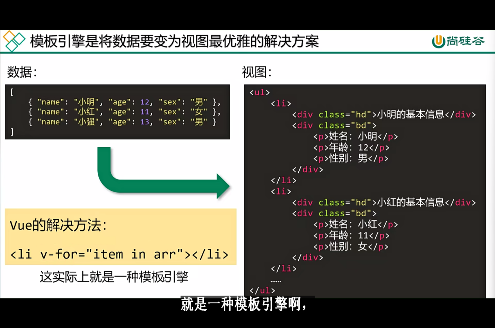

# 01 课程介绍


把这6个问题弄清楚先


​	

# 02 什么是模板引擎

> 模板引擎是将数据变为视图最优雅的解决方案

v-for实际上是一种模板引擎



mustache 小胡子 （内心os：外国人起名字真的很随意…）

抽象语法树、语法解析 有机会可以看看


通过了解学习mustache这一个简单库让大家能够去了解vue的底层的模板引擎这么一个主要思路

dom方法 说的就是document方法嘛

纯dom将数据转化为视图很麻烦 需要一层一层创建并一层一层追加

**01-数据变为视图-纯DOM法.html**

```html
<!DOCTYPE html>
<html lang="en">
  <head>
    <meta charset="UTF-8" />
    <meta http-equiv="X-UA-Compatible" content="IE=edge" />
    <meta name="viewport" content="width=device-width, initial-scale=1.0" />
    <title>Document</title>
  </head>
  <body>
    <ul id="list"></ul>

    <script>
      var arr = [
        { name: '小明', age: 12, sex: '男' },
        { name: '小红', age: 11, sex: '女' },
        { name: '小强', age: 13, sex: '男' },
      ];

      var list = document.getElementById('list');

      for (var i = 0; i < arr.length; i++) {
        // 每遍历一项都要用DOM方法去创建li标签
        let oLi = document.createElement('li');
        // 创建hd这个div
        let hdDiv = document.createElement('div');
        hdDiv.className = 'hd';
        hdDiv.innerText = arr[i].name + '的基本信息';
        // 创建bd这个div
        let bdDiv = document.createElement('div');
        bdDiv.className = 'bd';
        // 创建三个p
        let p1 = document.createElement('p');
        p1.innerText = '姓名: ' + arr[i].name;
        bdDiv.appendChild(p1);
        let p2 = document.createElement('p');
        p2.innerText = '年龄: ' + arr[i].age;
        bdDiv.appendChild(p2);
        let p3 = document.createElement('p');
        p3.innerText = '性别: ' + arr[i].sex;
        bdDiv.appendChild(p3); // 不上树的 p3显示不了

        // 创建的节点是孤儿节点 所以必须要上树才能被用户看见
        oLi.appendChild(hdDiv);
        // 创建的节点是孤儿节点 所以必须要上树才能被用户看见
        oLi.appendChild(bdDiv);
        // 创建的节点是孤儿节点 所以必须要上树才能被用户看见
        list.appendChild(oLi);
      }
    </script>
  </body>
</html>

```

运行结果：


待会讲数组join法

​	

# 03 数组join()法介绍

数组校验法

在es6前 没有反引号这种东西 字符无法换行编辑（单引号和双引号都不行）

便有人想到join()方法这种东西 借助它可以使得单引号和双引号可以换行编辑 但输出结果又是没有换行的效果；在引号内 用鼠标滚轮单击（然后通过 `END` 键跳到单行末尾）可以使得多行同时编辑 还可以斩断连接

.gif)


换行的形式很优雅！


但没必要 很简单的 写单引号不更方便？

这就是数组的校验法

​	

# 04 反引号法

