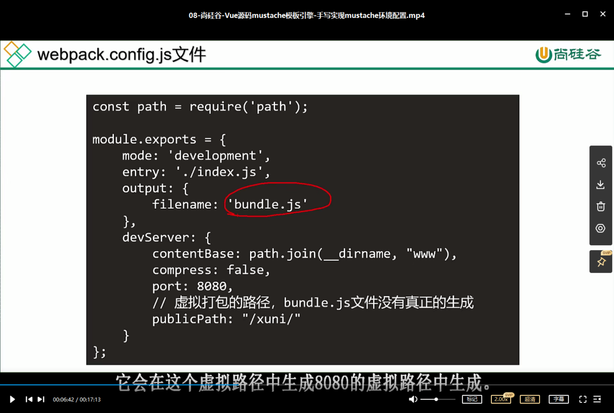
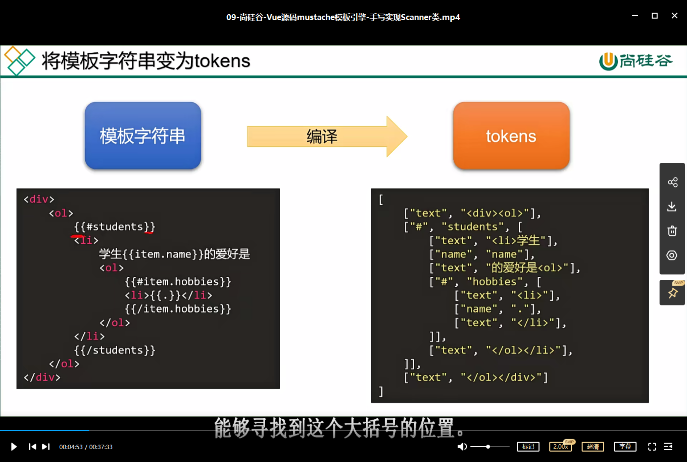
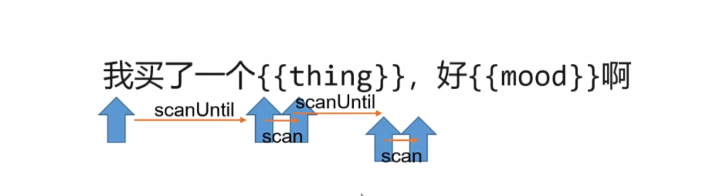
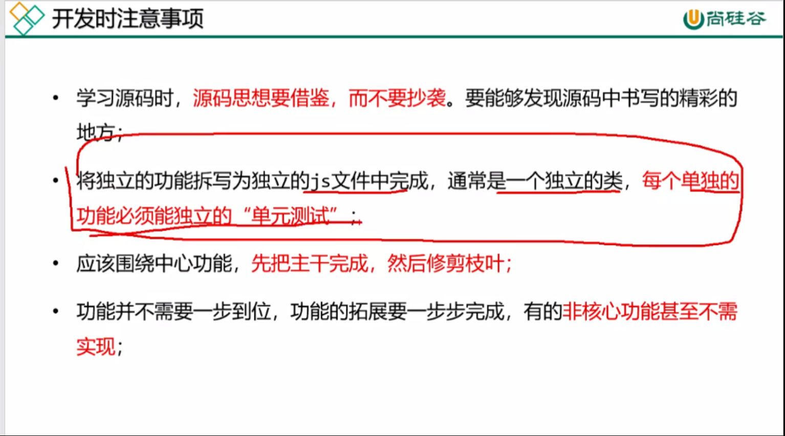
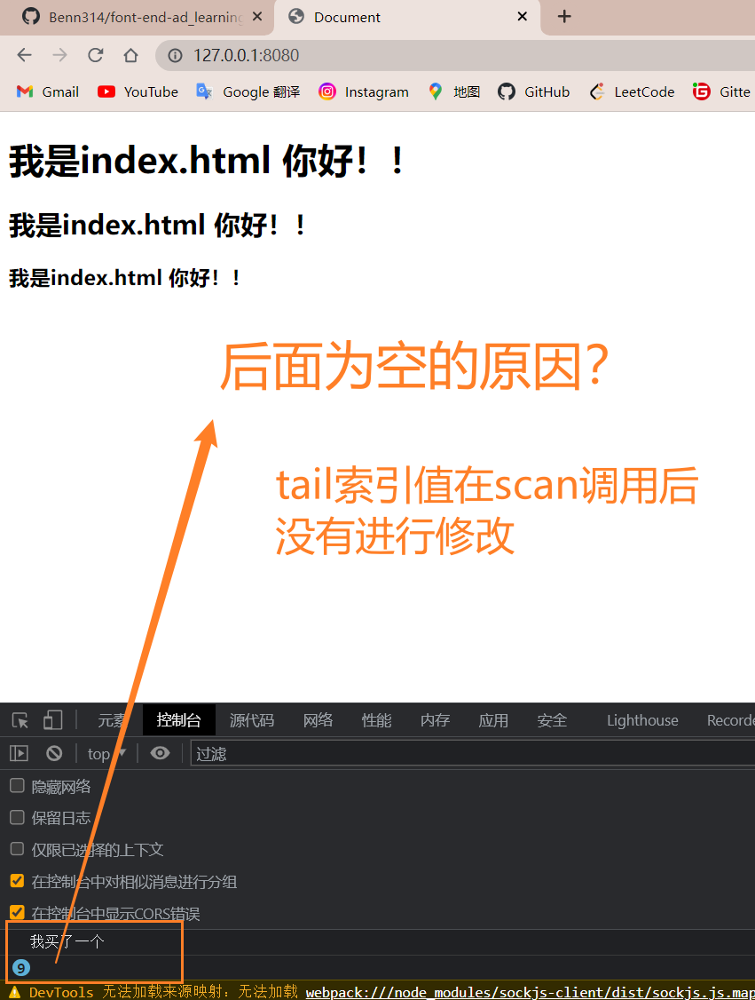
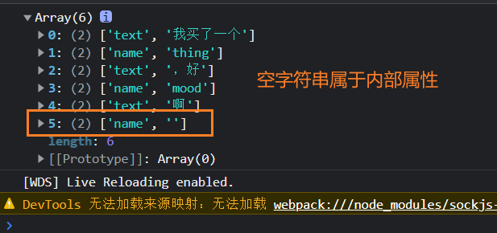
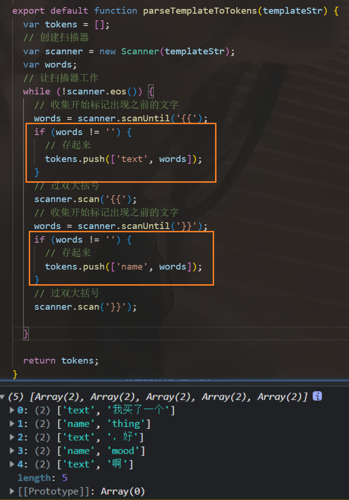
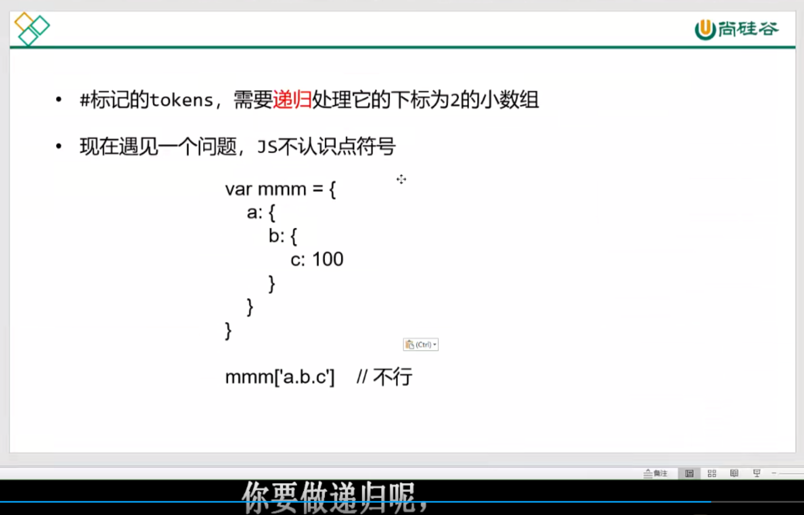
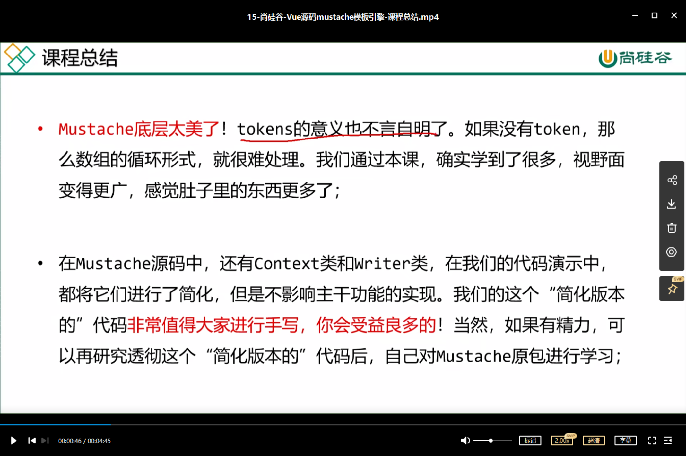

# 01 课程介绍


把这6个问题弄清楚先


​	

# 02 什么是模板引擎

> 模板引擎是将数据变为视图最优雅的解决方案

v-for实际上是一种模板引擎


mustache 小胡子 （内心os：外国人起名字真的很随意…）

抽象语法树、语法解析 有机会可以看看


通过了解学习mustache这一个简单库让大家能够去了解vue的底层的模板引擎这么一个主要思路

dom方法 说的就是document方法嘛

纯dom将数据转化为视图很麻烦 需要一层一层创建并一层一层追加

**01-数据变为视图-纯DOM法.html**

```html
<!DOCTYPE html>
<html lang="en">
  <head>
    <meta charset="UTF-8" />
    <meta http-equiv="X-UA-Compatible" content="IE=edge" />
    <meta name="viewport" content="width=device-width, initial-scale=1.0" />
    <title>Document</title>
  </head>
  <body>
    <ul id="list"></ul>

    <script>
      var arr = [
        { name: '小明', age: 12, sex: '男' },
        { name: '小红', age: 11, sex: '女' },
        { name: '小强', age: 13, sex: '男' },
      ];

      var list = document.getElementById('list');

      for (var i = 0; i < arr.length; i++) {
        // 每遍历一项都要用DOM方法去创建li标签
        let oLi = document.createElement('li');
        // 创建hd这个div
        let hdDiv = document.createElement('div');
        hdDiv.className = 'hd';
        hdDiv.innerText = arr[i].name + '的基本信息';
        // 创建bd这个div
        let bdDiv = document.createElement('div');
        bdDiv.className = 'bd';
        // 创建三个p
        let p1 = document.createElement('p');
        p1.innerText = '姓名: ' + arr[i].name;
        bdDiv.appendChild(p1);
        let p2 = document.createElement('p');
        p2.innerText = '年龄: ' + arr[i].age;
        bdDiv.appendChild(p2);
        let p3 = document.createElement('p');
        p3.innerText = '性别: ' + arr[i].sex;
        bdDiv.appendChild(p3); // 不上树的 p3显示不了

        // 创建的节点是孤儿节点 所以必须要上树才能被用户看见
        oLi.appendChild(hdDiv);
        // 创建的节点是孤儿节点 所以必须要上树才能被用户看见
        oLi.appendChild(bdDiv);
        // 创建的节点是孤儿节点 所以必须要上树才能被用户看见
        list.appendChild(oLi);
      }
    </script>
  </body>
</html>

```

运行结果：


待会讲数组join法

​	

# 03 数组join()法介绍

数组校验法

在es6前 没有反引号这种东西 字符无法换行编辑（单引号和双引号都不行）

便有人想到join()方法这种东西 借助它可以使得单引号和双引号可以换行编辑 但输出结果又是没有换行的效果；在引号内 用鼠标滚轮单击（然后通过 `END` 键跳到单行末尾）可以使得多行同时编辑 还可以斩断连接

.gif)


换行的形式很优雅！


但没必要 很简单的 写单引号不更方便？

这就是数组的校验法

​	

# 04 反引号法

纯DOM法解析比join()法（字符串解析）要快 不过现在浏览器的性能已经不在乎那点速度差距了

由于字符串中不能有换行符 所以采用了数组校验的方法 然后es6就推出了换行符

mustache是世界上最早的模板引擎

**03-数据变为视图-ES6的反引号法.html**

```html
<!DOCTYPE html>
<html lang="en">
  <head>
    <meta charset="UTF-8" />
    <meta http-equiv="X-UA-Compatible" content="IE=edge" />
    <meta name="viewport" content="width=device-width, initial-scale=1.0" />
    <title>Document</title>
  </head>
  <body>
    <!-- <li>
      <div class="hd"></div>
      <div class="bd">
        <p>姓名:</p>
        <p>年龄:</p>
        <p>性别:</p>
      </div>
    </li> -->
    <ul id="list"></ul>

    <script>
      var arr = [
        { name: '小明', age: 12, sex: '男' },
        { name: '小红', age: 11, sex: '女' },
        { name: '小强', age: 13, sex: '男' },
      ];

      var list = document.getElementById('list');

      // 遍历arr数组 每遍历一项 就以字符串的视角将HTML字符串添加到list中
      for (var i = 0; i < arr.length; i++) {
        list.innerHTML += `
          <li>
            <div class="hd">${arr[i].name}的基本信息</div>
            <div class="bd">
              <p>姓名: ${arr[i].name}</p>
              <p>年龄: ${arr[i].age}</p>
              <p>性别: ${arr[i].sex}</p>
            </div>
          </li>
        `;
      }
    </script>
  </body>
</html>

```

​	

# 05 mustache的基本语法


模板引擎对嵌套for很好用 它不用让你去就纠结哪个循环语句嵌套 而es6的拼接字符串碰到嵌套for有点棘手


1+1也不能算

display:none // 隐藏

**05_mustache基本使用-不循环以及循环简单数组.html**

```html
<!DOCTYPE html>
<html lang="en">
  <head>
    <meta charset="UTF-8" />
    <meta http-equiv="X-UA-Compatible" content="IE=edge" />
    <meta name="viewport" content="width=device-width, initial-scale=1.0" />
    <title>Document</title>
  </head>
  <body>
    <div id="container"></div>
    <script src="jslib/mustache.js"></script>
    <!-- <script src="https://cdn.bootcdn.net/ajax/libs/mustache.js/4.0.1/mustache.js"></script> -->
    <script>
      // console.log(Mustache);
      // #arr 循环开始 /arr 循环结束
      // var templateStr = `
      //   <h1>我买了一个{{thing}}, 好{{mood}}啊</h1>
      // `;

      // . 表示这个项本身（没有它本身没有name也没有key）
      var templateStr = `
        <ul>
          {{#arr}}
            <li>{{.}}</li>
          {{/arr}}
        </ul>
      `;

      var data = {
        thing: '华为手机',
        mood: '开心',
        arr: ['A', 'B', 'C'], // 循环简单数组
      };

      var domStr = Mustache.render(templateStr, data);
      // console.log(domStr);
      var container = document.getElementById('container');
      container.innerHTML = domStr;
    </script>
  </body>
</html>

```

**06-mustache基本使用-数组的嵌套.html**

```html
<!DOCTYPE html>
<html lang="en">
  <head>
    <meta charset="UTF-8" />
    <meta http-equiv="X-UA-Compatible" content="IE=edge" />
    <meta name="viewport" content="width=device-width, initial-scale=1.0" />
    <title>Document</title>
  </head>
  <body>
    <div id="container"></div>
    <script src="jslib/mustache.js"></script>
    <script>
      var templateStr = `
        <ul>
          {{#arr}}
            <li>
              {{name}}的爱好是：
              <ol>
                {{#hobbies}}
                  <li>{{.}}</li>
                {{/hobbies}}
              </ol>
            </li>
          {{/arr}}
        </ul>
      `;

      var data = {
        arr: [
          { name: '小明', age: 12, hobbies: ['游泳', '羽毛球'] },
          { name: '小红', age: 11, hobbies: ['编程', '写作文', '看报纸'] },
          { name: '小强', age: 13, hobbies: ['打台球'] },
        ],
      };

      var domStr = Mustache.render(templateStr, data);
      var container = document.getElementById('container');
      container.innerHTML = domStr;
    </script>
  </body>
</html>

```

**07-mustache基本使用-布尔值.html**

```html
<!DOCTYPE html>
<html lang="en">
  <head>
    <meta charset="UTF-8" />
    <meta http-equiv="X-UA-Compatible" content="IE=edge" />
    <meta name="viewport" content="width=device-width, initial-scale=1.0" />
    <title>Document</title>
  </head>
  <body>
    <div id="container"></div>
    <script src="jslib/mustache.js"></script>
    <script>
      var templateStr = `
        {{#m}}
          <h1>hello world</h1>
        {{/m}}
      `;

      var data = {
        m: true, // 显示h1标签内容
      };

      var domStr = Mustache.render(templateStr, data);
      var container = document.getElementById('container');
      container.innerHTML = domStr;
    </script>
  </body>
</html>

```

解决没有反引号时 存储模板字符串的问题（含智能提示）

```html
<script type="text/template">
	// 把type从text/javascript变成text/template，编辑器i无法解析template 不会被当成js代码执行 并且有html语法的高亮和智能补全
</script>
```

```html
<!DOCTYPE html>
<html lang="en">
  <head>
    <meta charset="UTF-8" />
    <meta http-equiv="X-UA-Compatible" content="IE=edge" />
    <meta name="viewport" content="width=device-width, initial-scale=1.0" />
    <title>Document</title>
  </head>
  <body>
    <div id="container"></div>
    <script type="text/template" id="mytemplate">
      <ul>
        {{#arr}}
          <li>
            <div class="hd">{{name}}的基本信息, 哈哈</div>
            <div class="bd">
              <p>姓名: {{name}}</p>
              <p>年龄: {{age}}</p>
              <p>性别: {{sex}}</p>
            </div>
          </li>
        {{/arr}}
      </ul>
    </script>
    <script src="jslib/mustache.js"></script>
    <script>
      // var templateStr = `
      //   {{#m}}
      //     <h1>hello world</h1>
      //   {{/m}}
      // `;
      // 这样一来templateStr就不用反引号了
      var templateStr = document.getElementById('mytemplate').innerHTML;

      var data = {
        m: true, // 显示h1标签内容
        arr: [
          { name: '小明', age: 12, sex: '男' },
          { name: '小红', age: 11, sex: '女' },
          { name: '小强', age: 13, sex: '男' },
        ],
      };

      var domStr = Mustache.render(templateStr, data);
      var container = document.getElementById('container');
      container.innerHTML = domStr;
    </script>
  </body>
</html>

```


​	

# 06 正则表达式思路简介

mustache库不能用简单的正则表达式思路实现


这张图的形参说明写错了 下面有修正版的


**function参数解析：**

- a(findStr)是寻找的部分（也就是查找到匹配的部分）

- b(通常叫$1 （capturedStr）是捕获到的东西

  $1表示第一个圆括号()捕获到的 c和d作用不大

- c是出现的位置 

- d参数是原本完整未修改的字符串

模板引擎：简单的可以用正则实现 但复杂的不行


mustache底层有一个tokens去做过渡实现的

​	

# 07 底层tokens思想


HTML标签无论开始标签还是结束标签都会被当成文本来进行处理

标签对tokens没什么意义 因为它是用字符串的思路来处理的 而不是dom方法的思路

AST：抽象语法树


这其中如何进行编译、结合、解析就是我们要学习的底层知识


忘记说了 数组的第0项表示type类型


修改了mustache.js源码的parseTemplate()方法

可以输出数据试试看

​	

# 08 手写实现mustache环境配置


浏览器是不支持require、export这些语法的 它得通过webpack打包才能实现

webpack可以热更新 更注重开发时的体验 而rollup更注重打包的体验

生成库UMD可以在nodejs环境中使用（npm安装它），也可以在浏览器环境中使用（script引入它）

面试题：实现UMD？只需要一个“通用头” 网上一堆答案

按照老师的配置

这个也跟老师一样入口是./test.js、./index.js、./main.js都行 命名而已

devServer里设置了虚拟打包 它并不会真正生成bundle.js

npm i -D （-D表示开发依赖development）

全局装了webpack 那为什么要在本地也装呢？

- 这个其实就是npm的一个激励 就是说如果你全局装了webpack 但是你项目中装了webpack 那么这个时候最好也把webpack-cli 装一下

index.html改变不能行，必须得是js文件修改才能热更新


为什么它能弹出./src/index.js中的alert哈哈哈哈我运行了呢 因为bundle.js是一个虚拟打包文件 这个文件并没有被真正生成 这个文件实际上是webpack-dev-server帮你去打包这个js文件到这个虚拟的地方 并且它是热更新的（测试过了，确实~ js文件直接修改会实时更新 而html文件修改完需要手动刷新才有更新）

js文件之间可以export引包

全局不用装webpack和webpack-dev-server 如果它报错 就在全局电脑也按需要的版本号装一下就行

webpack.config.js文件的内容也都注释清楚了 就是在8080端口提供了一个静态服务 它能把3w文件夹的东西静态的显示出来 然后可以把js文件虚拟打包到虚拟路径中 所以这个事情还是比较简单的

​	

# 09 手写实现Scanner类





scan和scanUntil方法解析图，scan是没用的，scanUntil是有用的，scanUntil路过的信息都会收集，scan不会（而是跳过）





**Scanner.js**

```js
/**
 * 扫描器类
 */
export default class Scanner {
  constructor(templateStr) {
    // console.log(templateStr);
    // 将模板字符串写到实例身上
    this.templateStr = templateStr;
    // 指针
    this.pos = 0;
    // 尾巴（指针后面未扫描的部分(包括指针当前的那一位),一开始就是模板字符串的原文）这里设计还是很精妙的
    this.tail = templateStr;
  }

  // 功能弱 就是走过指定内容 没有返回值
  scan(tag) {
    if (this.tail.indexOf(tag) == 0) { // 保险起见 加个if语句比较好
      // tag有多长 比如{{长度是2 就让指针后移多少位
      this.pos += tag.length;
      // 尾巴也要变 改变尾巴为从当前指针这个字符开始 到最后的全部字符
      this.tail = this.templateStr.substring(this.pos);
    }
  }

  // 让指针进行扫描 直到遇见指定内容结束 并且能够返回结束之前路过的文字
  scanUntil(stopTag) {
    // 记录一下执行本方法的时候pos值
    const pos_backup = this.pos;
    // 当尾巴的开头不是stopTag的时候 就说明还没有扫描到stopTag
    // 写&&很有必要 因为防止找不到 那么寻找到最后也要停止下来
    // eos()写在前面效率性能更高
    while (!this.eos() && this.tail.indexOf(stopTag) != 0) { // 这里等于0才是寻找到 -1是未寻找到 不写&& this.pos<this.templateStr.length容易死循环
      this.pos++;
      // 改变尾巴为从当前指针这个字符开始 到最后的全部字符
      this.tail = this.templateStr.substring(this.pos);
    }

    return this.templateStr.substring(pos_backup, this.pos); // 左闭右开区间 不包括this.pos索引位置
  }

  // 指针是否到头 返回布尔值 end of string
  eos() {
    return this.pos >= this.templateStr.length;
  }
}
```

**index.js**

```js
import Scanner from './Scanner'

// 全局提供SSG_TemplateEngine对象
window.SSG_TemplateEngine = {
  // 渲染方法
  render(templateStr, data) {

    /*
      实例化一个扫描器 构造函数提供一个参数 这个参数就是模板字符串
      也就是说这个扫描器就是针对这个模板字符串工作的
     */
    var scanner = new Scanner(templateStr);
    // console.log(templateStr);

    // // 测试scanUntil
    // var words = scanner.scanUntil('{{');
    // console.log(scanner.pos);
    // console.log(words);
    // scanner.scan('{{');
    // console.log(scanner.pos);

    var word;
    // while (scanner.pos != templateStr.length) { 改写成下面的形式
    // 当scanner没有到头
    while (!scanner.eos()) {
      word = scanner.scanUntil('{{');
      console.log(word);
      scanner.scan('{{');

      word = scanner.scanUntil('}}');
      console.log(word);
      scanner.scan('}}');

    }
  }
}
```

**index.html**

```html
<!DOCTYPE html>
<html lang="en">
  <head>
    <meta charset="UTF-8" />
    <meta http-equiv="X-UA-Compatible" content="IE=edge" />
    <meta name="viewport" content="width=device-width, initial-scale=1.0" />
    <title>Document</title>
  </head>
  <body>
    <h1>我是index.html 你好！！</h1>
    <h2>我是index.html 你好！！</h2>
    <h3>我是index.html 你好！！</h3>

    <!-- 它是一个虚拟打包路径 所以不会真正生成bundle.js -->
    <script src="/xuni/bundle.js"></script>

    <script>
      // 模板字符串
      var templateStr = '我买了一个{{thing}}，好{{mood}}啊';
      // 数据
      var data = {};
      // 调用render
      SSG_TemplateEngine.render(templateStr, data);
    </script>
  </body>
</html>

```

​	

# 10 手写将HTML变为tokens



我们需要对words进行一个判断 判断是否为空字符串 因为如果是空字符串也会返回这个scanner



这样就好多了 空字符串就不存起来

一维数组的tokens模板字符串解析

**parseTemplateToTokens.js**

```js
import Scanner from './Scanner';

/**
 * 将模板字符串变为tokens数组
 */

export default function parseTemplateToTokens(templateStr) {
  var tokens = [];
  // 创建扫描器
  var scanner = new Scanner(templateStr);
  var words;
  // 让扫描器工作
  while (!scanner.eos()) {
    // 收集开始标记出现之前的文字
    words = scanner.scanUntil('{{');
    if (words != '') {
      // 存起来
      tokens.push(['text', words]);
    }
    // 过双大括号
    scanner.scan('{{');
    // 收集开始标记出现之前的文字
    words = scanner.scanUntil('}}');
    if (words != '') {
      // 这个words就是{{}}中间的东西 判断一下首字符
      if (words[0] == '#') {
        // 存起来 从下标为1的项开始存 因为下标为0的项是#
        tokens.push(['#', words.substring(1)]);
      } else if (words[0] == '/') {
        tokens.push(['/', words.substring(1)]);
      } else {
        tokens.push(['name', words]);
      }
    }
    // 过双大括号
    scanner.scan('}}');
  }

  return tokens;
}
```

​	

# 11 手写将tokens嵌套起来

视频很棒！建议二刷

运用了js的引用类型数据 定义collector收集器来跳转push/pop的位置 以便嵌套tokens

代码里的 sections[] 则是数据结构-栈思想的具象化

**nestToken.js**

```js
/**
 * 函数的功能是折叠tokens 将#和/之间的tokens能够整合起来 作为他的下标为3的项
 * @param {*} tokens 
 */
export default function nestedTokens(tokens) {
  // 结果数组
  var nestedTokens = [];
  // 栈结构 存放小tokens 栈顶（靠近端口的 最新进入的）的tokens数组中当前操作的这个小tokens小数组
  var sections = []; //因为是push进元素 所以队尾是栈口(length-1的索引位置) 第0项是栈底
  // 收集器 天生指向nestedTokens结果数组 引用类型值 所以指向的是同一个数组
  // 收集器的指向会变化 当遇见#的时候 收集器会指向这个token的下标为2的新数组
  var collector = nestedTokens;

  // console.log(tokens);

  for (var i = 0; i < tokens.length; i++) {
    let token = tokens[i];

    switch (token[0]) {
      case '#':
        // 收集器中放入这个token
        collector.push(token);
        // 入栈
        sections.push(token);
        // 收集器要换人了 给token添加下标为2的项 并且让收集器指向它
        collector = token[2] = [];
        break;
      case '/':
        // 出栈 pop()会返回刚刚弹出的项
        sections.pop();
        // 改变收集器为栈结构队尾（队尾是栈顶）那项的下标为2的数组
        collector = sections.length > 0 ? sections[sections.length - 1][2] : nestedTokens;
        break;
      default:
        // 甭管当前的collector是谁 可能是结果nestedTokens
        // 也可能是某个token的下标为2的数组 甭管是谁 推入collector即可
        collector.push(token);
    }
  }

  return nestedTokens;
}

```

​	

# 12 手写将tokens注入数据

#标记的tokens，需要递归处理它的下标为2的小数组



下面的renderTemplate.js是初代版本 只能解决非嵌套的对象(JS不认识 . 符号 我们需要进行函数封装解析(lookup函数) )，并且对#和/还没有解决注入

**renderTemplate.js**

```js
/**
 * 函数的功能是让tokens数组变为dom字符串
 */
export default function renderTemplate(tokens, data) {
  console.log(tokens, data);
  // 结果字符串
  var resultStr = '';
  // 遍历tokens
  for (var i = 0; i < tokens.length; i++) {
    let token = tokens[i];

    // 看类型
    if (token[0] == 'text') {
      // 拼起来
      resultStr += token[1];
    } else if (token[0] == 'name') {
      resultStr += data[token[1]];
    }
  }

  console.log(resultStr);
  return resultStr;
}
```

​	

# 13 手写lookup函数

**lookup.js**

```js
/**
 * 功能是可以在dataObj对象中 寻找用连续点符号的keyname属性（这个函数曾经作为面试题出现过）
 * 比如 dataObj是
 * {
      a: {
        b: {
          c: 100
        }
      }
    }
    那么lookup(dataObj, 'a.b.c')结果就是100
 */
export default function lookup(dataObj, keyName) {
  // console.log(dataObj, keyName);
  // 看看keyName中有没有点符号
  if (keyName.indexOf('.') != -1) {
    // 如果有点符号 那么拆开
    var keys = keyName.split('.');
    // 设置一个临时变量 这个临时变量用于周转 一层一层找下去
    var temp = dataObj;
    // 每找一层 就把它设置为新的临时变量
    for (var i = 0; i < keys.length; i++) {
      temp = temp[keys[i]];
    }

    // console.log(temp);
    return temp;
  }
  // 如果这里面没有点符号
  return dataObj[keyName];
}

```

lookup函数运用

**renderTemplate.js**

```js
import lookup from "./lookup";
/**
 * 函数的功能是让tokens数组变为dom字符串
 */
export default function renderTemplate(tokens, data) {
  console.log(tokens, data);
  // 结果字符串
  var resultStr = '';
  // 遍历tokens
  for (var i = 0; i < tokens.length; i++) {
    let token = tokens[i];

    // 看类型
    if (token[0] == 'text') {
      // 拼起来
      resultStr += token[1];
    } else if (token[0] == 'name') {
      // 如果是name类型 那么就直接使用它的值 当然要用lookup
      // 因为防止这里是'a.b.c'有逗号的形式
      resultStr += lookup(data, token[1]);
    } else if (token[0] == '#') {

    }
  }

  console.log(resultStr);
  return resultStr;
}
```

​	

# 14 手写parseArray函数 

**parseArray.js**

```js
import lookup from "./lookup";
import renderTemplate from "./renderTemplate";
/**
 * 处理数组 结合renderTemplate实现递归
 * 注意 这个函数收的参数是token！而不是tokens！
 * token是什么 就是一个简单的['#', 'students', []]
 * 
 * 这个函数要递归调用renderTemplate函数 调用多少次由data决定
 * 比如data的形式是这样的
 * {
      students: [
        { name: '小明', hobbies: ['游泳', '羽毛球'] },
        { name: '小红', hobbies: ['编程', '写作文', '看报纸'] },
        { name: '小强', hobbies: ['打台球'] },
      ]
    }
    那么parseArray()函数就要递归调用renderTemplate函数3次 因为数组的长度是3
 */
export default function parseArray(token, data) {
  // console.log(token, data);
  // 得到整体数据data中这个数组要使用的部分
  var v = lookup(data, token[1]);
  // console.log(v);
  // 结果字符串
  var resultStr = '';
  // 遍历v数组 v一定是数组（因为我们这里不对布尔值进行考虑 我们做的是简易版mustache 源码mustache #后面可以加布尔值 但这我们不考虑这种情况）
  // 注意 下面这个循环可能是整个包中最难思考的一个循环
  // 它是遍历数据 而不是遍历tokens 数据中数据有几条 就要遍历几条
  for (var i = 0; i < v.length; i++) {
    // 这里要补一个'.'属性
    // 拼接
    resultStr += renderTemplate(token[2], {
      ...v[i],
      '.': v[i]
    });
  }
  return resultStr;
};

```

对 `parseTemplateToTokens.js` 文件做了去空格的处理（标签外空格去掉 标签内空格保留）

**parseTemplateToTokens.js**

```js
export default function parseTemplateToTokens(templateStr) {
  var tokens = [];
  // 创建扫描器
  var scanner = new Scanner(templateStr);
  var words;
  // 让扫描器工作
  while (!scanner.eos()) {
    // 收集开始标记出现之前的文字
    words = scanner.scanUntil('{{');
    if (words != '') {
      // 尝试写一下去掉空格 智能判断是普通文字的空格 还是标签中的空格
      // 标签中的空格不能去掉 比如<div class='box'>不能去掉class前面的空格
      let isInJJH = false;
      // 空白字符串
      var _words = '';
      for (var i = 0; i < words.length; i++) {
        // 判断是否在标签里
        if (words[i] == '<') {
          isInJJH = true;
        } else if (words[i] == '>') {
          isInJJH = false;
        }
        //  如果这项不是空格 拼接上
        if (!/\s/.test(words[i])) {
          _words += words[i];
        } else {
          // 如果这项是空格 只有当它在标签内的时候 才能拼接上
          if (isInJJH) {
            _words += " ";
          }
        }
      }
      // console.log(_words);
      // 存起来 去掉空格
      tokens.push(['text', _words]);
```

​	

# 15 课程总结


