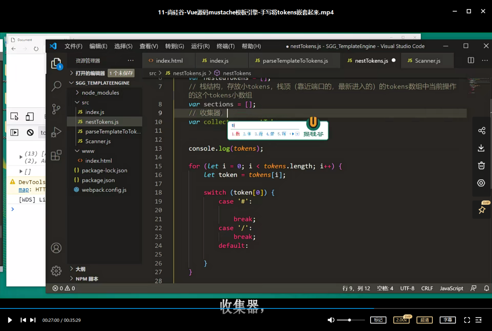

```html
11月8日 【Ben】

遇到的问题
1.indexOf MDN
2.substr和substring区别了解一下 MDN

今日小结
1. 学习了手写实现mustache环境配置、手写实现Scanner类、手写将HTML变为tokens、手写将tokens嵌套起来
2.【Vue-mustache模板引擎】P8看到了P11
3. xxx

明日计划
1.【Vue-mustache模板引擎】学到P15
```

​	


[About protected branches](https://docs.github.com/en/repositories/configuring-branches-and-merges-in-your-repository/defining-the-mergeability-of-pull-requests/about-protected-branches)

​	

mustache-第11集_tokens嵌套教了一个新算法解题思想，强烈建议二刷！

