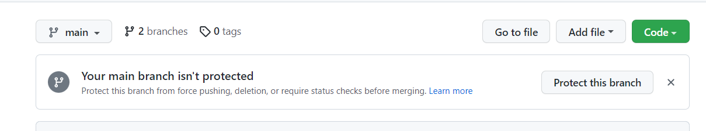

```html
11月8日 【Ben】

遇到的问题
1.indexOf MDN
2.substr和substring区别了解一下 MDN

今日小结
1. 学习了xxx
2.【Vue-mustache模板引擎】P8看到了第xx集
3. xxx

明日计划
1.【Vue-mustache模板引擎】学到第xx集
```

​	



[About protected branches](https://docs.github.com/en/repositories/configuring-branches-and-merges-in-your-repository/defining-the-mergeability-of-pull-requests/about-protected-branches)