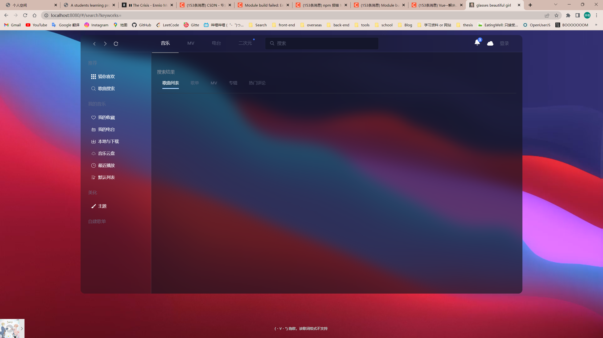

```html
11月9日 【Ben】

遇到的问题
1. 模块化编程的思想很重要 上下翻阅开发体验不好不说 有时候程序越写越大 甚至不知道自己写的方法要拿来解决什么问题了 懵逼了

模块化编程确实就是把功能拆解成一个个函数 方便调用 先把项目结构搭建好 工程化进行
2. mustache模板引擎需要回来二刷！！

今日小结
1. 学习了手写将tokens注入数据、手写lookup函数、手写parseArray函数
2.【Vue-mustache模板引擎】P12看到了P15
3. xbox录屏很舒服 在系统设置中可以更改设置 录制所有应用程序音频和修改帧率为60帧（亲测有效）之前下载过其他的录屏软件 设置了60帧但都没有60帧的效果

明日计划
1.【Vue-响应式】学到P5
```

​	

今日学习：

[Why I Love Using Vim To Write Code](https://www.youtube.com/watch?v=o4X8GU7CCSU)

[让你的Vs Code在Windows上像Vim一样小巧](https://zhuanlan.zhihu.com/p/573733911)

今天发现的vue2项目 https://github.com/XiangZi7/Glassesgirl

已保存在 `C:\Users\小楷\Desktop\大三上\LeetCode\Demo\Glassesgirl-main`



需要自己搭建网易云API 下面是up本人教学

[如何搭建网易云接口](https://www.bilibili.com/video/BV1C44y1G7mj/?spm_id_from=333.1007.top_right_bar_window_history.content.click&vd_source=1f9072e850dde202d6ddd4c60d9d334d)

> NeteaseCloudMusicApi地址：https://github.com/Binaryify/NeteaseCloudMusicApi vercel地址：https://vercel.com/ github进不去的同学可以去Edge插件库搜索一个叫github加速插件

有接口文档：https://neteasecloudmusicapi.vercel.app/#/ （建议自己搭建 才不容易有安全隐患 [如何搭建网易云接口](https://www.bilibili.com/video/BV1C44y1G7mj/?spm_id_from=333.1007.top_right_bar_window_history.content.click&vd_source=1f9072e850dde202d6ddd4c60d9d334d)）
