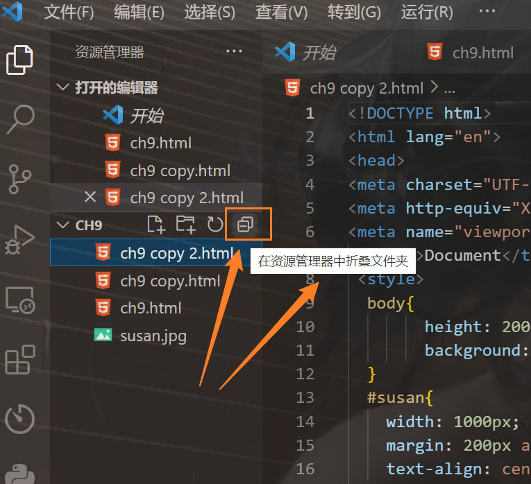

```html
10月27日 【Ben】

遇到的问题
【问题】
1.git bash中 pwd是什么命令
2.解决git bash无法识别windows文件路径问题
3.nth-child了解一下

【解决】
1.pwd : print working directory, 打印工作目录，它会显示我们当前所在的目录路径。
2.windows文件路径复制以后，加上单引号即可
例如：cd 'C:\Users\小楷\Desktop\font-end-ad_learning'

今日小结
1. 学习了节流与防抖
2.【自定义工具函数库】P5看到了P6
3. Ts项目 src下要同时有index.ts和index.html npm run build打包编译才能通过
4.发现git bash的快捷键 鼠标右键是粘贴剪贴板的第一条内容

明日计划
1.【自定义工具函数库】学到P20
```

​	

参考文章

[git bash 下操作文件及文件夹命令](https://www.cnblogs.com/SamWeb/p/6516784.html)

​	


​	

一个很好用的功能

