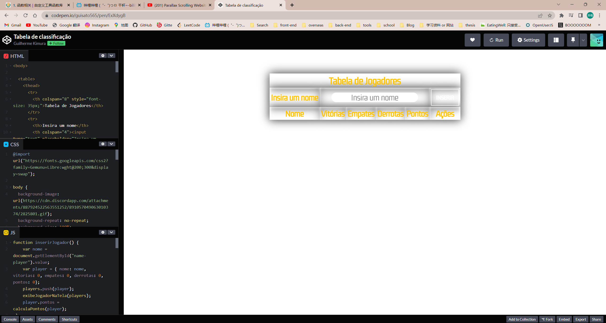
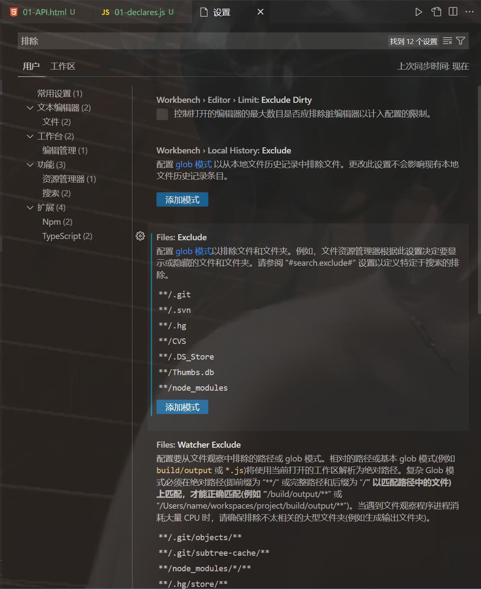
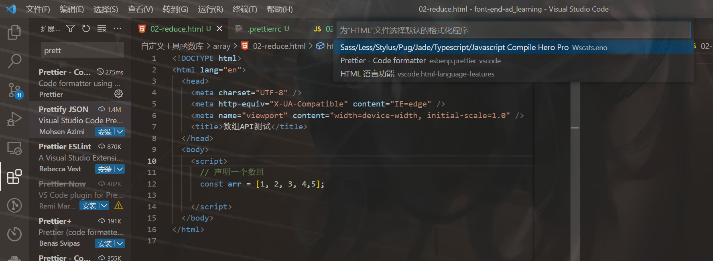

```html
10月28日 【Ben】

遇到的问题
【问题】
1.【vue2】eslint报错：Parsing error: No Babel config file detected?

【解决】
1.需要把开发项目作为主文件夹 babel.config.js在主目录 才不会报这个错误

今日小结
1. 学习了map封装实现、reduce函数封装、filter函数封装、find函数封装、findIndex函数封装、数组去重
2.【自定义工具函数库】P7看到了P14
3. ctrl \ 拆分编辑器
4.mounceInc配置了下滑为保存 鼠标动作若重复 新的功能会覆盖旧的
5.res就是result
6.在项目根目录下配置.prettierrc文件 prettier就会跟着这个配置信息走 没有的话默认是跟着vscode
json文件获取：https://www.prettier.cn/playground/

"semi": true, // 尾随分号;
"singleQuote": true, // 默认分号使用单引号
"trailingComma": "es5", // JS中是否在最后一行添加逗号 不用就设置为none
7.做项目很重要的一步就是项目开始时 看一下是否有Eslint规范 进行.prettierrc配置 不然的话就把prettier禁用了 别待会一堆规范问题

明日计划
1.【自定义工具函数库】学到P30
```

​	

参考文章

[eslint报错：Parsing error: No Babel config file detected?](https://www.cnblogs.com/hmy-666/p/16441069.html)

[关于index.html app.vue main.js index.js这些事](https://blog.csdn.net/zy_leslie/article/details/96129390?depth_1-utm_source=distribute.pc_relevant.none-task&utm_source=distribute.pc_relevant.none-task)

[解决prettier和eslint冲突详细配置](https://segmentfault.com/a/1190000041023812)

​	

codepen图片资源加载不出来单纯只是因为 还在加载ing 需要等待一会



​	

vscode目录隐藏指定文件 加快加载速度



​	

[VSCode 代码片段生成器](http://99cc.vip/public/tools/vscode_snippet/index.html)

vv快速打出vue模板

```json
  "vue初始化模板": {
    "prefix": "vvue",
    "body": [
      "<template>",
      "  <div>",
      "    ${1:}",
      "  </div>",
      "</template>",
      "",
      "<script>",
      "export default {",
      "  name:'${2:}',",
      "}",
      "</script>",
      "",
      "<style lang=\"scss\">",
      "  ${3:}",
      "</style>"
    ],
    "description": "Vue-初始化代码片段"
  }
```

​	



设置一个默认格式化程序
