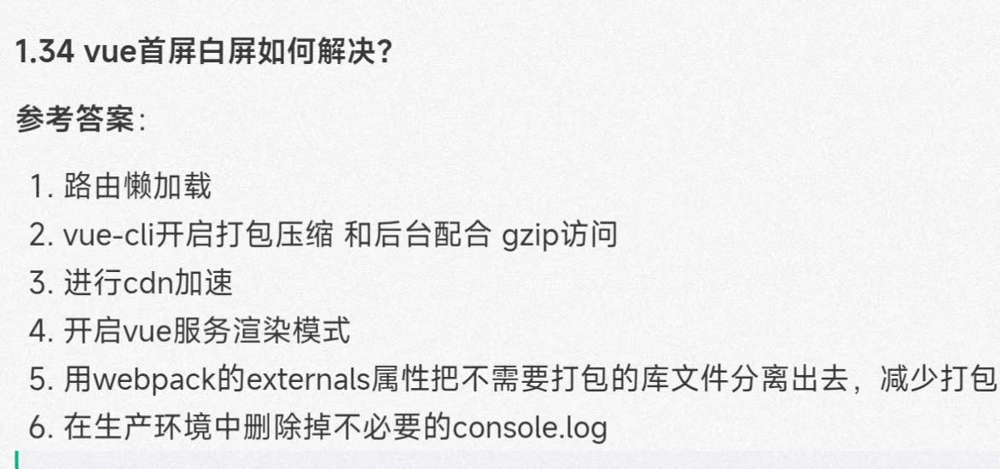
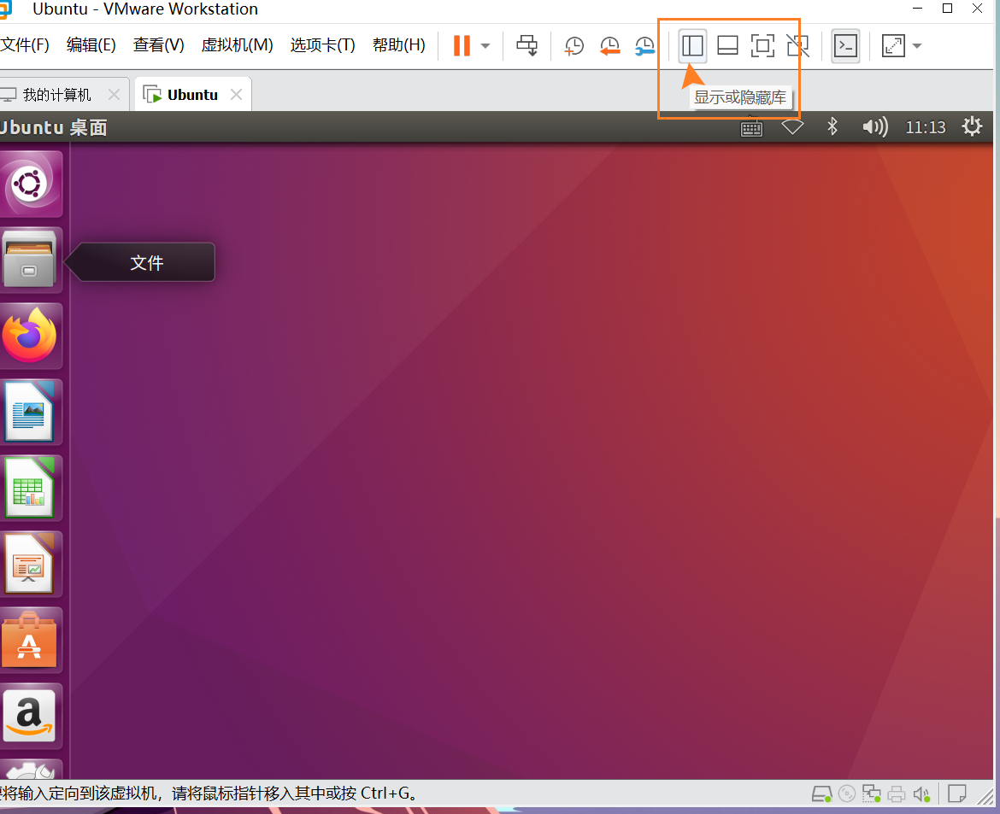
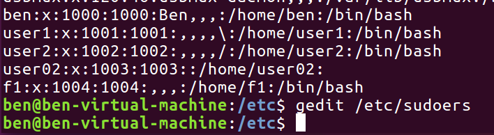

```html
10月30日 【Ben】

遇到的问题
【问题】
1. Linux 用户组的作用
2. 挂载的含义
3. LinuX系统下如何显示隐藏文件

【解决】
1. 在 Linux 系统中用户组起着重要作用。 用户组提供了一种简单方法供一组用户互相共享文件。用户组也允许系统管理员更加有效地管理用户权限，因为管理员可以将权限分配给用户组而不是逐一分配给单个用户。尽管通常只要在系统中添加用户账户就会创建用户组，关于用户组如何工作以及如何运用用户组还有很多需要了解的。
2. 挂载（mounting）是指由操作系统使一个存储设备（诸如硬盘、CD-ROM或共享资源）上的计算机文件和目录可供用户通过计算机的文件系统访问的一个过程。 一般来说，当计算机关机时，每个已挂载存储都将经历一次卸载，以确保所有排队的数据被写入，并保证介质上文件系统结构的完整性。 访问这个目录来访问存储设备
3. 用ls命令时可以加上参数ls -a可以显示该目录下的所有文件（包括隐藏文件）

今日小结
1. 学习了xxx
2.【自定义工具函数库】看到了第xx集
3. 若想退出管理员权限可输入命令：su 用户名
4. Linux 删除文件
在Linux中，删除目录中的文件夹和文件的方法其实很简单，使用rm -rf命令即可。 -r 向下递归，不管有多少级目录，一并删除。 -f 直接强行删除，没有任何提示。
rm -rf 目录名字
-r 向下递归，不管有多少级目录，一并删除。
-f 直接强行删除，没有任何提示。

实例：
删除文件夹实例：
rm -rf /var/log/httpd
这句代码的意思是：删除/var/log/httpd目录以及其下所有文件、文件夹

删除文件实例：
rm -f /var/log/httpd/access.log
这个将会强制删除/var/log/httpd/access.log这个文件

5. Linux cat可用于查看文件信息
一个 > 表示覆盖 两个 > 表示追加
cat [>/>>] ./文件名 可用于编辑文件 
ctrl + D 则是退出文本编辑
6. cp -r d1/* d4 是把d1下的所有文件/目录复制到d4下
而cp -r d1/ d4 是一整个d1（连同d1目录名一起复制到d4下）

cp
-i：与 -f 选项相反，在覆盖目标文件之前给出提示，要求用户确认是否覆盖，回答 y 时目标文件将被覆盖。
（切记一定要回答y 才能覆盖 直接回车是没有覆盖的）

7. chmod：更改文件9个属性
先复习一下刚刚上面提到的数据：文件的权限字符为： -rwxrwxrwx ， 这九个权限是三个三个一组的！其中，我们可以使用数字来代表各个权限，各权限的分数对照表如下：
r:4 可读
w:2 可写
x:1 可执行

8.mkdir
-m<目标属性>或--mode<目标属性>建立目录的同时设置目录的权限；

9.cp
-b：覆盖已存在的文件目标前将目标文件备份；
    
10.mv -v
打印移动信息
    
11. useradd
-d, --home HOME_DIR      # 将使用 HOME_DIR 作为用户登录目录的值来创建新用户。 
-m, --create-home   # 如果用户的主目录不存在，则创建它。
    
12. 同时更改文件或目录的所有者和用户组，实例：命令为“chown -R jd-root:jd-root test_dir”
    
13. //文件修改时间设置为：2018年7月13日 14:12:02
# touch -t 201807131412.02 test.txt
or
# touch -d "2008-07-11 03:41:10" test.txt
# stat test.txt
 
明日计划
1.【自定义工具函数库】学到第xx集
```

​	

参考文章

[什么是挂载，Linux挂载详解](http://c.biancheng.net/view/2859.html)

[Ubuntu获取和退出管理员权限的方法](https://blog.csdn.net/weixin_42076938/article/details/105353127)

[Linux向文件添加内容的几种方法](https://www.jianshu.com/p/b85c12b4a74a)

[Linux ls 命令](https://www.runoob.com/linux/linux-comm-ls.html)

[Linux cp 命令](https://www.runoob.com/linux/linux-comm-cp.html)

[linux修改文件或目录的所有者(chown)和用户组](https://blog.csdn.net/wh8_2011/article/details/69815660)

[Linux 压缩、解压、打包详解](https://segmentfault.com/a/1190000024498487)

[ Linux 文件压缩和解压](https://dunwu.github.io/linux-tutorial/linux/cli/linux-cli-file-compress.html#_1-linux-%E6%96%87%E4%BB%B6%E5%8E%8B%E7%BC%A9%E5%92%8C%E8%A7%A3%E5%8E%8B%E8%A6%81%E7%82%B9)

[Linux修改的文件“修改时间”](https://blog.csdn.net/u010164190/article/details/81036830)

[Linux系统将用户添加到用户组](https://www.jianshu.com/p/fcca6c1d78ee)

[Linux userdel命令](https://www.runoob.com/linux/linux-comm-userdel.html)

[Linux中添加、修改和删除用户和用户组](https://blog.csdn.net/GMingZhou/article/details/78706439)

​	





​	

`cat etc/passwd` 然后执行下图命令



​	

编译原理

> 左递归 5-10分 期末
>
> 间接左递归
