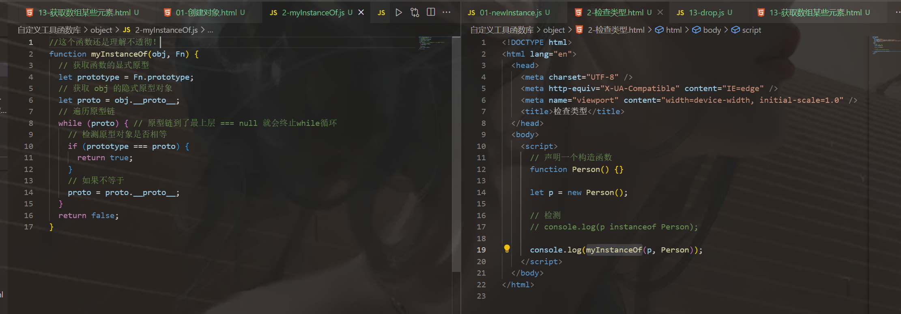

```html
11月1日 【Ben】

遇到的问题
【问题】
1.filter会返回一个新数组吗？
2.显式原型和隐式原型对象的区别和联系

【解决】
1.filter() 方法创建一个新的数组，新数组中的元素是通过检查指定数组中符合条件的所有元素。
注意： filter() 不会对空数组进行检测。
注意： filter() 不会改变原始数组。

被调用时传入三个参数：
元素的值
元素的索引
被遍历的数组本身
2.

今日小结
1. 学习了数组扁平化、数组分块、数组差集、删除数组元素、获取数组某些元素、创建新对象、比对对象类型
2.【自定义工具函数库】P18看到了P25
3. 有什么问题 直接Google就好了 不要说写在日报里攒着当摆设 心安理得 这不会有半点进步和收获

明日计划
1.【自定义工具函数库】学到P45
```


- [ ] 设置一个prettier js文件的话 默认保存时在语句后面加分号;（如果没加的话）

参考文章

[Array.prototype.filter()](https://developer.mozilla.org/zh-CN/docs/Web/JavaScript/Reference/Global_Objects/Array/filter)

[JavaScript Array filter() 方法](https://www.runoob.com/jsref/jsref-filter.html)

遇到的问题


**解决：**


```js
const arr = []
let temp = [] //这个数组地址为0xaaa  temp -> 0xaa
arr.push(temp) // push 0xaa
temp.push(1) // 0xaa push 1
console.log('arr :>> ', arr); //[0xaa=>[1]]
temp = [] // temp -> 0xbb 【这行是关键】
arr.push(temp) // push 0xbb
console.log('arr1 :>> ', arr); // [0xaa=>[1] ,0xbb=>[]]
```

​	


​	
