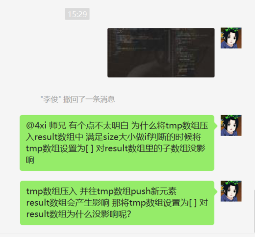

```html
11月1日 【Ben】

遇到的问题
Xxxxxx

今日小结
1. 学习了xxx
2.【自定义工具函数库】看到了第xx集
3. xxx

明日计划
1.【自定义工具函数库】学到第xx集
```


- [ ] 设置一个prettier js文件的话 默认保存时在语句后面加分号;（如果没加的话）

遇到的问题



**解决：**


```js
const arr = []
let temp = [] //这个数组地址为0xaaa  temp -> 0xaa
arr.push(temp) // push 0xaa
temp.push(1) // 0xaa push 1
console.log('arr :>> ', arr); //[0xaa=>[1]]
temp = [] // temp -> 0xbb 【这行是关键】
arr.push(temp) // push 0xbb
console.log('arr1 :>> ', arr); // [0xaa=>[1] ,0xbb=>[]]
```

​	


