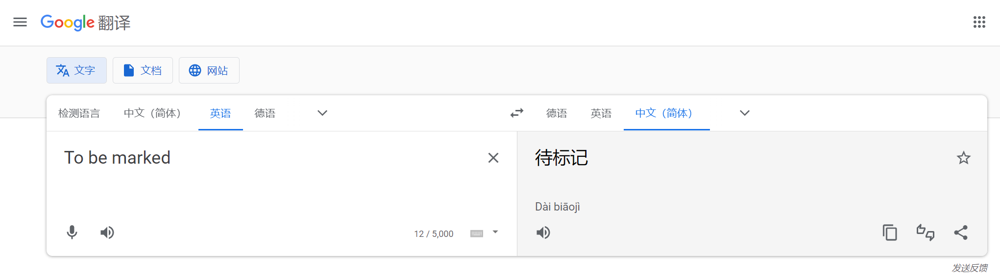

```html
11月3日 【Ben】

遇到的问题
【问题】
1. 表单事件复习一下
2. js行结尾，是否必须写分号？
3. indexOf属性学习一下

【解决】
1.
2. 可将分号“;”省略的几种情形：
3. 

(1)语句各自独占一行，通常可以省略结尾的分号;
(2)程序结束或者右花括号(})之前的分号也可以省略;

javascript懒汉原则：不添加分号“;”就可以顺利解析的语句，不会主动添加分号(;)再进行解析。javascript只有在缺少分号就无法正确解析代码的时候，javascript才会填补分号。

今日小结
1. 学习了事件委托函数封装、手写事件总线、消息订阅与发布、取消订阅、axios函数功能介绍
2.【自定义工具函数库】P35看到了P39
3. xxx

明日计划
1.【自定义工具函数库】学到P45
```

​	

- [x] 电脑定时开关机设置一下🆗？
- [x] prettier给js文件语句末尾设置自动添加分号

javaWeb 考试范围为书的前15章 题基本上都是书上的作业题

​	

参考文章：

[Windows系统通过计划任务设置定时重启](https://help.aliyun.com/document_detail/40818.html)

[js行结尾，是否必须写分号](https://blog.csdn.net/harborian/article/details/102582664)

​	

