# 01 课程介绍

[自定义工具函数库 | 尚硅谷](https://zxfjd3g.github.io/atguigu_utils-docs/)

克隆对象涉及一个问题 深拷贝 课程会讲解四种深拷贝的方式

大厂面试喜欢一些底层的 原生JS 所以这门课程对面试是有帮助的

​	

# 02 call函数封装实现

可以改变函数运行时的this值 并且得到函数运行的执行结果

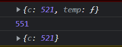

第一次打印的时候 obj的temp属性还没有被delete 所以可以看到temp属性被打印出来 执行完call函数后 temp属性被delete 所以就看不到了

**01-call.js**

```js
/**
 * 第一个参数 我们要执行的函数
 * 第二个参数 函数运行时this指向的对象
 * 第三个参数起 函数运行时的参数
 */
function call(Fn,obj,...args){
  // 判断
  if(obj === undefined || obj === null){
    obj = globalThis; //全局对象 globalThis es11的特性 用它来指向全局对象
  }
  // 为 obj 添加临时方法
  obj.temp = Fn;
  // 调用 temp 方法
  let result = obj.temp(...args);
  // 删除 temp 方法
  delete obj.temp;
  // 返回执行结果
  return result;
}
```

**01-call.html**

```html
<!DOCTYPE html>
<html lang="en">
<head>
  <meta charset="UTF-8">
  <meta http-equiv="X-UA-Compatible" content="IE=edge">
  <meta name="viewport" content="width=device-width, initial-scale=1.0">
  <title>Document</title>
  <script src="01-call.js"></script>
</head>
<body>
  <script>
    // 声明一个函数
    function add(a,b){
      console.log(this);
      return a + b + this.c
    }
    // 声明一个对象
    let obj = {
      c:521
    }
    // 添加全局属性
    window.c = 1314;

    // 执行 call 函数
    console.log(call(add,obj,10,20));
    // console.log(obj);
    console.log(call(add,null,10,20));
    // console.log(obj);

  </script>
</body>
</html>
```

​	

# 03 apply函数封装实现

也是改变函数运行时的this值 并且得到函数运行的执行结果

但apply函数和call函数还是有一个很明显的区别 区别在于函数运行时的一个参数 它的设定是一个数组 而call的实参是以单独形式存在的

**02-apply.js**

```js
// 这里就不用res参数了（... 表示多个参数吗？查一下） 直接用args普通参数就可以了
function apply(Fn, obj, args){ // 因为这里args只传一个数组参数 所以写一个args就行
  //判断
  if(obj === undefined || obj === null){ // 如果对象是未定义或为空
    obj = globalThis; //让对象等于全局对象（chrome里全局对象是window对象 IE里的全局对象是global对象）
  }
  // 为 obj 添加临时方法
  obj.temp = Fn;
  // 执行方法
  let result = obj.temp(...args); // ...是扩展运算符 要把它（数组）展开
  // 删除临时属性
  delete obj.temp;
  // 返回结果
  return result;
}
```

**02-apply.html**

```html
<!DOCTYPE html>
<html lang="en">
<head>
  <meta charset="UTF-8">
  <meta http-equiv="X-UA-Compatible" content="IE=edge">
  <meta name="viewport" content="width=device-width, initial-scale=1.0">
  <title>apply 测试</title>
  <script src="02-apply.js"></script>
</head>
<body>
  <script>
    // 声明一个函数
    function add(a,b){
      console.log(this);
      return a + b + this.c
    }
    // 声明一个对象
    let obj = {
      c:521
    }
    // 添加全局属性
    window.c = 1314;

    // 执行 apply 函数
    console.log(apply(add,obj,[10, 20]));
    console.log(apply(add,null,[10, 20]));
  </script>
</body>
</html>
```

​	

# 04 bind函数封装实现

bind函数跟call函数很像 call会执行目标函数 bind会创建一个新函数 但是它不会去执行函数 这是bind和call的一个区别 至于参数这块他们是相同的

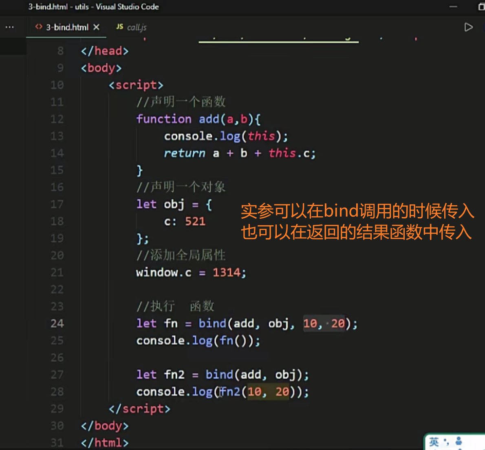

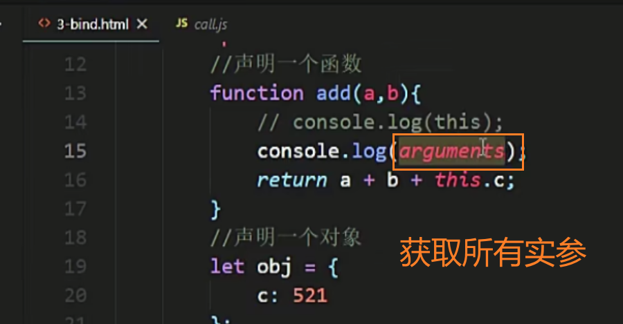

**03-bind.js**

```js
function bind(Fn, obj, ...args){
  // 返回一个新的函数
  return function(...args2){
    // 执行 call 函数
    return call(Fn, obj, ...args, ...args2); //这里的...args, ...args2不代表什么 就是实参传入的【位置以及调用】顺序而已
  }
}
```

**03-bind.html**

```html
<!DOCTYPE html>
<html lang="en">
<head>
  <meta charset="UTF-8">
  <meta http-equiv="X-UA-Compatible" content="IE=edge">
  <meta name="viewport" content="width=device-width, initial-scale=1.0">
  <title>bind函数</title>
  <script src="01-call.js"></script>
  <script src="03-bind.js"></script>
</head>
<body>
  <script>
    // 声明一个函数
    function add(a,b){
      console.log(this);
      console.log(arguments);
      return a + b + this.c;
    }
    //声明一个对象
    let obj = {
      c: 521
    };
    //添加全局属性
    window.c = 1314;

    //执行函数
    // let fn = bind(add, obj, 10, 20);
    // console.log(fn());

    // let fn2 = bind(add, obj);
    // console.log(fn2(10,20));

    let fn3 = add.bind(obj,10,20); //这里的bind不是我们自定义的 而是原型内置的
    console.log(fn3(30, 40));

    let fn4 = bind(add, obj, 10, 20);
    console.log(fn4(30, 40)); //后面的失效只是因为add只调用到了前面的两个实参 后面的没调用就没参与计算 可以通过arguments看到实参的数量和顺序位置
  </script>
</body>
</html>
```

​	

# 05 函数节流

函数节流与防抖在做什么事情呢？其实是在控制事件处理程序的执行频率

为什么要控制事件回调的执行频率呢？是因为浏览器当中有一些事件 比如说这个onresize事件就是窗口的变化事件还有mousemove鼠标移动事件当然还有这个scroll事件窗口滚动事件 这些事件它的触发频率非常高 极有可能会造成页面卡顿 如果说在这个事件处理程序当中 还包含了与后端的交互 这样还会给后端增加很多压力 所以这个时候函数的节流与防抖控制频率就显得非常重要了

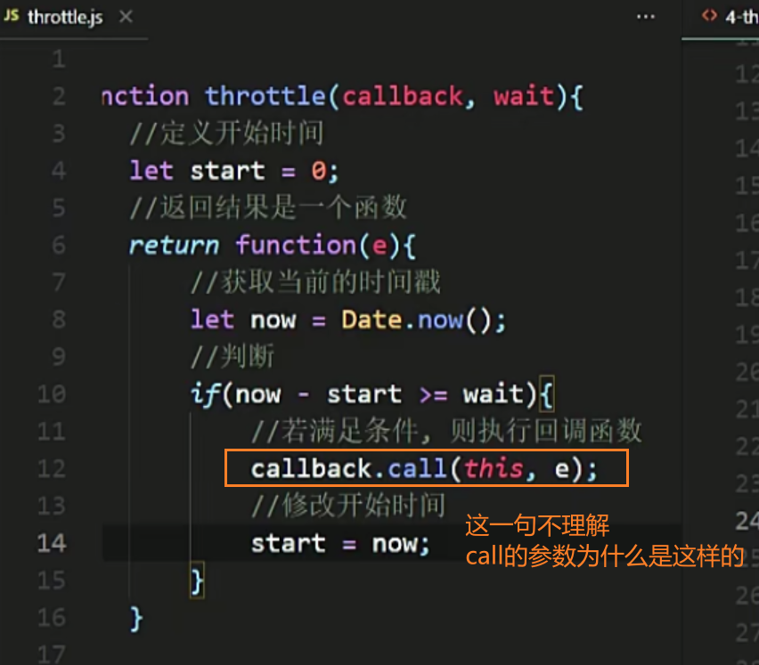

**04-throttle.js**

```js
// 第一个参数是回调 第二个参数是等待间隔
function throttle(callback, wait){
  // 定义开始时间
  let start = 0;
  // 返回结果是一个函数
  return function(e){
    // console.log('iloveyou');
    // 获取当前的时间戳
    let now = Date.now();
    // 判断
    if(now - start >= wait){
      // 若满足条件 则执行回调函数
      callback.call(this, e);
      // 修改开始时间
      start = now;
    }
  }
}
```

**04-throttle.html**

```html
<!DOCTYPE html>
<html lang="en">
<head>
  <meta charset="UTF-8">
  <meta http-equiv="X-UA-Compatible" content="IE=edge">
  <meta name="viewport" content="width=device-width, initial-scale=1.0">
  <title>节流测试</title>
  <script src="04-throttle.js"></script>
  <!-- <script src="throttle.js"></script> -->
  <style>
    body{
      height: 2000px;
      background: linear-gradient(#125,#eae);
    }
  </style>
</head>
<body>
  <script>
    //绑定滚动事件
    // window.addEventListener('scroll',function(){
    //   console.log(Data.now());
    // })

    window.addEventListener('scroll',throttle(function(e){
      // console.log(Date.now());
      // console.log(this);
      console.log(e);
    },500));
  </script>
</body>
</html>
```

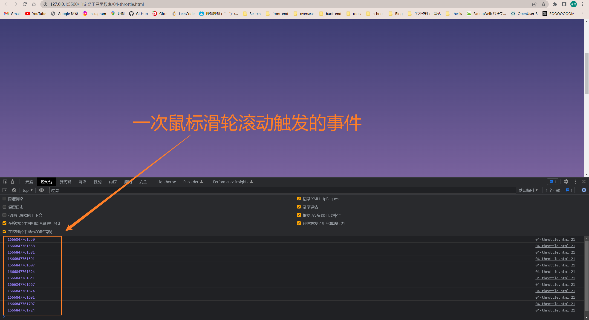

​	

# 06 函数防抖

当事件触发之后 它不会立即执行回调 会等待一段时间再去执行回调 那么在等待的时间过程呢 如果你再次触发了事件 它会再次等待 上一个事件处理程序是不执行的 直到一次触发等待超过时间间隔 才进行回调

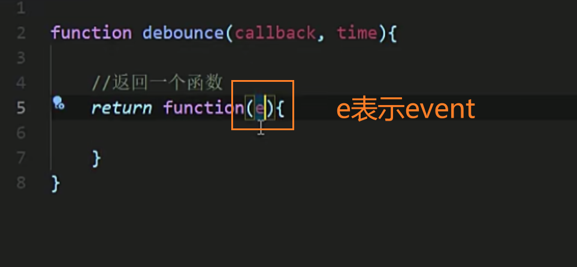

setTimeout有个特点是它内部的this指向外层作用下this的值

this指向事件源

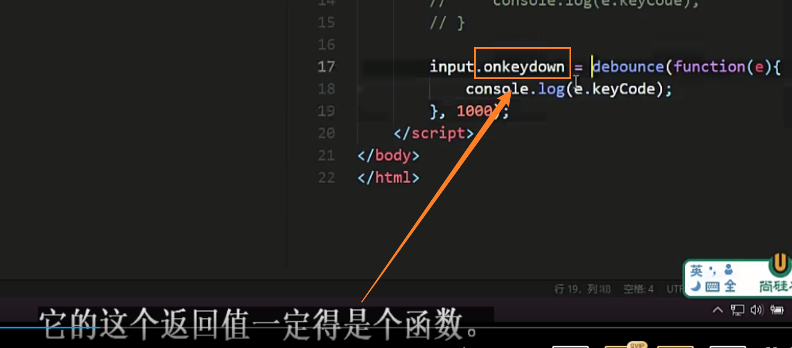

如果不是函数的话 这个事件在触发之后没法去执行回调

**【顶级理解】**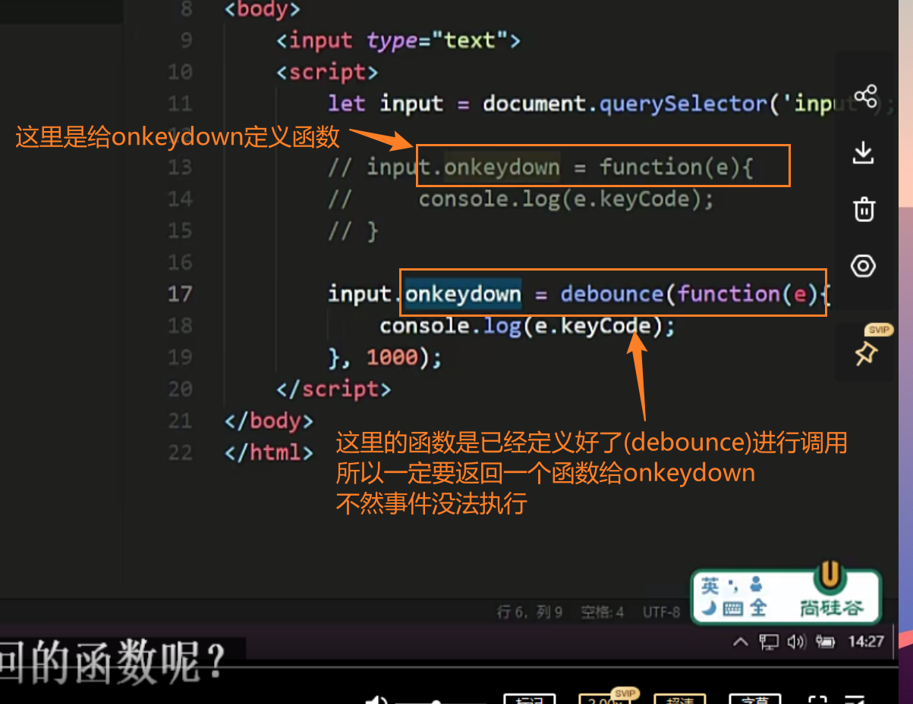

而且返回的函数这里还要加事件回调（事件对象）因为这玩意 人家内部要用 往里边传入参数 如果你没有形参去接 到时候你在代码题里边没用办法获取事件对象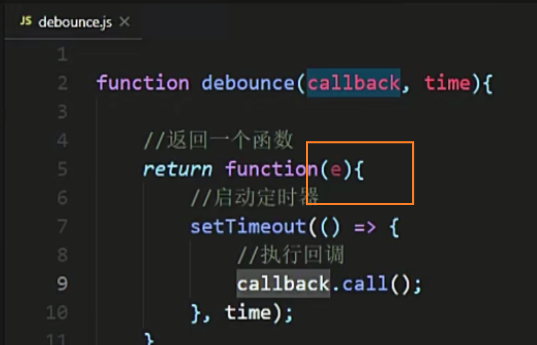


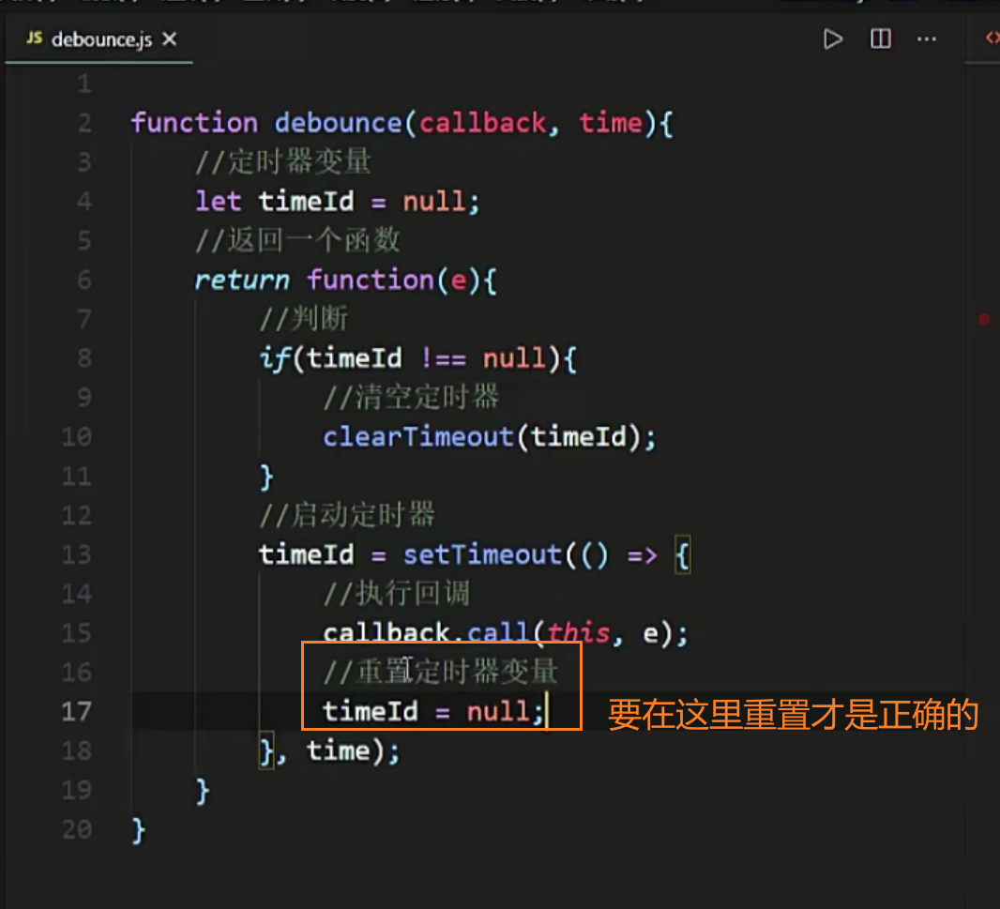

if判断和setTimeout里的清空都不能省 因为一个是执行完的清空 一个是未执行的清空

我们要的效果是多A次定时器time内打入的话 只执行最后一个定时器的

图A框里的 ` timeId = null` 如果没有写的话 效果已经是能达成 但是有小瑕疵 逻辑不严谨 执行了些无用代码 就是每一次都要进入if判断语句去清空（如果定时器有执行完的话（也就是超过了time时间后才执行任务））它的清空是没用的 因为上个定时器已经执行完失效了 所以这是浪费性能的 所以有执行定时器的话 正确方式是 顺便在最后补一个 `timeId = null` 重置定时器变量 当我们在上一次执行成功 执行回调之后应该要将这个定时器变量给它复原 以此来优化性能 更为合理一些

通过这样的事件就可以很好的控制这个事件的触发频率 特别是这种相关关键字搜索的功能 它与服务器是直接挂钩的 你这里输什么就会传递给服务器什么 如果你触发频率不控制 他就会向服务器发送大量请求 给服务器造成压力 这是我们当前对防抖做的一个实现

**05-debounce.js**

```js
function debounce(callback, time){
  // 定时器变量
  let timeId  = null;
  // 返回一个函数
  return function(e){
    // 判断
    if(timeId !== null){
      // 清空定时器
      clearTimeout(timeId);
    }
    // 启动定时器
    timeId = setTimeout(() => {
      // 执行回调
      callback.call(this, e);
      // 重置定时器
      timeId = null;
    }, time);
  }
}
```

**05-debounce.html**

```html
<!DOCTYPE html>
<html lang="en">
<head>
  <meta charset="UTF-8">
  <meta http-equiv="X-UA-Compatible" content="IE=edge">
  <meta name="viewport" content="width=device-width, initial-scale=1.0">
  <title>防抖测试</title>
  <script src="05-debounce.js"></script>
</head>
<body>
  <input type="text">
  <script>
    let input = document.querySelector('input');

    // 当键盘按下时 会有对应的keyCode返回
    // 这里自己理解错了一点 太久没看js给忘了 以为是函数的返回结果返回给onkeydown 实际上onkeydown才是这个函数的函数名 所以按下键盘时便是执行函数 自然就会在控制台打印结果
    // input.onkeydown = function(e){
    //   console.log(e.keyCode);
    // }

    input.onkeydown = debounce(function(e){
      console.log(e.keyCode);
    },1000);
  </script>
</body>
</html>
```

​	

# 07 数组函数map封装实现

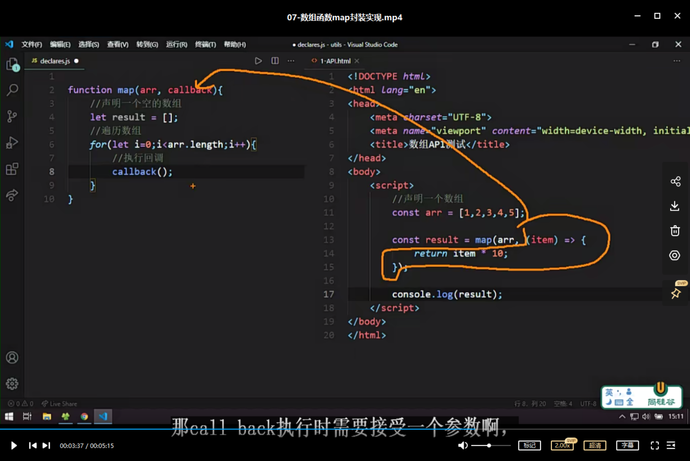

**01-map.html**

```html
<!DOCTYPE html>
<html lang="en">
<head>
  <meta charset="UTF-8">
  <meta http-equiv="X-UA-Compatible" content="IE=edge">
  <meta name="viewport" content="width=device-width, initial-scale=1.0">
  <title>数组API测试</title>
  <script src="01-declares.js"></script>
</head>
<body>
  <script>
    // 声明一个数组
    const arr = [1,2,3,4,5];

    const result = map(arr, (item, index) => {
      console.log(index);
      return item * 10;
    });

    console.log(result);
  </script>
</body>
</html>
```

**01-map.js**

```js
function map(arr, callback){
  // 声明一个空的数组
  let result = [];
  // 遍历数组
  for (var i = 0; i < arr.length; i++) {
     // 执行回调
     result.push(callback(arr[i], i));
  }
  // 返回结果
  return result;
}
```

​	

# 08 reduce函数封装

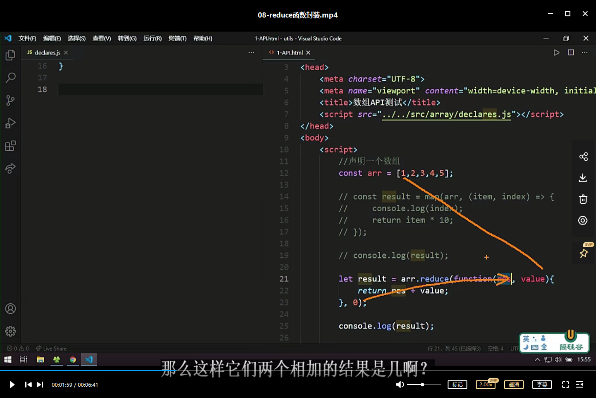

没有上一次计算的结果（也就是才第一次参与运算）就是给定的初始化+value 后面就都是result+value

**02-reduce.html**

```html
<!DOCTYPE html>
<html lang="en">
  <head>
    <meta charset="UTF-8" />
    <meta http-equiv="X-UA-Compatible" content="IE=edge" />
    <meta name="viewport" content="width=device-width, initial-scale=1.0" />
    <title>数组API测试</title>
    <script src="02-reduce.js"></script>
  </head>
  <body>
    <script>
      // 声明一个数组
      const arr = [1, 2, 3, 4, 5];

      // 系统内置
      // reduce()有三个参数 第一个是数组 第二个是回调 第三个是初始值
      // let result = arr.reduce(function (res, value) {
      //   return res + value;
      // }, 0);

      // console.log(result);

      // 自定义
      let result = reduce(
        arr,
        function (res, value) {
          return res + value;
        },
        10
      );

      console.log(result);
    </script>
  </body>
</html>

```

**02-reduce.js**

```js
function reduce(arr, callback, initValue) {
  // 声明变量
  let result = initValue;
  // 执行回调
  for (var i = 0; i < arr.length; i++) {
    // 执行回调
    result = callback(result, arr[i]);
  }
  //返回最终的结果
  return result;
}
```

​	

# 09 filter函数封装

**03-filter.html**

```html
<!DOCTYPE html>
<html lang="en">
  <head>
    <meta charset="UTF-8" />
    <meta http-equiv="X-UA-Compatible" content="IE=edge" />
    <meta name="viewport" content="width=device-width, initial-scale=1.0" />
    <title>数组API测试</title>
    <script src="03-filter.js"></script>
  </head>
  <body>
    <script>
      // 声明一个数组
      const arr = [1, 2, 3, 4, 5];

      // filter 内置
      // const result = arr.filter((item) => item % 2 === 1);

      // filter 自定义
      const result = arr.filter((item) => item % 2 === 0);
      console.log(result);
    </script>
  </body>
</html>

```

**03-filter.js**

```js
/**
 * 
 * @param {Array} arr 
 * @param {Function} callback 
 */
function filter(arr, callback) {
  // 声明空数组
  let result = [];
  // 遍历数组
  for (var i = 0; i < arr.length; i++) {
    // 执行回调
    let res = callback(arr[i], i);
    // 判断 如果为真则压入到 result 结果中
    if (res) {
      result.push(arr[i]);
    }
  }
  // 返回结果
  return result;
}
```

​	

# 10 find函数封装

**04-find.html**

```html
<!DOCTYPE html>
<html lang="en">
  <head>
    <meta charset="UTF-8" />
    <meta http-equiv="X-UA-Compatible" content="IE=edge" />
    <meta name="viewport" content="width=device-width, initial-scale=1.0" />
    <title>数组API测试</title>
    <script src="04-find.js"></script>
  </head>
  <body>
    <script>
      // 声明一个数组
      const arr = [1, 2, 3, 4, 2050, 5, 1024];

      //find 内置
      // const result = arr.find((item) => {
      //   return item > 1000;
      // });

      const result = find(arr, (item, index) => item > 10000);
      console.log(result);
    </script>
  </body>
</html>

```

**04-find.js**

```js
/**
 * 
 * @param {Array} arr 
 * @param {Function} callback 
 */
function find(arr, callback) {
  // 遍历数组
  for (var i = 0; i < arr.length; i++) {
    // 执行回调
    let res = callback(arr[i], i);
    // 判断
    if (res) {
      // 返回当前正在遍历的元素
      return arr[i];
    }
  }
  // 如果没有遇到满足条件的 返回 undefined
  return undefined;
}
```

​	

# 11 findIndex函数封装

**05-findIndex.html**

```html
<!DOCTYPE html>
<html lang="en">
  <head>
    <meta charset="UTF-8" />
    <meta http-equiv="X-UA-Compatible" content="IE=edge" />
    <meta name="viewport" content="width=device-width, initial-scale=1.0" />
    <title>数组API测试</title>
    <script src="05-findIndex.js"></script>
  </head>
  <body>
    <script>
      // 声明一个数组
      const arr = [1, 2, 3, 4, 2050, 5, 1024];

      // 内置
      // const result = arr.findIndex((item) => item > 1000);

      // 自定义
      const result = findIndex(arr, (item, index) => item > 10000);
      console.log(result);
    </script>
  </body>
</html>

```

**05-findIndex.js**

```js
/**
 * 
 * @param {Array} arr 
 * @param {Function} callback 
 */
function findIndex(arr, callback) {
  // 遍历数组
  for (var i = 0; i < arr.length; i++) {
    // 执行回调
    let res = callback(arr[i], i);
    // 判断
    if (res) {
      // 返回当前正在遍历的元素的下标
      return i;
    }
  }
  // 如果没有遇到满足条件的 返回 -1
  return -1;
}
```

​	

# 12 数组去重

**06-every和some.html**

```html
<!DOCTYPE html>
<html lang="en">
  <head>
    <meta charset="UTF-8" />
    <meta http-equiv="X-UA-Compatible" content="IE=edge" />
    <meta name="viewport" content="width=device-width, initial-scale=1.0" />
    <title>Document</title>
    <script src="06-every和some.js"></script>
  </head>
  <body>
    <script>
      // 声明一个数组
      const arr = [1, 2, 3, 4, 2050, 5, 1024];

      // const result = arr.every((item) => item > 0);
      // const result = arr.some((item) => item > 20000);

      // const result = every(arr, (item, index) => {
      //   return item > 0;
      // });

      const result = some(arr, (item, index) => {
        return item < 0;
      });
      console.log(result);
    </script>
  </body>
</html>

```

**06-every和some.js**

```js
/**
 * 
 * @param {Array} arr 
 * @param {Function} callback 
 * @returns 
 */
function every(arr, callback) {
  // 遍历数组
  for (var i = 0; i < arr.length; i++) {
    // 执行回调 如果回调执行返回结果为 false
    if (!callback(arr[i], i)) {
      return false;
    }
  }
  // 如果都满足条件则返回 true
  return true;
}

function some(arr, callback) {
  // 遍历数组
  for (var i = 0; i < arr.length; i++) {
    // 执行回调 如果回调执行返回结果为 false
    if (callback(arr[i], i)) {
      return true;
    }
  }
  // 如果都满足条件则返回 true
  return false;
}
```

​	

# 13 数组去重-1

**07-数组去重.html**

```html
<!DOCTYPE html>
<html lang="en">
  <head>
    <meta charset="UTF-8" />
    <meta http-equiv="X-UA-Compatible" content="IE=edge" />
    <meta name="viewport" content="width=device-width, initial-scale=1.0" />
    <title>去重测试</title>
    <script src="07-unique.js"></script>
  </head>
  <body>
    <script>
      // 声明一个数组
      const arr = [1, 2, 3, 2, 1, 4, 5];

      //去重
      console.log(unique(arr));
    </script>
  </body>
</html>

```

**07-unique.js**

```js

function unique(arr) {
  // 声明一个空数组
  const result = [];
  // 遍历原始数组
  arr.forEach(item => {
    // 检测 result 数组中是否包含这个元素
    if (result.indexOf(item) === -1) {
      // 若没有该元素 则插入到result中
      result.push(item);
    }
  });
  // 返回
  return result;
}
```

​	

# 14 数组去重-2

**07-数组去重.html**

```html
<!DOCTYPE html>
<html lang="en">
  <head>
    <meta charset="UTF-8" />
    <meta http-equiv="X-UA-Compatible" content="IE=edge" />
    <meta name="viewport" content="width=device-width, initial-scale=1.0" />
    <title>去重测试</title>
    <script src="07-unique.js"></script>
  </head>
  <body>
    <script>
      // 声明一个数组
      const arr = [1, 2, 3, 2, 1, 4, 5, 6];

      //去重 方式一
      // console.log(unique(arr));

      //去重 方式二
      console.log(unique2(arr));
    </script>
  </body>
</html>
```

**07-unique.js**

```js
// 把item值当作对象属性进行存储
function unique2(arr) {
  // 声明一个空数组
  const result = [];
  // 声明空对象
  const obj = {};
  // 遍历数组
  arr.forEach(item => {
    if (obj[item] === undefined) {
      // 将 item 作为下标存储在 obj 中
      obj[item] = true;
      result.push(item);
    }
  });
  // 返回
  return result;
}

```

​	

# 15 数组去重-3

set集合和数组很像 但它里面的元素的唯一的

set实现了迭代器[iterator](javascript:;)的接口 所以可以使用…的方式展开

**07-数组去重.html**

```html
// 去重 方式三
      console.log(unique3(arr));
```

**07-数组去重.js**

```js
// 用es6语法 set去做去重
function unique3(arr) {
  // // 数组转化为集合 Set
  // let set = new Set(arr);
  // // 将 set 展开创建一个数组
  // let array = [...set];
  // return array;

  // 一步到位
  return [...new Set(arr)];
}
```

​	

# 16 concat数组合并

除了传递数组元素以外 还能传递非数组的元素

**08-数组合并与拆分.html**

```html
<!DOCTYPE html>
<html lang="en">
  <head>
    <meta charset="UTF-8" />
    <meta http-equiv="X-UA-Compatible" content="IE=edge" />
    <meta name="viewport" content="width=device-width, initial-scale=1.0" />
    <title>数组合并与拆分</title>
    <script src="08-concat.js"></script>
  </head>
  <body>
    <script>
      let arr = [1, 2, 3];
      // const result = arr.concat([4, 5, 6], 7, 8); // 传递非数组元素 7，8 也能将其合并在一起

      const result = concat(arr, [4, 5, 6], 7, 8); // 传递非数组元素 7，8 也能将其合并在一起
      console.log(result);

      // const result = [...arr];
      // arr.forEach((item) => {
      //   // console.log(item);
      //   result.push(item);
      // });
      // console.log(result);
    </script>
  </body>
</html>

```

**08-concat.js**

```js
/**
 * 
 * @param {Array} arr 
 * @param  {...any} args 
 */
function concat(arr, ...args) {
  // 声明一个空数组
  const result = [...arr]; // 展开
  // const result = arr; // 这样也行
  // 遍历数组
  args.forEach(item => {
    // 判断 item 是否为数组
    if (Array.isArray(item)) {
      // result.push(item) // 这么写的话是把数组往另一个数组里面压(因为第一个参数是数组形式的，同时我们是遍历args 所以第一个元素不展开的话就是压数组而不是压数组元素) 会形成二维数组 而我们是需要追加到一维数组里面去
      result.push(...item)
    } else {
      result.push(item);
    }
  });
  // console.log(result);
  return result;
}

```

​	

# 17 slice数组切片

**08-数组合并与拆分.html**

```html
<!DOCTYPE html>
<html lang="en">
  <head>
    <meta charset="UTF-8" />
    <meta http-equiv="X-UA-Compatible" content="IE=edge" />
    <meta name="viewport" content="width=device-width, initial-scale=1.0" />
    <title>数组合并与拆分</title>
    <script src="08-concat.js"></script>
  </head>
  <body>
    <script>
      // 数组切片
      let arr = [1, 3, 5, 7, 9, 15];
      // let result = arr.slice(1, 5); // slice是左闭右开
      // console.log(result);

      const result = slice(arr, 1, 5);
      // const result = slice(arr);
      console.log(result);
    </script>
  </body>
</html>

```

**08-concat.js**

```js
/**
 * 
 * @param {Array} arr 
 * @param {Number} begin 
 * @param {Number} end 
 * @returns 
 */
function slice(arr, begin, end) {
  // 若arr数组长度为 0
  if (arr.length === 0) {
    return [];
  }

  // 判断 begin
  begin = begin || 0; // 如果没有传参begin 则设置默认值0
  if (begin >= arr.length) {
    return [];
  }

  // 判断 end
  end = end || arr.length; // 如果没有传参end 则设置默认值数组长度
  if (end < begin) {
    end = arr.length;
  }

  // 声明一个空数组
  const result = [];

  // 遍历对象
  for (var i = 0; i < arr.length; i++) {
    if (i >= begin && i < end) {
      // 将下标对应的元素压入数组
      result.push(arr[i]);
    }
  }

  return result;
}

```

​	

# 18 数组扁平化-1

将多维数组变成一维数组

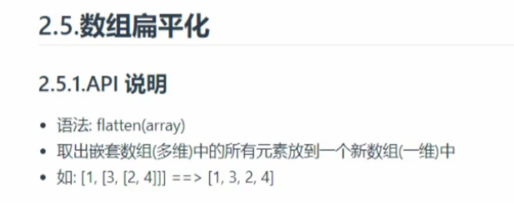

**09-数组扁平化.html**

```html
<!DOCTYPE html>
<html lang="en">
  <head>
    <meta charset="UTF-8" />
    <meta http-equiv="X-UA-Compatible" content="IE=edge" />
    <meta name="viewport" content="width=device-width, initial-scale=1.0" />
    <title>数组扁平化测试</title>
    <script src="09-flatten.js"></script>
  </head>
  <body>
    <script>
      // 声明一个数组
      let arr = [1, 2, [3, 4, [5, 6]], 7]; // [1,2,3,4,5,6,7]

      //数组扁平化 方式一
      // 因为这个效果原生API没有给我们提供 所以我们需要自己去自定义封装
      console.log(flatten1(arr));
    </script>
  </body>
</html>

```

**09-flatten.js**

```js
/**
 * 数组扁平化
 * @param {Array} arr 
 */
function flatten1(arr) {
  // 声明空数组
  let result = []; //用来接收最后的结果
  // 遍历数组
  arr.forEach(item => {
    // 判断
    if (Array.isArray(item)) {
      // 单纯...展开 是不行的 因为可能不止嵌套一次
      // flatten1(item); //这样写是拼接不到item的 因为拼接的result是局部的局部的局部... 等等 就是我们是要凭借在第一个定义的result 也就是最外层的result
      result = result.concat(flatten1(item)); // [1,2,3,4,5,6,7]
    } else {
      result = result.concat(item); // 这里没有重新赋值的话 原数组这一块就是空的 它是返回一个新数组 需要变量来进行接收
    }
  });

  // 返回结果
  return result;
}
```

递归到最底 然后从最底慢慢递归回去 用了concat函数 所以每次都会把递归的数组拼接成一个一维数组 慢慢拼接回去

​	

# 19 数组扁平化-2

**09-数组扁平化.html**

```html
<!DOCTYPE html>
<html lang="en">
  <head>
    <meta charset="UTF-8" />
    <meta http-equiv="X-UA-Compatible" content="IE=edge" />
    <meta name="viewport" content="width=device-width, initial-scale=1.0" />
    <title>数组扁平化测试</title>
    <script src="09-flatten.js"></script>
  </head>
  <body>
    <script>
      // 声明一个数组
      let arr = [1, 2, [3, 4, [5, 6]], 7]; // [1,2,3,4,5,6,7]

      // some 以及 concat
      console.log(flatten2(arr));
    </script>
  </body>
</html>

```

**09-flatten.js**

```js
function flatten2(arr) {
  // 声明数组 我们希望对一个新数组进行操作 而不是对原数组进行操作
  let result = [...arr];
  //循环判断
  while (result.some(item => Array.isArray(item))) {
    // 循环前：[1, 2, [3, 4, [5, 6]], 7]
    // result = [].concat([1, 2, [3, 4, [5, 6]], 7]); // 第一次循环：[1, 2, 3, 4, [5, 6], 7]
    // result = [].concat([1, 2, 3, 4, [5, 6], 7]); // 第二次循环：[1, 2, 3, 4, 5, 6, 7]
    result = [].concat(...result);
    console.log(result); // 我们还可以看中间展开的结果值
  }
  // console.log(result);
  return result;
}
```


# 	20 数组分块

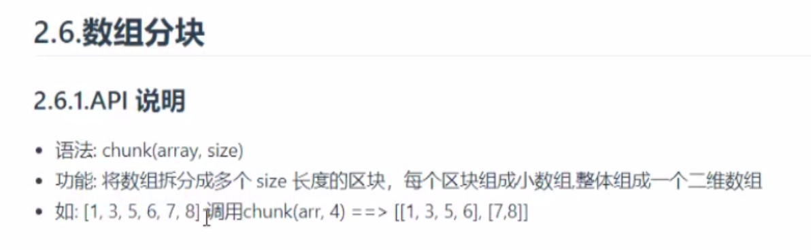

chunk 数据块；组块

掌握到一种很聪明的解法

压数组可以是长度为0时候再压 压入后再填元素 因为这样可以解决子元素数量不满 填不进去的情况 意思就是 例如 判断 `if(tmp.length === size)` 再去压 那么最后如果有剩余元素个数小于size的情况 那么剩下的这几个就压不进去了

**10-数组分块.html**

```html
<!DOCTYPE html>
<html lang="en">
  <head>
    <meta charset="UTF-8" />
    <meta http-equiv="X-UA-Compatible" content="IE=edge" />
    <meta name="viewport" content="width=device-width, initial-scale=1.0" />
    <title>数组分块测试</title>
    <script src="10-chunk.js"></script>
  </head>
  <body>
    <script>
      console.log(chunk([1, 2, 3, 4, 5, 6, 7], 3));
      // 结果 [[1,2,3],[4,5,6],[7]]
    </script>
  </body>
</html>

```

**10-chunk.js**

```js
/**
 * 数组分块
 * @param {Array} arr 目标数组
 * @param {Number} size 子数组元素个数 不传的话默认是一
 */
function chunk(arr, size = 1) {
  // 判断
  if (arr.length === 0) {
    return [];
  }
  // 声明两个变量
  let result = [];
  let tmp = []; // 呈放子数组[1,2,3]
  // 遍历
  arr.forEach(item => {
    // 判断tmp元素长度是否为0
    if (tmp.length === 0) {
      // 将 tmp 压入到 result 中
      result.push(tmp);
      // [[1,2,3],[4,5,6],[7]]
    }
    // 将元素压入到临时数组 tmp 中
    tmp.push(item);
    // 判断
    if (tmp.length === size) {
      tmp = [];
    }
  });
  return result;
}
```

遇到的问题

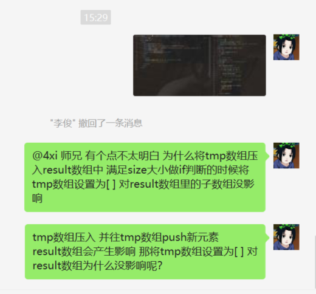

**解决：**

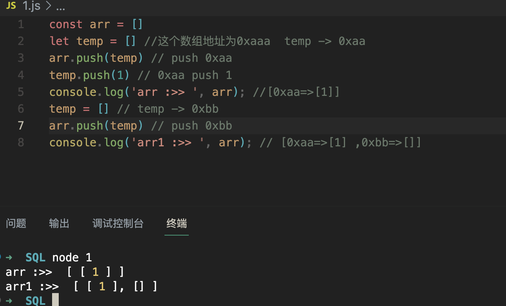

```js
const arr = []
let temp = [] //这个数组地址为0xaaa  temp -> 0xaa
arr.push(temp) // push 0xaa
temp.push(1) // 0xaa push 1
console.log('arr :>> ', arr); //[0xaa=>[1]]
temp = [] // temp -> 0xbb 【这行是关键】
arr.push(temp) // push 0xbb
console.log('arr1 :>> ', arr); // [0xaa=>[1] ,0xbb=>[]]
```

​	

# 21 数组差集

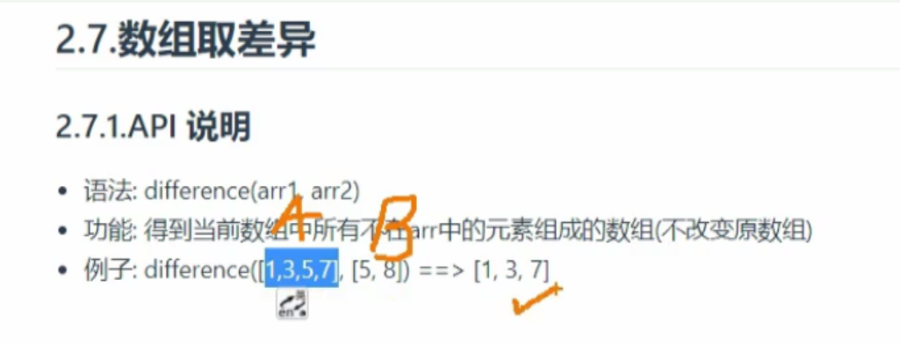

**11-数组差集.html**

```html
<!DOCTYPE html>
<html lang="en">
  <head>
    <meta charset="UTF-8" />
    <meta http-equiv="X-UA-Compatible" content="IE=edge" />
    <meta name="viewport" content="width=device-width, initial-scale=1.0" />
    <title>数组差集</title>
    <script src="11-difference.js"></script>
  </head>
  <body>
    <script>
      // console.log(difference([1, 3, 5, 7], [5, 8]));
      console.log(difference([1, 3, 5, 7]));
    </script>
  </body>
</html>

```

**11-difference.js**

```js
/**
 * 
 * @param {Array} arr1 
 * @param {Array} arr2 
 */
function difference(arr1, arr2 = []) {
  // slice是返回一个新数组 而不是返回原数组 我们不希望原数组被影响
  // 判断参数
  if (arr1.length === 0) {
    return [];
  }
  if (arr2.length === 0) {
    return arr1.slice();
  }
  const result = arr1.filter(item => !arr2.includes(item));
  return result;
}
```

​	

# 22 删除数组元素

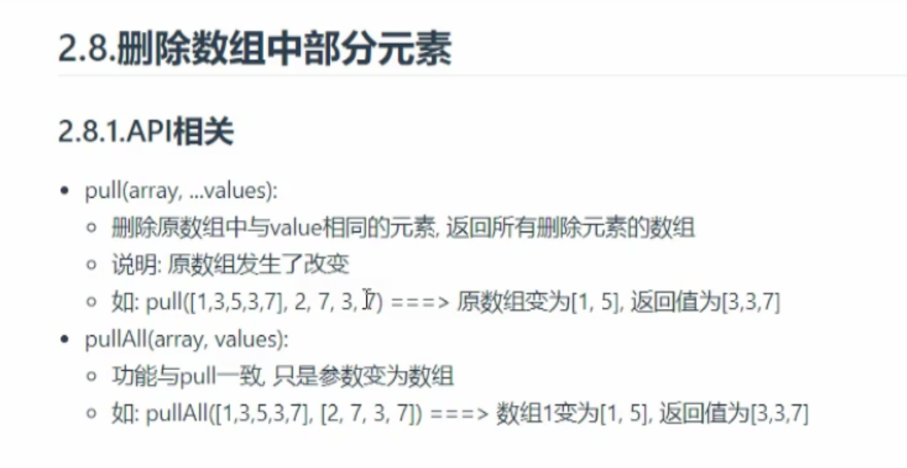

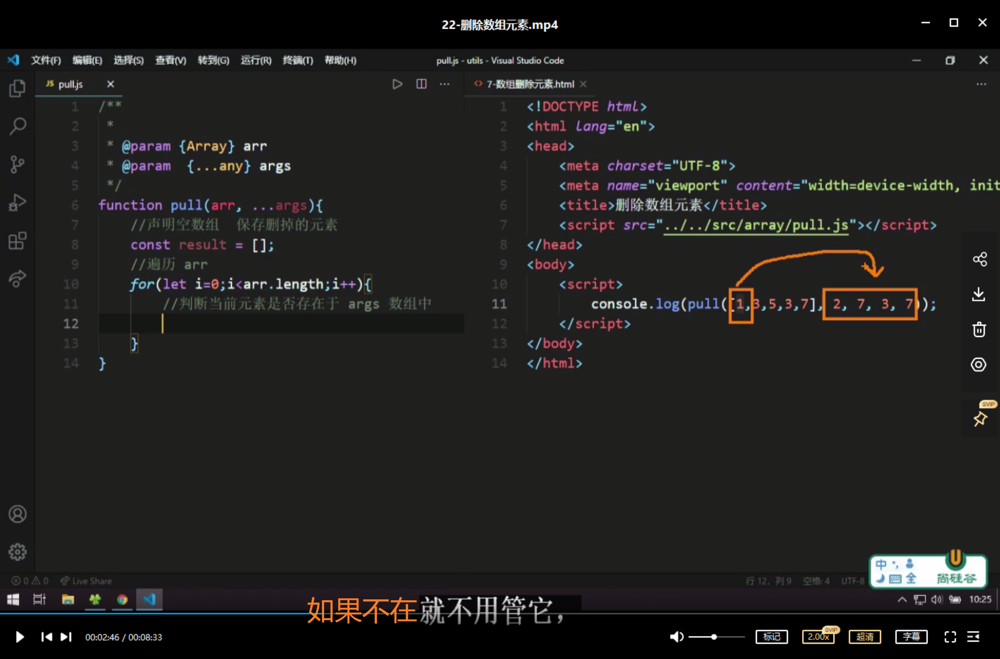

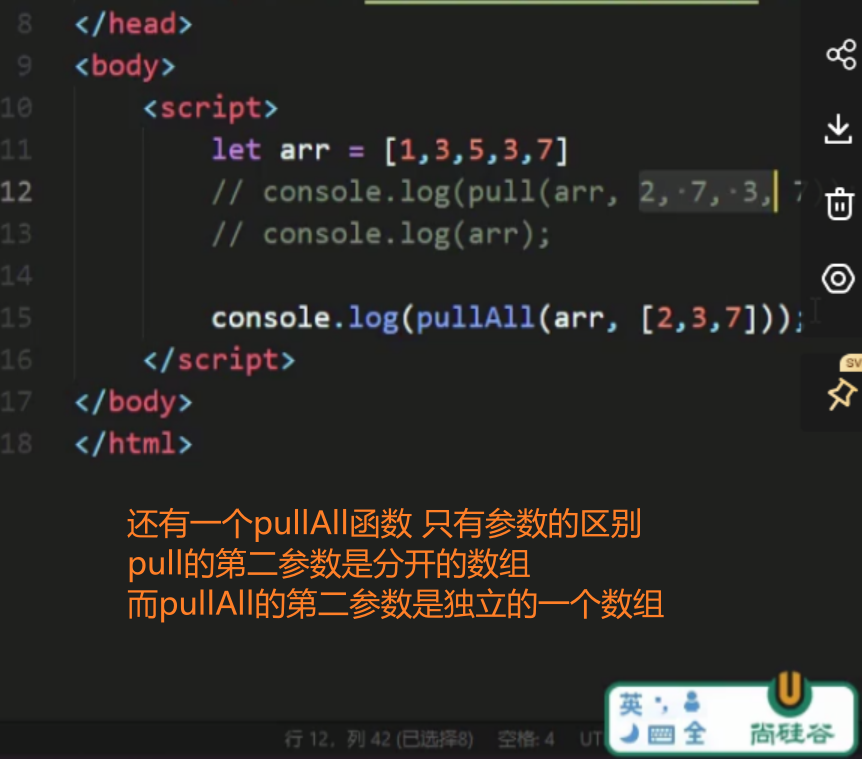

**12-数组删除元素.html**

```html
<!DOCTYPE html>
<html lang="en">
  <head>
    <meta charset="UTF-8" />
    <meta http-equiv="X-UA-Compatible" content="IE=edge" />
    <meta name="viewport" content="width=device-width, initial-scale=1.0" />
    <title>删除数组元素</title>
    <script src="12-pull.js"></script>
  </head>
  <body>
    <script>
      // console.log(pull([1, 3, 5, 3, 7], 2, 7, 3, 7));

      let arr = [1, 3, 5, 3, 7, 2];
      // console.log(pull(arr, 2, 7, 3, 7));
      // console.log(arr);

      console.log(pullAll(arr, [2, 3, 7]));
    </script>
  </body>
</html>

```

**12-pull.js**

```js
/**
 * 
 * @param {Array} arr 
 * @param  {...any} args 
 */
function pull(arr, ...args) {
  // 声明空数组 保存删除的元素
  const result = [];
  // 遍历 arr
  for (var i = 0; i < arr.length; i++) {
    // 判断当前元素是否存在于 args 数组中
    if (args.includes(arr[i])) {
      // 将当前元素的值存入到 result 中
      result.push(arr[i]);
      // 删除当前的元素
      arr.splice(i, 1); // 删除用splice删除 因为splice可以改变原数组
      // 下标自减
      i--; // 不 i-- 的话 会跳过一位数没有检测 （可以自己思考一下~）
    }
  }
  // 返回
  return result;
}

function pullAll(arr, values) {
  return pull(arr, ...values)
}
```

​	

# 23 获取数组某些元素

它这个函数调完之后不会改变原数组的内容 是返回新数组 不会改变原数组

**13-获取数组某些元素.html**

```html
<!DOCTYPE html>
<html lang="en">
  <head>
    <meta charset="UTF-8" />
    <meta http-equiv="X-UA-Compatible" content="IE=edge" />
    <meta name="viewport" content="width=device-width, initial-scale=1.0" />
    <title>获取数组某些元素</title>
    <script src="13-drop.js"></script>
  </head>
  <body>
    <script>
      console.log(drop([1, 3, 5, 7, 9, 11], 2));
      console.log(dropRight([1, 3, 5, 7, 9, 11], 2));
    </script>
  </body>
</html>

```

**13-drop.js**

```js
/**
 * 
 * @param {Array} arr 
 * @param {Number} size 
 */
function drop(arr, size) {
  // 过滤原数组 产生新数组
  // return arr.filter((value, index) => {
  //   //
  //   return index >= size;
  // })
  return arr.filter((value, index) => index >= size); // 用来测试数组中每个元素的函数。返回 true 表示该元素通过测试，保留该元素，false 则不保留。它接
}

function dropRight(arr, size) {
  // return arr.filter((value, index) => {
  //   return index < arr.length - size;
  // })
  return arr.filter((value, index) => index < arr.length - size);
}
```

​	

# 24 创建新对象

newInstance() 根据构造函数来创建实例对象 做这个的主要目标在于模拟构造函数创建实例对象的一个过程

**01-创建对象.html**

```html
<!DOCTYPE html>
<html lang="en">
  <head>
    <meta charset="UTF-8" />
    <meta http-equiv="X-UA-Compatible" content="IE=edge" />
    <meta name="viewport" content="width=device-width, initial-scale=1.0" />
    <title>创建对象测试</title>
    <script src="01-newInstance.js"></script>
  </head>
  <body>
    <script>
      function Person(name, age) {
        this.name = name;
        this.age = age;

        // return { a: 100 };
        // return [];
        // return function () {};

        // 如果返回的是非对象数据类型的值 那么这个new的返回结果就是那个新创建的对象
        // return 'im OK'; // Person {name: undefined, age: undefined}
      }

      // 调用 newInstance 函数创建对象
      let obj = newInstance(Person, '张三', 18);
      console.log(obj);

      // console.log(new Person());
    </script>
  </body>
</html>

```

**01-newInstance.js**

```js
/**
 * 
 * @param {Function} Fn 构造函数
 * @param  {...any} args 
 */
function newInstance(Fn, ...args) {
  // 1. 创建一个新对象
  const obj = {};
  // 2. 修改函数内部 this 指向新对象并执行
  const result = Fn.call(obj, ...args);
  // 修改新对象的原型对象
  obj.__proto__ = Fn.prototype;
  // 3. 返回新对象
  // console.log(result); // undefined

  // return obj;
  return result instanceof Object ? result : obj;
}
```

​	

# 25 比对对象类型

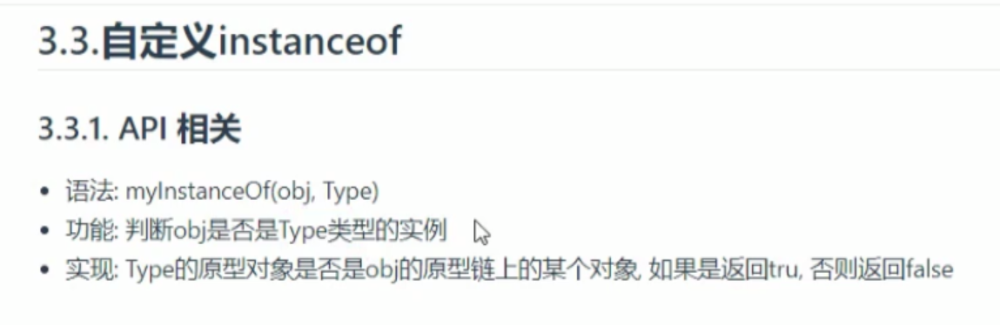

如何判断一个对象是否为一个构造函数的实例呢？

如果Type构造函数在obj对象的原型链上 则表明obj是Type的一个实例

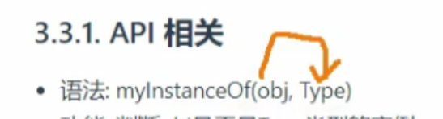

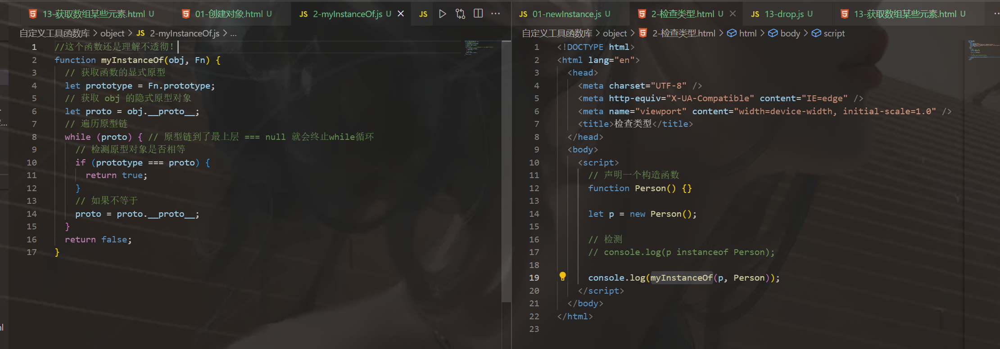

**02-检查类型.html**

```html
<!DOCTYPE html>
<html lang="en">
  <head>
    <meta charset="UTF-8" />
    <meta http-equiv="X-UA-Compatible" content="IE=edge" />
    <meta name="viewport" content="width=device-width, initial-scale=1.0" />
    <title>检查类型</title>
    <script src="02-myInstanceOf.js"></script>
  </head>
  <body>
    <script>
      // 声明一个构造函数
      function Person() {}

      let p = new Person();

      // 检测
      // console.log(p instanceof Person);

      // console.log(myInstanceOf(p, Person));
      // console.log(myInstanceOf(p, Object)); // 因为Object是所有对象最上层的类 所以它的显式原型都在对象的原型链上边
      // console.log(myInstanceOf(Person, Function));
      console.log(myInstanceOf(p, Function)); //false 原因：不是由函数创建 而是由Person创建而来的
    </script>
  </body>
</html>

```

**02-myInstanceOf.js**

```js
//这个函数还是理解不透彻！
function myInstanceOf(obj, Fn) {
  // 获取函数的显式原型
  let prototype = Fn.prototype;
  // 获取 obj 的隐式原型对象
  let proto = obj.__proto__;
  // 遍历原型链
  while (proto) { // 原型链到了最上层 === null 就会终止while循环
    // 检测原型对象是否相等
    if (prototype === proto) {
      return true;
    }
    // 如果不等于
    proto = proto.__proto__;
  }
  return false;
}
```

​	

# 26 对象合并

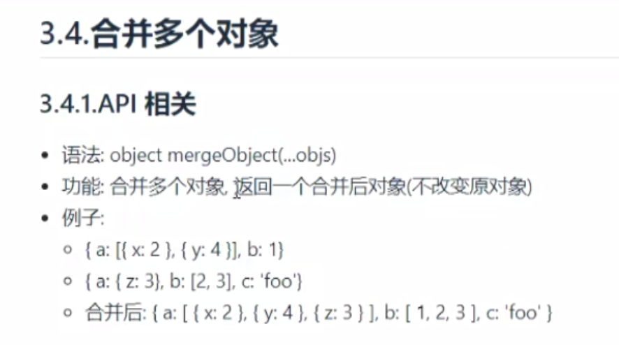

产生重名不会覆盖 而是会把多个对象当中同名属性内容合并在一起 
